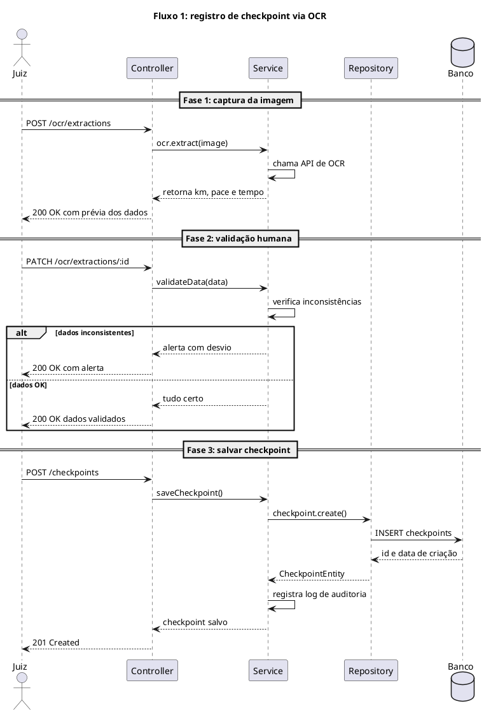
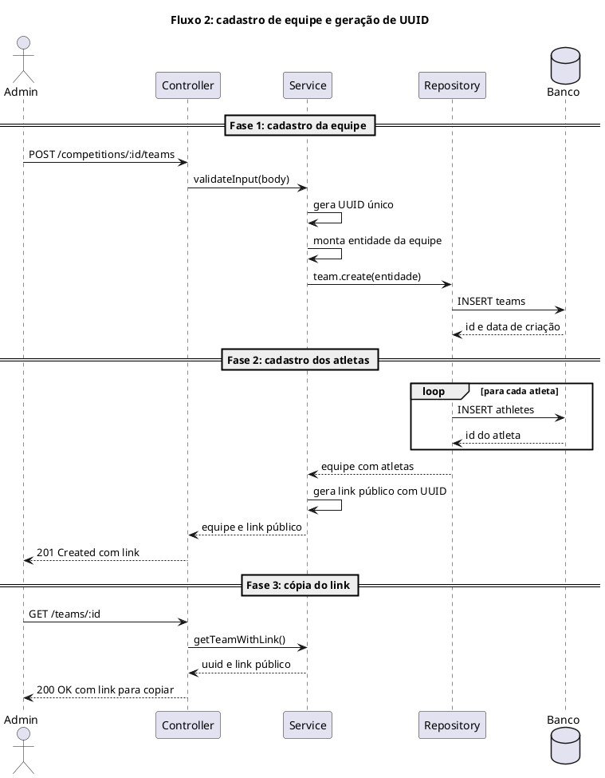

# Diagramas de sequência UML - Seção 3.2.4

Este documento reúne o código-fonte em PlantUML dos dois diagramas de sequência usados na seção 3.2.4 do WAD, correspondentes aos arquivos `assets/programacao/diagrama-sequencia-uml-1.svg` e `assets/programacao/diagrama-sequencia-uml-2.svg`. O primeiro descreve o fluxo de registro de checkpoint via OCR, e o segundo descreve o cadastro de equipe com geração e uso de UUID público.

Fluxo 1:

Fluxo 2:

