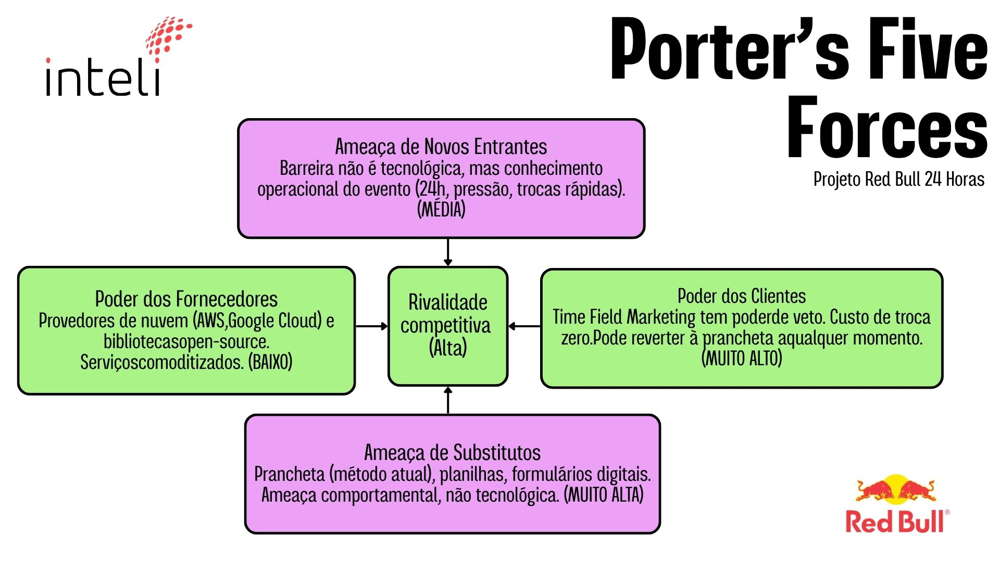
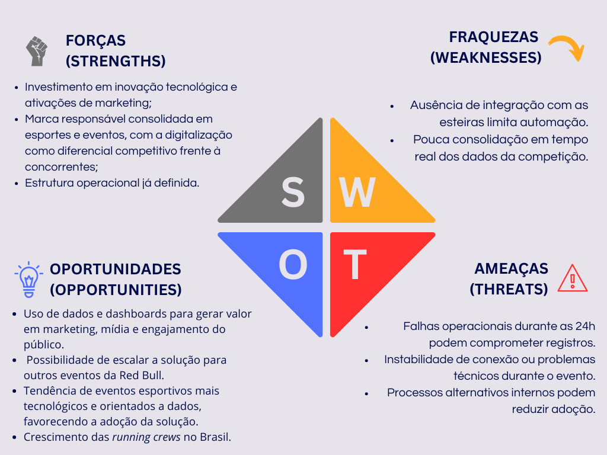
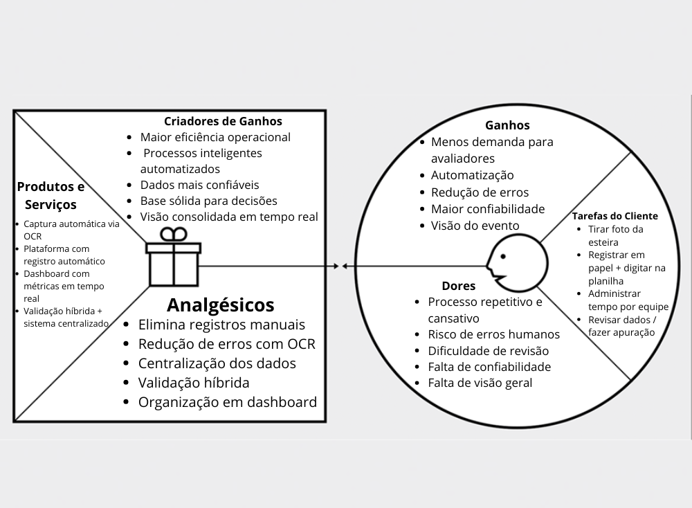
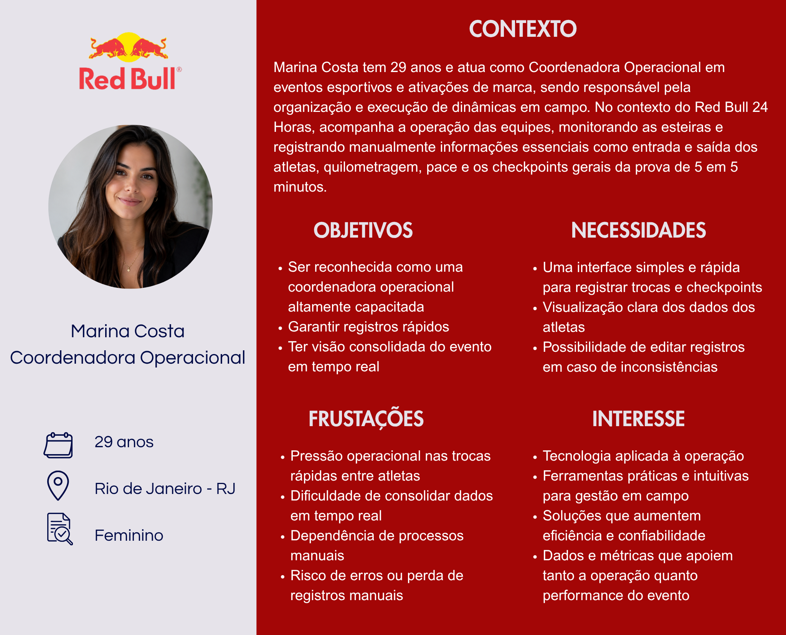
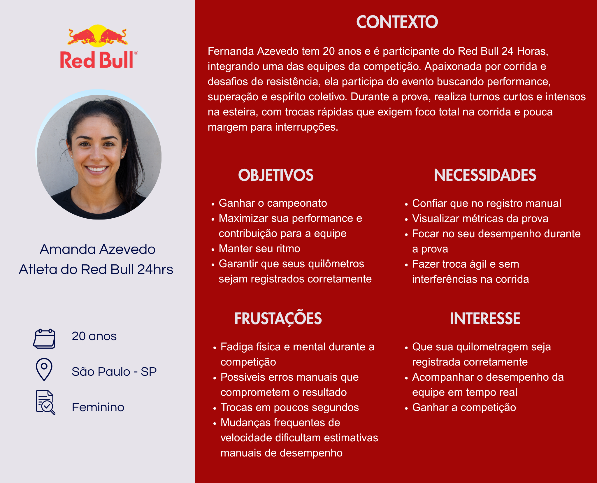
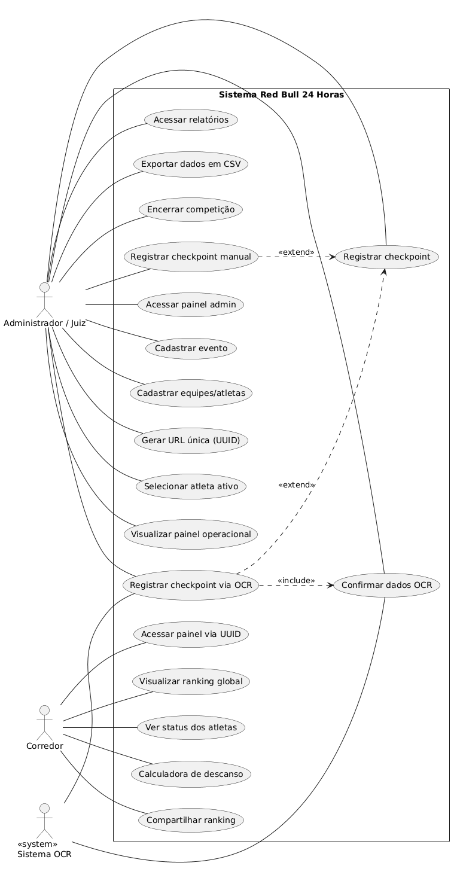

# WAD - Web Application Document - Módulo 2 - Inteli

**_Os trechos em itálico servem apenas como guia para o preenchimento da seção. Por esse motivo, não devem fazer parte da documentação final_**

## Nome do Grupo

#### Ana Clara Tenório Pelegrini
#### Beatriz Okubo Vieira Lima
#### Eduardo Hirohito Izawa Maciel
#### Isabella Sandra Santos
#### Julia Khristina de Oliveira Silva Souza
#### Luiza Nicol Giusti Dias Cardoso
#### Mariana Azevedo Silva
#### Vinícius Tavares Castiglia

## Sumário

[1. Introdução](#c1)

[2. Visão Geral da Aplicação Web](#c2)

[3. Projeto Técnico da Aplicação Web](#c3)

[4. Desenvolvimento da Aplicação Web](#c4)

[5. Testes da Aplicação Web](#c5)

[6. Estudo de Mercado e Plano de Marketing](#c6)

[7. Conclusões e trabalhos futuros](#c7)

[8. Referências](c#8)

[Anexos](#c9)

 

# 1. Introdução (sprints 1 a 5)

A Red Bull, marca global atuante em eventos esportivos e experiências de marca, é o parceiro deste projeto por meio de seu time de Field Marketing, responsável pela operação do Red Bull 24 Horas, competição anual em que duas equipes de dezesseis corredores se revezam ininterruptamente em esteiras durante vinte e quatro horas, buscando acumular a maior quilometragem total. Atualmente, o registro dos quilômetros percorridos é realizado de forma manual por operadores, que anotam em pranchetas os momentos de início e término de cada turno, além de checkpoints periódicos. Esse processo é suscetível a erros de anotação, distrações humanas e inconsistências, o que compromete a confiabilidade e a rastreabilidade dos resultados finais. Como as esteiras utilizadas no evento não permitem integração direta com dispositivos externos e alternativas como dispositivos vestíveis sincronizados se mostraram inviáveis diante da dinâmica de trocas rápidas entre corredores, a apuração depende exclusivamente de registros humanos, sem mecanismos estruturados de auditabilidade dos dados.

Diante desse cenário, o projeto propõe o desenvolvimento de uma plataforma web de gestão de performance em tempo quase real, projetada para uso em iPads posicionados ao lado das esteiras pelos operadores do evento. A solução substitui o registro manual por uma abordagem de automação assistida, na qual o operador captura imagens do visor da esteira por meio de fotografia, e o sistema realiza a extração automática dos dados por meio de reconhecimento óptico de caracteres (OCR). Esses dados são submetidos à validação humana, com emissão de alertas em caso de inconsistências, garantindo maior confiabilidade e controle sobre o processo de apuração.

A plataforma é dividida em duas interfaces principais: uma área privada de operação, onde os administradores registram checkpoints, corrigem dados extraídos via OCR, acompanham informações detalhadas de cada equipe e gerenciam a dinâmica da competição. Além da área pública por equipe, acessada sem login por meio de uma URL com UUID único entregue ao capitão de cada equipe, responsável pela exibição do ranking, status individual dos atletas e calculadora de descanso durante a competição.

A criação de valor do sistema se concentra em quatro eixos principais: redução de erros no processo de apuração, aumento da confiabilidade e auditabilidade dos dados, ganho de eficiência operacional para a equipe organizadora da Red Bull e disponibilização de informações atualizadas em tempo quase real para acompanhamento público da competição.

# 2. Visão Geral da Aplicação Web (sprint 1)

## 2.1. Escopo do Projeto (sprints 1 e 4)

### 2.1.1. Modelo de 5 Forças de Porter (sprint 1)

O modelo das Cinco Forças de Porter constitui um framework de análise estratégica utilizado para avaliar a atratividade e a intensidade competitiva de uma indústria. O posicionamento estratégico de uma organização não depende exclusivamente da concorrência direta, mas da interação entre cinco forças estruturais: a rivalidade entre concorrentes existentes, a ameaça de novos entrantes, a ameaça de produtos ou serviços substitutos, o poder de barganha dos fornecedores e o poder de barganha dos clientes. A aplicação desse modelo permite identificar oportunidades, vulnerabilidades competitivas e fatores críticos para a sustentabilidade de uma solução (Porter, 2008).

No contexto deste projeto, a análise foi aplicada à operação do Red Bull 24 Horas, considerando o desenvolvimento de uma aplicação web para digitalização do processo de registro de quilometragem durante o evento. A solução proposta busca substituir um processo manual suscetível a erros, transformando a coleta operacional em um fluxo digital mais confiável, ágil e escalável.

  Imagem 1 - Análise das cinco forças de Porter 
   
  Fonte: Elaborado pelos autores (2026).

#### 1. Rivalidade entre concorrentes existentes (ALTA)

A rivalidade competitiva neste contexto é considerada alta, pois existem diversas soluções que podem atender parcialmente à necessidade de registro operacional do evento, incluindo ferramentas genéricas de coleta de dados, como Google Forms, Microsoft Excel, aplicativos móveis de coleta de informações e plataformas genéricas de gestão operacional. Embora essas alternativas sejam amplamente acessíveis e de fácil implementação, elas não foram desenvolvidas para atender às particularidades do Red Bull 24 Horas, como uso contínuo por 24 horas, trocas frequentes de operadores e necessidade de registro rápido sob pressão operacional.

O diferencial competitivo da solução proposta reside na sua especialização funcional, sendo projetada especificamente para o fluxo real do evento, priorizando velocidade de uso, padronização dos registros e redução de retrabalho. Para a Red Bull, essa especialização representa um ganho estratégico ao transformar um processo operacional crítico em uma atividade mais confiável e eficiente.

#### 2. Ameaça de novos entrantes (MÉDIA)

A entrada de novos desenvolvedores de soluções digitais neste mercado é relativamente acessível do ponto de vista técnico, uma vez que as ferramentas de desenvolvimento web são amplamente disponíveis. No entanto, a principal barreira competitiva não está na tecnologia em si, mas na capacidade de adaptação ao contexto operacional específico do evento.

O Red Bull 24 Horas apresenta características próprias, tal qual operações contínuas por 24 horas, rotatividade de usuários, pressão por rapidez e necessidade de confiabilidade no registro dos dados, nesse cenário, é possível verificar que esses fatores dificultam a criação de soluções verdadeiramente aderentes sem conhecimento aprofundado da dinâmica operacional. Dessa forma, embora novos entrantes possam desenvolver sistemas similares, a replicação de uma solução efetivamente integrada à realidade do evento representa uma barreira prática relevante.

#### 3. Ameaça de produtos ou serviços substitutos (MUITO ALTA)

A ameaça de substitutos é considerada muito alta, pois o principal substituto da solução proposta é o próprio método atualmente utilizado pela operação, que hoje se configura no registro manual por meio de pranchetas. Apesar de suscetível a erros de preenchimento, perda de informações e retrabalho, esse modelo apresenta vantagens importantes, como baixo custo operacional, alta familiaridade entre os operadores e integração natural à dinâmica do evento. Além disso, ferramentas simples, como planilhas digitais, formulários online e aplicativos móveis de coleta, também representam alternativas viáveis, reforçando a resistência à adoção de novas tecnologias. Por isso, a principal ameaça não é necessariamente tecnológica, mas comportamental, uma vez que a substituição de um processo já consolidado exige que a nova solução demonstra benefícios claros em rapidez, simplicidade e confiabilidade.

#### 4. Poder de barganha dos fornecedores (BAIXO)

O poder de barganha dos fornecedores é considerado baixo, uma vez que os recursos necessários para o desenvolvimento da solução são predominantemente tecnológicos, incluindo serviços de hospedagem, infraestrutura web, frameworks de desenvolvimento e bibliotecas de software amplamente disponíveis no mercado.
Esses recursos apresentam alta disponibilidade, baixa diferenciação e facilidade de substituição, reduzindo significativamente a dependência de fornecedores específicos. Além disso, a solução não depende de integrações complexas com hardware proprietário ou tecnologias exclusivas, o que amplia a flexibilidade técnica e financeira do projeto.

#### 5. Poder de barganha dos clientes (MUITO ALTO)

A principal área demandante da solução corresponde ao time operacional de Field Marketing da Red Bull, responsável pelo registro dos dados durante o evento. Esse grupo exerce elevado poder de barganha, pois a adoção da ferramenta depende diretamente da sua aceitação em um ambiente caracterizado por alta pressão operacional, rapidez na tomada de decisão e necessidade de execução contínua. O custo de substituição é praticamente inexistente, uma vez que o método manual atualmente utilizado pode ser retomado a qualquer momento sem impactos financeiros ou contratuais. Além disso, qualquer aumento de complexidade, lentidão ou dificuldade de uso pode comprometer diretamente a aceitação da solução. Dessa forma, a área demandante exerce não apenas poder de escolha, mas também poder de veto, exigindo que a ferramenta seja comprovadamente mais simples, rápida e confiável do que o processo atual para garantir sua adoção efetiva.

#### Conclusão da análise

A aplicação do modelo das Cinco Forças de Porter evidencia que a solução proposta para o Red Bull 24 Horas está inserida em um contexto de elevada pressão competitiva, especialmente em relação à rivalidade entre soluções alternativas, à resistência comportamental associada aos métodos já consolidados e ao elevado poder de decisão da área demandante. Em contrapartida, a baixa dependência de fornecedores e a especialização operacional da ferramenta criam condições favoráveis para a construção de vantagem competitiva sustentável. Dessa forma, o sucesso da solução não depende exclusivamente de sua viabilidade técnica, mas principalmente de sua capacidade de entregar ganhos reais de usabilidade, confiabilidade e eficiência operacional no contexto específico da Red Bull.

### 2.1.2. Análise SWOT da Instituição Parceira (sprint 1)

A análise SWOT (ou FOFA) é uma ferramenta de planejamento estratégico que permite avaliar fatores internos (forças e fraquezas) e externos (oportunidades e ameaças) que impactam o desempenho de uma organização (Casarotto, 2019). Com base nisso, foi realizada a análise do evento Red Bull 24 Horas, conforme apresentado na Imagem 2, considerando seu posicionamento no mercado e relação com concorrentes.

  Imagem 2 - Análise SWOT  
   
  Fonte: Elaborado pelos autores (2026).

#### Forças

  No contexto do evento Red Bull 24 Horas, destacam-se como principais forças o investimento contínuo em inovação tecnológica e ativações de marketing, reforçando o posicionamento da marca como referência em eventos esportivos. A consolidação da Red Bull nesse segmento, aliada à sua forte presença digital, representa um diferencial competitivo relevante frente a concorrentes. Além disso, a existência de uma estrutura operacional bem definida favorece a implementação de soluções digitais, aumentando a eficiência e a escalabilidade do evento.

#### Fraquezas

   Entre as fraquezas, observa-se a ausência de integração com as esteiras, o que limita a automação da coleta de dados e mantém a dependência de processos manuais. Adicionalmente, a baixa consolidação de dados em tempo real compromete a visibilidade geral da competição e pode impactar a confiabilidade das informações durante o evento, reduzindo a qualidade da experiência em comparação a soluções mais automatizadas adotadas por concorrentes.

#### Oportunidades
No ambiente externo, identificam-se oportunidades relacionadas ao uso estratégico de dados para geração de valor em marketing, mídia e engajamento do público, por meio de dashboards e indicadores relevantes. Há potencial de escalabilidade da solução para outros eventos da Red Bull, fortalecendo sua vantagem competitiva. Além disso, a crescente tendência de eventos esportivos orientados a dados e o crescimento das running crews no Brasil ampliam o público-alvo e favorecem a adoção da solução proposta.

#### Ameaças

Entre as ameaças, destacam-se possíveis falhas operacionais ao longo das 24 horas do evento, que podem comprometer os registros da competição. Instabilidades técnicas ou de conexão também representam riscos significativos para a continuidade do sistema. Por fim, a existência de processos alternativos internos pode reduzir a adesão à solução proposta, especialmente se não houver percepção clara de valor em relação às práticas já utilizadas.

### 2.1.3. Solução (sprints 1 a 5)

#### a) Problema a ser resolvido

Atualmente, o processo de registro de dados dos corredores durante a competição é predominantemente manual, exigindo que operadores realizem anotações periódicas ao longo de 24 horas ininterruptas. Esse modelo gera sobrecarga operacional significativa, além de alta suscetibilidade a erros humanos decorrentes de fadiga, falhas de interpretação e inconsistências de caligrafia. Como consequência, a confiabilidade dos dados é comprometida, impactando diretamente a precisão da apuração, a transparência do evento e a qualidade das análises estratégicas realizadas pela organização.

#### b) Dados disponíveis 

Como base inicial, foi utilizado o site oficial do evento Red Bull 24 Hours, fornecido durante o onboarding, contendo informações institucionais, dinâmica da competição e contexto geral. Complementarmente, foram realizadas interações com o parceiro, nas quais foram identificados os principais fluxos operacionais, limitações do processo atual e requisitos implícitos, especialmente relacionados à necessidade de automatização do registro de checkpoints e à melhoria da confiabilidade dos dados coletados (Red Bull, 2025).

#### c) Solução proposta

Propõe-se o desenvolvimento de uma aplicação web integrada, com foco na automatização da coleta e processamento de dados por meio de tecnologia de Reconhecimento Óptico de Caracteres (OCR). A solução permitirá que operadores capturem imagens dos displays das esteiras, realizando a extração automática das informações relevantes. Além disso, a plataforma contemplará módulos de cadastro de equipes e atletas, monitoramento em tempo quase real, visualização de rankings globais e geração de relatórios analíticos com indicadores de desempenho, garantindo escalabilidade, padronização e maior robustez no processo.

#### d) Forma de utilização da solução

A solução será estruturada em dois ambientes principais: um administrativo e outro público. No ambiente administrativo, acessado por operadores via autenticação (UUID), será possível cadastrar competições, gerenciar equipes e registrar checkpoints por OCR ou entrada manual. No ambiente público, usuários terão acesso a um painel com ranking atualizado periodicamente, desempenho das equipes e métricas relevantes. Ao final da competição, administradores poderão exportar relatórios detalhados para análise estratégica e tomada de decisão.

#### e) Benefícios esperados

A implementação da solução proporcionará significativa redução de erros operacionais, aumento da eficiência no processo de coleta de dados e maior confiabilidade das informações registradas. A disponibilização de métricas em tempo quase real permitirá melhor acompanhamento do desempenho das equipes durante o evento. Além disso, os relatórios analíticos contribuirão para decisões mais assertivas, melhoria contínua das edições futuras e fortalecimento da experiência dos participantes e da gestão do evento.

#### f) Critério de sucesso e como será avaliado

O sucesso da solução será mensurado por meio de indicadores objetivos, como a redução da taxa de erro nos registros (meta inferior a 1%), aumento da consistência e integridade dos dados e diminuição do tempo de processamento das informações. A avaliação será realizada em conjunto com o parceiro, considerando o impacto operacional durante a execução do evento, a aderência aos requisitos levantados e a qualidade das análises geradas para suporte à tomada de decisão.

### 2.1.4. Value Proposition Canvas (sprint 1): 

O Canvas da Proposta de Valor permite analisar o alinhamento entre as necessidades do cliente e a solução proposta (Osterwalder; Pigneur, 2011). No contexto deste projeto, evidencia-se o encaixe entre as dificuldades enfrentadas por avaliadores e organizadores no processo de coleta, registro e apuração de dados em competições e a solução proposta, baseada na automatização por meio de reconhecimento óptico de caracteres (OCR) e disponibilização de informações em tempo real. Essa abordagem está alinhada ao uso de tecnologias digitais para aumento de eficiência operacional e redução de erros em processos manuais, amplamente discutido na literatura de transformação digital (Vial, 2019).

A seguir, a Imagem 3 ilustra o Canva de Proposta de Valor desenvolvido para o projeto em análise.

  Imagem 3 - Value Proposition Canvas da Solução  
   
  Fonte: Elaborado pelo próprio grupo (2026).

#### A. Perfil do Cliente

Na primeira parte do Canvas da Proposta de Valor é analisado o cenário e o perfil em que o cliente já se encontra. Aqui, é possível explorar quais são as dores do cliente, suas tarefas no contexto atual e o que eles buscam ganhar.

**Tarefas do Cliente**
- Tirar foto das esteiras durante a competição
- Registrar os dados com papel e caneta
- Digitar os dados para planilha do google
- Administrar o tempo total de cada equipe
- Revisar todos os registros coletados
- Realizar a apuração final dos resultados

**Dores do Cliente**
- Processo repetitivo e cansativo
- Risco de erros humanos durante a coleta e digitação dos dados
- Dificuldade na revisão, validação e apuração das informações
- Incerteza quanto à precisão e consistência dos dados coletados
- Falta de visão consolidada e organizada do evento

**Ganhos**
- Menos demanda para os avaliadores
- Automatização do processo de registro e processamento de dados
- Redução de erros operacionais
- Maior confiablidade e precisão das informações
- Maior eficiência operacional durante o evento
- Visão consolidada e organizada do andamento da competição.

#### B. Mapa de Valor

Os elementos do mapa de valor foram estruturados para responder diretamente às dores identificadas e potencializar os ganhos esperados pelos usuários.

**Produtos e Serviços**

A solução proposta oferece os seguintes elementos:

* Plataforma digital de gestão de performance em tempo real
* Sistema de captura de imagens e extração automática de dados por OCR
* Dashboard para visualização de métricas e desempenho por equipe
* Sistema de validação híbrida dos dados (automática e manual)

**Aliviadores de Dores**

A solução atua diretamente na redução das dificuldades enfrentadas pelos usuários:

* Eliminação do registro manual em papel e da digitação em planilhas
* Redução de erros humanos na coleta, registro e processamento dos dados
* Simplificação do processo de revisão, validação e apuração das informações
* Centralização das informações em uma única plataforma
* Aumento da confiabilidade dos dados por meio de validação híbrida

**Criadores de Ganho**

Além de resolver problemas, a solução potencializa ganhos relevantes:

* Geração de informações em tempo real para acompanhamento da competição
* Geração de uma visão consolidada e organizada dos dados do evento
* Aumento da produtividade da equipe organizadora
* Apoio à gestão operacional por meio de dados confiáveis e consolidados
* Melhoria da experiência operacional dos avaliadores durante o evento

A partir da análise do Value Proposition Canvas, observa-se que a solução proposta está diretamente alinhada às necessidades dos avaliadores e organizadores, ao automatizar o processo de coleta e registro de dados por meio de OCR, reduzindo erros humanos e esforço operacional. Além disso, a centralização e disponibilização das informações em tempo real caracterizam uma automação do fluxo de dados, proporcionando maior confiabilidade, eficiência e suporte à tomada de decisão, garantindo uma gestão mais precisa e organizada da competição.

### 2.1.5. Matriz de Riscos do Projeto (sprint 1)

A Matriz de Riscos é uma ferramenta de gestão utilizada para identificar, analisar e priorizar eventos que possam impactar negativamente o desenvolvimento e a execução de um projeto. Por meio da avaliação da probabilidade de ocorrência e do nível de impacto de cada risco, torna-se possível classificá-los conforme sua criticidade e definir estratégias preventivas, corretivas ou de contingência, reduzindo incertezas e aumentando as chances de sucesso do projeto (PMI, 2021).

No contexto deste projeto, a Matriz de Riscos é aplicada para antecipar possíveis desafios relacionados à implementação da solução de captura e processamento de dados em tempo quase real durante eventos esportivos da Red Bull GmbH. Considerando fatores técnicos, operacionais e humanos, a análise dos riscos permite estabelecer planos de resposta capazes de minimizar falhas na coleta, processamento e disponibilização das informações, garantindo maior confiabilidade, desempenho e continuidade operacional da solução proposta.

#### 2.1.5.1 - Matriz de Ameaças

Para identificar e priorizar os principais riscos do projeto, foi elaborada a matriz de risco apresentada no Quadro 1 a seguir.

 Quadro 1 - Matriz de Risco 

| Risco                              | Descrição                                                                 | Probabilidade       | Impacto     | Classificação | Plano de Resposta                                                                 |
|-----------------------------------|---------------------------------------------------------------------------|--------------------|-------------|--------------|-----------------------------------------------------------------------------------|
| Falha no Reconhecimento de Imagem  | O sistema pode não identificar corretamente os dados capturados nas imagens da esteira. | 70% (Alta)         | Muito Alto        | Crítico      | Treinar o modelo com imagens reais do ambiente de operação, realizar testes iterativos e disponibilizar validação manual para casos de inconsistência.          |
| Baixa Qualidade das Imagens       | Iluminação inadequada, movimento ou posicionamento incorreto podem comprometer a captura dos dados.  | 80% (Muito Alta)  | Muito Alto        | Crítico      | Padronizar os pontos de captura, definir posicionamento fixo dos dispositivos e realizar testes em diferentes condições de iluminação.      |
| Falha de Conexão com a Internet   | Instabilidade de rede pode interromper o envio ou sincronização dos dados.     | 60% (Média)        | Alto        | Crítico      | Utilizar rede dedicada para operação, implementar armazenamento temporário local e sincronização automática quando a conexão for restabelecida.                   |
| Sobrecarga do Sistema             | Alto volume de acessos ou processamento simultâneo pode reduzir o desempenho da aplicação.  | 50% (Média)        | Alto        | Alto         | Realizar testes de carga, otimizar consultas e monitorar métricas de desempenho antes e durante o evento.                       |
| Erro Humano                       | Operadores podem registrar dados incorretamente ou utilizar funcionalidades inadequadamente.           | 40% (Média)         | Médio  | Alto         | Desenvolver interface intuitiva, criar instruções operacionais e realizar treinamento prévio da equipe.                       |
| Falta de Padronização operacional            | Diferenças nos procedimentos de coleta podem gerar inconsistências nos dados.   | 30% (Baixa)       | Médio       | Médio        | Definir protocolos de operação, validações automáticas e checklist de execução.             |
| Bugs ou falhas de software                            | Erros de implementação podem comprometer funcionalidades específicas do sistema.        | 20% (Baixa)          | Baixo       | Baixo        | Executar testes funcionais, testes de integração e monitoramento contínuo com correções rápidas.                   |

  Fonte: Elaborado pelos autores (2026).

#### 2.1.5.2 - Matriz de Oportunidades

 De forma complementar, o Quadro 2 a seguir apresenta a matriz de oportunidades identificadas para o projeto.

  Quadro 2 - Matriz de oportunidades do projeto

| Oportunidade | Descrição | Probabilidade | Impacto | Classificação | Plano de Resposta |
|--------------|----------|--------------|--------|--------------|-------------------|
| Maior precisão nos dados coletados | A substituição do input manual por OCR reduz erros de digitação identificados no risco de erro humano. | 90% (Alta) | Alto | Alta Prioridade | Garantir uma alternativa de entrada manual com validação para evitar inconsistências em casos de falhas do OCR. |
| Tomada de decisão estratégica | Dados em tempo quase real permitem decisões estratégicas relacionadas ao pace e aos períodos de descanso, influenciando a dinâmica competitiva. | 50% (Média) | Muito Alto | Alta Prioridade | Desenvolver interfaces claras e dashboards de rápida interpretação. |
| Aumento da eficiência operacional | A automação reduz atividades manuais e retrabalho da equipe operacional durante o evento. | 90% (Alta) | Muito Alto | Alta Prioridade | Automatizar fluxos operacionais e minimizar entradas manuais. |
| Possível reutilização do sistema | Projeto pode ser reutilizado em outros eventos esportivos da Red Bull. | 10% (Baixa) | Médio | Baixa Prioridade | Estruturar sistema modular e escalável. |
| Menor perda de dados durante o evento | O uso de checkpoints digitais periódicamente permite maior precisão histórica e reduz perdas de dados. | 50% (Média) | Alto | Alta Prioridade | Otimizar o processamento das capturas sem comprometer a estabilidade do sistema. |
| Geração de insights de dados | O armazenamento estruturado permite análises de desempenho, ritmo e comportamento para relatórios pós-evento. | 70% (Alta) | Muito Alto | Média Prioridade | Garantir exportação facilitada de dados (ex: CSV) para auditoria e materiais de marketing. |

  Fonte: Elaborado pelos autores (2026).

 

## 2.2. Personas (sprint 1)

Personas são personagens fictícios criados com base em dados plausíveis que representam um tipo de usuário compatível com o projeto. Elas incluem informações como objetivos, necessidades, frustrações e interesses, auxiliando na compreensão do problema e no desenvolvimento da solução.

  Imagem 4 - Persona 1: Marina Costa, Coordenadora Operacional 
   
  Fonte: Elaborado pelos autores (2026).

#### Informações
<ul>
    <li>Idade: 29 anos;</li>
    <li>Localização: Rio de Janeiro - RJ</li>
    <li>Cargo: Coordenadora operacional do evento RedBull 24 horas</li>
    <li>Gênero: Feminino</li>
</ul>

#### Biografia
Marina Costa tem 29 anos e atua como Coordenadora Operacional em eventos esportivos e ativações de marca, sendo responsável pela organização e execução de dinâmicas em campo. No contexto do Red Bull 24 Horas, acompanha a operação das equipes, monitorando as esteiras e registrando manualmente informações essenciais como entrada e saída dos atletas, quilometragem, pace e os checkpoints gerais da prova de 5 em 5 minutos. 

#### Objetivos
<ul>
    <li>Ser reconhecida como uma coordenadora operacional altamente capacitada</li>
    <li>Garantir registros rápidos </li>
    <li>Ter visão consolidada do evento em tempo real</li>
</ul>

#### Necessidades
<ul>
    <li>Uma interface simples e rápida para registrar trocas e checkpoints</li>
    <li>Visualização clara dos dados dos atletas</li>
    <li>Possibilidade de editar registros em caso de inconsistências</li>
</ul>

#### Frustrações
<ul>
    <li>Pressão operacional nas trocas rápidas entre atletas </li>
    <li>Dificuldade de consolidar dados em tempo real </li>
    <li>Dependência de processos manuais </li>
    <li>Risco de erros ou perda de registros manuais</li>
</ul>

#### Interesses
<ul>
    <li>Tecnologia aplicada à operação</li>
    <li>Ferramentas práticas e intuitivas para gestão em campo</li>
    <li>Soluções que aumentem eficiência e confiabilidade</li>
    <li>Dados e métricas que apoiem tanto a operação quanto performance do evento</li>
</ul>  

  Imagem 5 - Persona 2: Bruno Monteiro, Gerente de Field Marketing 
   
  Fonte: Elaborado pelos autores (2026).

#### Informações
<ul>
    <li>Idade: 32 anos;</li>
    <li>Localização: São Paulo - SP </li>
    <li>Cargo: Gerente de Field Marketing da RedBull</li>
    <li>Gênero: Masculino</li>
</ul>

#### Biografia
Bruno Monteiro tem 32 anos e atua como Gerente de Field Marketing, sendo responsável pela supervisão e validação das operações em eventos esportivos da marca. No contexto do Red Bull 24 Horas, o Bruno lidera com uma visão geral da prova e acompanha o desempenho das equipes, garantindo que todos os dados coletados, como quilometragem, pace médio e entradas dos atletas,  estejam consistentes e confiáveis para a análise de resultados no fim da prova. 

#### Objetivos
<ul>
    <li>Monitorar a coleta de dados</li>
    <li>Usar dados para melhorar a competição</li>
    <li>Ver métricas dos participantes </li>
    <li>Garantir confiabilidade dos resultados</li>
</ul>

#### Necessidades
<ul>
    <li>Visualização clara de métricas</li>
    <li>Alertas para inconsistências </li>
    <li>Automatização da coleta de dados</li>
    <li>Relatórios exportáveis para análise pós-evento</li>
</ul>

#### Frustrações
<ul>
    <li>Dependência de registros manuais, sujeitos a erro humano</li>
    <li>Dificuldade em identificar inconsistências </li>
    <li>Falta de resultados em tempo real</li>
    <li>Alto esforço operacional para acompanhar múltiplas equipes simultaneamente</li>
</ul>

#### Interesses
<ul>
    <li>Eficiência e redução de erros</li>
    <li>Tecnologias de automação e monitoramento em tempo real</li>
    <li>Melhoria do evento para globalizá-lo</li>
    <li>Experiência fluida para equipe e para os participantes</li>
</ul>  

  Figura 6 - Persona 3: Amanda Azevedo, Atleta da RedBull 24 horas 
   
  Fonte: Elaborado pelos autores (2026).

#### Informações
<ul>
    <li>Idade: 20 anos;</li>
    <li>Localização: São Paulo - SP</li>
    <li>Cargo: Atleta do RedBull 24 horas</li>
    <li>Gênero: Feminino</li>
</ul>

#### Biografia
Fernanda Azevedo tem 20 anos e é participante do Red Bull 24 Horas, integrando uma das equipes da competição. Apaixonada por corrida e desafios de resistência, ela participa do evento buscando performance, superação e espírito coletivo. Durante a prova, realiza turnos curtos e intensos na esteira, com trocas rápidas que exigem foco total na corrida e pouca margem para interrupções. 

#### Objetivos
<ul>
    <li>Ganhar o campeonato </li>
    <li>Maximizar sua performance e contribuição para a equipe  </li>
    <li>Garantir que seus quilômetros sejam registrados corretamente</li>
</ul>

#### Necessidades
<ul>
    <li>Confiar no registro manual </li>
    <li>Visualizar métricas da prova</li>
    <li>Focar no seu desempenho durante a prova</li>
    <li>Fazer troca ágil e sem interferências na corrida</li>
</ul>

#### Frustrações
<ul>
    <li>Fadiga física e mental durante a competição</li>
    <li>Possíveis erros manuais que comprometem o resultado  </li>
    <li>Trocas em poucos segundos </li>
    <li>Mudanças frequentes de velocidade dificultam estimativas manuais de desempenho</li>
</ul>

#### Interesses
<ul>
    <li>Que sua quilometragem seja registrada corretamente</li>
    <li>Acompanhar o desempenho da equipe em tempo real </li>
    <li>Ganhar a competição </li>
</ul>  

## 2.3. User Stories (sprints 1 a 5)

User stories são descrições curtas e objetivas de funcionalidades escritas sob a perspectiva do usuário final. Elas seguem geralmente o formato: “Como (papel/perfil), posso (ação/meta), para (benefício/razão)”, com foco no valor entregue e não em detalhes técnicos (Interaction Design Foundation, 2024). Esse modelo é amplamente utilizado em metodologias ágeis, como o Scrum, pois facilita a comunicação entre equipe de desenvolvimento e stakeholders, além de permitir a divisão dos requisitos em partes menores e testáveis.

A partir das user stories, torna-se necessário compreender quem são os usuários que estão sendo representados. Nesse contexto, entram as personas, que são representações fictícias baseadas em dados reais de usuários. Elas descrevem características como necessidades, objetivos, comportamentos e desafios, permitindo que a equipe tenha uma visão mais concreta do público-alvo (Nielsen Norman Group, 2024). Dessa forma, as decisões de design e desenvolvimento passam a ser guiadas por perfis realistas, garantindo maior alinhamento com as expectativas dos usuários e contribuindo para soluções mais eficazes e centradas na experiência.

Com as user stories definidas e as personas estabelecidas, é necessário garantir que as funcionalidades descritas estejam claras e possam ser validadas. Para isso, utilizam-se os critérios de aceitação, que são condições específicas, mensuráveis e verificáveis que determinam quando uma user story pode ser considerada concluída (Tymoshchenko, 2023). Esses critérios reduzem ambiguidades, facilitam testes e garantem que o sistema desenvolvido atenda às expectativas do usuário. Por exemplo, um critério de aceitação pode ser: “Dado que o usuário adiciona um produto ao carrinho de compras (ambiente digital), quando ele acessa o carrinho, então o item deve ser exibido com o nome, quantidade e preço corretos”.

Além dos critérios de aceitação, há mais uma bússola que norteia a equipe no momento de definir as user stories, garantindo qualidade e relevância ao projeto: os critérios INVEST (Independent, Negotiable, Valuable, Estimable, Small, Testable) (Ben Salem, 2023). De modo geral, cada US precisa ser independente, ou seja, não deve depender de outras para gerar valor; negociável, permitindo ajustes conforme o entendimento do projeto evolui; valiosa, entregando benefícios claros ao usuário; estimável, possibilitando que o time dimensione o esforço necessário e gerencie o cronograma de entregas; pequena, de modo que possa ser implementada em uma única iteração, facilitando a implementação e o acompanhamento; e testável, garantindo que seja possível verificar objetivamente se foi concluída com sucesso.

Sendo assim, por meio das user stories, mantém-se o foco no valor gerado ao usuário, além de orientar a priorização das tarefas e facilitar a comunicação entre stakeholders e desenvolvedores. Elas também servem como referência para a definição e compreensão dos requisitos funcionais e não funcionais do projeto, evidenciando as necessidades do usuário por meio de entregas objetivas. Além disso, contribuem para o planejamento iterativo, auxiliam na estimativa de esforço das atividades e permitem a validação contínua das funcionalidades por meio de critérios de aceitação, favorecendo a adaptação do produto conforme o feedback obtido ao longo do desenvolvimento.

A seguir, são apresentadas as histórias de usuário definidas até o momento para o projeto em análise.

  Quadro 3 - User Story 

| Identificação | US01 |
---| ---
| **Persona** | Administrador |
| **User Story** | "Como administrador, posso acessar o painel do admin, para gerenciar a competição e acessar todas as funcionalidades do sistema de forma centralizada." |
| **Critério de aceite 1** | CR1: O sistema deve permitir o acesso ao painel do admin em ambiente controlado. **Teste**: Dado que o administrador acessa o sistema, quando entra na plataforma, então deve ser direcionado ao painel do admin. |
| **Critério de aceite 2** | CR2: O painel deve exibir as principais seções do sistema. **Teste**: Dado que o admin acessa o painel, quando a página carrega, então deve visualizar opções como "criar competição", "equipes", "ranking" e "relatórios". |
| **Critério de aceite 3** | CR3: O painel deve exibir o estado atual do sistema (com ou sem competição). **Teste**: Dado que não há competição cadastrada, quando o painel é exibido, então deve mostrar a opção "Criar competição". Além disso, dado que existe uma competição cadastrada, quando o painel é exibido, então deve mostrar status, tempo e equipes. |
| Critérios INVEST | Independente: Esta US não depende de outras para ser desenvolvida, pois o painel do admin pode ser construído sem que o sistema de login ou o ranking estejam finalizados.   Negociável: A forma de acesso ao painel e as seções exibidas podem ser redefinidas conforme as necessidades identificadas durante o projeto.   Valorosa: Centraliza o controle do sistema, oferecendo ao administrador um ponto único de acesso a todas as funcionalidades da competição.   Estimável: Escopo claro e limitado a uma tela principal com exibição condicional de estado.   Pequena: Compreende apenas a tela principal do admin e sua lógica de exibição de estado.   Testável: Os comportamentos de redirecionamento e exibição condicional são verificáveis objetivamente para cada estado do sistema. |

  Fonte: Elaborado pelos autores (2026).

 

  Quadro 4 - User Story 

| Identificação | US02 |
---| ---
| **Persona** | Administrador |
| **User Story** | "Como administrador, posso cadastrar uma nova competição com data e localização, para estruturar e iniciar um evento de corrida." |
| **Critério de aceite 1** | CR1: O sistema deve permitir o preenchimento dos dados do evento. **Teste**: Dado que o admin acessa o formulário, quando preenche nome, data e local, então os campos devem aceitar os valores corretamente. |
| **Critério de aceite 2** | CR2: O sistema deve validar campos obrigatórios. **Teste**: Dado que há campos vazios, quando o admin tenta criar o evento, então o sistema deve impedir a criação e exibir erro. |
| **Critério de aceite 3** | CR3: O sistema deve criar o evento com status inicial. **Teste**: Dado que os dados são válidos, quando o admin confirma, então o evento deve ser criado com status "não iniciado". |
| Critérios INVEST | Independente: Esta US não depende de outras para ser desenvolvida, pois o formulário de cadastro pode ser construído de forma isolada.   Negociável: Os campos do formulário podem ser revisados conforme necessidade do projeto.   Valorosa: É a base do sistema, pois sem um evento cadastrado nenhuma outra funcionalidade pode ser utilizada.   Estimável: Escopo claro e limitado a um formulário com validações simples.   Pequena: Compreende apenas um formulário de criação de evento.   Testável: Validações bem definidas permitem testes objetivos de cada critério. |

  Fonte: Elaborado pelos autores (2026).

 

  Quadro 5 - User Story 

| Identificação | US03 |
---| ---
| **Persona** | Administrador |
| **User Story** | "Como administrador, posso cadastrar e editar equipes com seus atletas, para garantir que todos os participantes estejam registrados corretamente." |
| **Critério de aceite 1** | CR1: O sistema deve permitir criar uma equipe. **Teste**: Dado que o admin insere nome e líder, quando salva, então a equipe deve aparecer na lista. |
| **Critério de aceite 2** | CR2: O sistema deve permitir adicionar atletas. **Teste**: Dado que o admin adiciona atletas à equipe, quando salva, então os atletas devem estar corretamente vinculados à equipe. |
| **Critério de aceite 3** | CR3: O sistema deve permitir edição e remoção de atletas. **Teste**: Dado que o admin altera ou remove dados de um atleta, quando salva, então as mudanças devem ser refletidas corretamente na equipe. |
| **Critério de aceite 4** | CR4: Quando não há equipes cadastradas, a tela deve exibir um botão de adição com instrução visual. **Teste**: Dado que o admin acessa /admin/equipes sem nenhuma equipe cadastrada, quando a página carrega, então deve exibir o botão "+ Adicionar equipe" acompanhado de instrução visual, sem exibir uma lista vazia. |
| Critérios INVEST | Independente: Esta US pode ser desenvolvida sem depender de outras funcionalidades, pois o cadastro de equipes é uma operação isolada.   Negociável: A estrutura dos dados da equipe, como campos obrigatórios e opcionais, pode ser ajustada conforme as necessidades do projeto.   Valorosa: É essencial para o funcionamento da competição, pois sem equipes e atletas cadastrados nenhuma corrida pode ser realizada.   Estimável: Trata-se de um CRUD simples com escopo bem definido.   Pequena: Compreende apenas as operações de criação, edição e remoção dentro do cadastro de equipes.   Testável: Cada operação de CRUD possui comportamento verificável e resultado esperado claro. |

  Fonte: Elaborado pelos autores (2026).

 

  Quadro 6 - User Story 

| Identificação | US04 |
---| ---
| **Persona** | Administrador |
| **User Story** | "Como administrador, posso acessar relatórios detalhados da competição, para analisar desempenho e inconsistências." |
| **Critério de aceite 1** | CR1: O sistema deve exibir relatórios da competição. **Teste**: Dado que o admin acessa a seção de relatórios, quando seleciona um tipo — visão geral da competição, relatório por equipe ou relatório de inconsistências —, então os dados correspondentes devem ser exibidos corretamente. |
| **Critério de aceite 2** | CR2: O sistema deve identificar e listar inconsistências. **Teste**: Dado que existem divergências entre os dados capturados via OCR e os inseridos manualmente, quando o relatório de inconsistências é gerado, então o sistema deve listar todas as ocorrências identificadas. |
| **Critério de aceite 3** | CR3: O sistema deve permitir a exportação dos dados. **Teste**: Dado que o admin solicita a exportação de um relatório, quando executa a ação, então o sistema deve gerar e disponibilizar um arquivo CSV com os dados correspondentes. |
| Critérios INVEST | Independente: Esta US pode ser desenvolvida de forma isolada, pois a geração de relatórios não depende de outras funcionalidades estarem finalizadas.   Negociável: Os tipos de relatório, filtros disponíveis e formatos de exportação podem evoluir conforme as necessidades identificadas durante o projeto.   Valorosa: Gera insights estratégicos para o administrador, permitindo análise de desempenho e identificação de problemas durante a competição.   Estimável: Possui complexidade média, com escopo definido em exibição, identificação de inconsistências e exportação de dados.   Pequena: É modular e pode ser dividida em partes — exibição de relatórios, detecção de inconsistências e funcionalidade de exportação.   Testável: Cada critério possui resultados verificáveis e comportamentos esperados claramente definidos. |

  Fonte: Elaborado pelos autores (2026).

 

  Quadro 7 - User Story 

| Identificação | US05 |
---| ---
| **Persona** | Administrador |
| **User Story** | "Como administrador, posso gerar uma URL única (UUID) automaticamente ao cadastrar uma equipe, para que o link possa ser distribuído ao capitão da equipe sem necessidade de login." |
| **Critério de aceite 1** | CR1: O sistema deve gerar automaticamente um UUID ao salvar uma equipe. **Teste**: Dado que o administrador clica em "Salvar equipe" no modal de criação, quando a equipe é salva, então o sistema deve gerar um UUID único e exibi-lo na tela com um botão "Copiar link". Além disso, dado que dois cadastros distintos são realizados, quando comparados, então os UUIDs gerados devem ser diferentes. |
| **Critério de aceite 2** | CR2: O UUID e o botão "Copiar link" devem estar visíveis no card da equipe na listagem. **Teste**: Dado que o admin navega para a tela de equipes, quando a página carrega, então cada card deve exibir seu UUID e o botão "Copiar link". Além disso, dado que o admin clica em "Copiar link", quando a ação é executada, então o link deve ser copiado corretamente para a área de transferência. |
| **Critério de aceite 3** | CR3: O UUID não deve expirar enquanto o evento estiver ativo. **Teste**: Dado que o evento está em andamento, quando o link gerado é acessado, então a página deve carregar corretamente. |
| Critérios INVEST | Independente: Esta US não depende de outras para ser desenvolvida, pois a geração do UUID ocorre de forma isolada no momento do cadastro da equipe.   Negociável: A implementação pode ser simplificada ou refinada em conjunto com o parceiro e os demais envolvidos no projeto.   Valorosa: Elimina a necessidade de login para a equipe, facilitando o acesso ao painel sem barreiras de autenticação.   Estimável: O fluxo de geração do UUID no momento do cadastro é claro e bem delimitado.   Pequena: Escopo limitado à geração, exibição e cópia do link.   Testável: O comportamento é verificável via criação de equipes e acesso ao link gerado. |

  Fonte: Elaborado pelos autores (2026).

 

  Quadro 8 - User Story 

| Identificação | US06 |
---| ---
| **Persona** | Administrador |
| **User Story** | "Como administrador, posso acessar a aba de equipes pelo menu de navegação ou pelo card de atalho na Home, para gerenciar o cadastro de equipes e atletas da competição." |
| **Critério de aceite 1** | CR1: O menu fixo deve exibir o item "Equipes" em todas as telas do admin e redirecionar corretamente. **Teste**: Dado que o admin está em qualquer tela do sistema, quando clica em "Equipes" no menu fixo, então deve ser redirecionado para /admin/equipes e o item deve ficar destacado como ativo no menu. |
| **Critério de aceite 2** | CR2: O card "Gerenciar equipes" na Home deve redirecionar para a tela de gestão de equipes. **Teste**: Dado que o admin está na Home, quando clica no card "Gerenciar equipes", então deve ser redirecionado para /admin/equipes. |
| Critérios INVEST | Independente: Esta US não depende de outros fluxos, pois a navegação até a tela de equipes pode ser desenvolvida de forma isolada.   Negociável: Os atalhos, ícones e rótulos do menu podem ser ajustados conforme necessidade do projeto.   Valorosa: Centraliza o gerenciamento de equipes e oferece acesso rápido por dois pontos de entrada distintos.   Estimável: O padrão de navegação é bem definido e de complexidade baixa.   Pequena: Escopo limitado à navegação entre telas por dois pontos de entrada distintos, sem envolver lógica de exibição de conteúdo ou estado da listagem.   Testável: As rotas e os estados de tela são verificáveis objetivamente. |

  Fonte: Elaborado pelos autores (2026).

 

  Quadro 9 - User Story 

| Identificação | US07 |
---| ---
| **Persona** | Administrador |
| **User Story** | "Como administrador, posso clicar no botão 'Acessar competição' no card de uma equipe, para abrir o painel operacional completo da equipe e gerenciar os registros em tempo real." |
| **Critério de aceite 1** | CR1: O sistema deve navegar para o painel operacional da equipe selecionada ao clicar em "Acessar competição". **Teste**: Dado que o admin clica em "Acessar competição" no card de uma equipe, quando a navegação ocorre, então o sistema deve exibir o painel em /admin/equipes/operacional com os dados da equipe correta. |
| **Critério de aceite 2** | CR2: O painel operacional deve conter os três blocos definidos na especificação. **Teste**: Dado que o admin abre o painel operacional, quando a página carrega, então devem estar presentes a área de controle do juiz, o fluxo de registro de checkpoint e a tabela de dados da equipe. Além disso, o dropdown de atletas deve listar todos os membros da equipe selecionada. |
| Critérios INVEST | Independente: Esta US depende apenas do cadastro prévio da equipe, sendo desenvolvível de forma isolada após essa etapa.   Negociável: O layout e a organização dos blocos do painel podem ser reorganizados conforme feedback do parceiro.   Valorosa: É a tela operacional principal da competição, centralizando o controle em tempo real.   Estimável: Escopo bem delimitado pela especificação, com dois critérios de aceite claros.   Pequena: Limitada ao acesso e ao carregamento correto do painel operacional.   Testável: A navegação e a presença dos componentes são verificáveis objetivamente. |

  Fonte: Elaborado pelos autores (2026).

 

  Quadro 10 - User Story 

| Identificação | US08 |
---| ---
| **Persona** | Administrador / Juiz |
| **User Story** | "Como administrador/juiz, posso selecionar o atleta ativo na tela de checkpoint, para controlar com precisão quem está em corrida." |
| **Critério de aceite 1** | CR1: O dropdown deve exibir todos os atletas da equipe com seu status atual. **Teste**: Dado que o juiz abre o dropdown na tela de checkpoint, quando a lista é exibida, então todos os atletas da equipe devem aparecer com seu respectivo status — Em corrida, Em descanso ou Pronto para entrar — visível ao lado do nome. |
| **Critério de aceite 2** | CR2: Os botões de status devem ser atualizados automaticamente após a troca de atleta. **Teste**: Dado que o juiz clica em "Trocar atleta" e confirma a entrada do próximo atleta, quando a ação é concluída, então o atleta anterior deve ter seu status alterado para "Em descanso" e o atleta atual para "Em corrida". |
| Critérios INVEST | Independente: Esta US funciona de forma independente do fluxo OCR e pode ser desenvolvida separadamente.   Negociável: O número de status possíveis e o fluxo de troca podem ser expandidos ou ajustados conforme necessidade.   Valorosa: Garante controle preciso da operação durante a prova, evitando inconsistências no registro de atletas.   Estimável: O fluxo de seleção e troca de atletas é bem definido e de complexidade controlada.   Pequena: Limitada ao controle de atleta ativo, sem envolver o registro de performance.   Testável: Os estados dos atletas após cada ação são verificáveis objetivamente. |

  Fonte: Elaborado pelos autores (2026).

 

  Quadro 11 - User Story 

| Identificação | US09 |
---| ---
| **Persona** | Administrador |
| **User Story** | "Como administrador, posso fotografar a tela da esteira durante a corrida, para que o sistema extraia automaticamente os dados de performance via OCR e os registre no checkpoint do atleta." |
| **Critério de aceite 1** | CR1: O sistema deve capturar a imagem e extrair os dados via OCR. **Teste**: Dado que o admin clica em "Tirar foto da esteira", quando a câmera integrada é aberta e a foto é capturada, então o sistema deve exibir o preview da imagem ao lado dos dados extraídos — distância (km), pace (min/km) e tempo total. |
| **Critério de aceite 2** | CR2: O sistema deve alertar visualmente quando o valor extraído apresentar discrepância. **Teste**: Dado que o OCR extrai um valor que diverge da média histórica do atleta ou da meta da prova, quando o dado é exibido, então o campo deve ser marcado em vermelho com mensagem de alerta. Além disso, dado que o valor está dentro do esperado, quando exibido, então nenhum alerta deve ser apresentado. |
| **Critério de aceite 3** | CR3: O sistema deve registrar se o dado foi confirmado via OCR ou corrigido manualmente. **Teste**: Dado que o juiz confirma o dado extraído pelo OCR, quando salvo, então o log de auditoria deve registrar o método como "OCR". Além disso, dado que o juiz corrige o dado manualmente, quando salvo, então o log deve registrar o método como "manual". |
| Critérios INVEST | Independente: O fluxo OCR é autossuficiente; o modo de entrada manual é tratado como US separada.   Negociável: A engine de OCR utilizada e o limiar de discrepância podem ser ajustados conforme os resultados obtidos em testes.   Valorosa: Elimina erros de digitação e agiliza o registro de checkpoints durante a competição.   Estimável: O fluxo de cinco etapas — captura, extração, alerta, revisão e confirmação — está bem especificado.   Pequena: Limitada à captura, extração e confirmação de um único checkpoint.   Testável: Os dados extraídos, os alertas de discrepância e os logs de auditoria são verificáveis objetivamente. |

  Fonte: Elaborado pelos autores (2026).

 

  Quadro 12 - User Story 

| Identificação | US10 |
---| ---
| **Persona** | Administrador |
| **User Story** | "Como administrador, posso registrar um checkpoint manualmente digitando os dados quando a câmera falhar ou a foto estiver ilegível, para que nenhum registro seja perdido por falha técnica." |
| **Critério de aceite 1** | CR1: O modo manual deve disponibilizar um formulário com os campos de distância, pace e tempo total. **Teste**: Dado que o admin acessa o modo de entrada manual, quando preenche os campos de distância (km), pace (min/km) e tempo total e clica em "Salvar registro manual", então os dados devem ser salvos corretamente no checkpoint da equipe e do atleta. |
| **Critério de aceite 2** | CR2: O sistema deve registrar automaticamente que o checkpoint foi inserido em modo manual. **Teste**: Dado que o admin salva um registro pelo modo manual, quando o dado é persistido, então o log de auditoria deve exibir a flag "manual" para distingui-lo dos registros inseridos via OCR. |
| Critérios INVEST | Independente: É o caminho de contingência do sistema e pode ser desenvolvido de forma independente do fluxo OCR.   Negociável: Os campos disponíveis no modo manual podem ser expandidos conforme necessidade identificada durante o projeto.   Valorosa: Garante continuidade operacional em situações de falha técnica, evitando perda de registros durante a competição.   Estimável: Trata-se de um formulário simples com campos bem definidos e comportamento claro.   Pequena: Escopo limitado à entrada e ao salvamento manual de um único checkpoint.   Testável: Os dados salvos e a flag de método no log de auditoria são verificáveis objetivamente. |

  Fonte: Elaborado pelos autores (2026).

 

  Quadro 13 - User Story 

| Identificação | US11 |
---| ---
| **Persona** | Administrador |
| **User Story** | "Como administrador, posso visualizar uma tabela com os dados consolidados da equipe que se atualiza automaticamente a cada 5 minutos, para acompanhar a evolução da performance sem precisar recarregar a página." |
| **Critério de aceite 1** | CR1: A tabela deve exibir os dados consolidados da equipe com todos os campos definidos. **Teste**: Dado que o admin registra um checkpoint, quando a tabela é exibida, então devem estar presentes os últimos checkpoints registrados com timestamp e atleta, o pace médio atualizado, a distância total acumulada e o tempo total ativo, todos com valores coerentes. |
| **Critério de aceite 2** | CR2: A tabela deve ser atualizada automaticamente a cada 5 minutos sem ação do usuário. **Teste**: Dado que um novo checkpoint é registrado, quando o intervalo de 5 minutos é atingido, então o novo registro deve aparecer na tabela sem que o admin recarregue a página. Além disso, deve ser exibido um indicador visual ou timestamp da última atualização. |
| **Critério de aceite 3** | CR3: Os valores de pace médio e distância total devem ser recalculados corretamente a cada atualização. **Teste**: Dado que múltiplos checkpoints foram registrados, quando a tabela é atualizada, então o pace médio deve corresponder à média ponderada correta e a distância total deve ser a soma de todos os checkpoints da sessão. |
| Critérios INVEST | Independente: Esta US depende apenas dos checkpoints já registrados, podendo ser desenvolvida de forma isolada.   Negociável: O intervalo de atualização de 5 minutos pode ser tornado configurável em versões futuras.   Valorosa: Oferece ao juiz uma visão consolidada e atualizada da performance da equipe em tempo real.   Estimável: A lógica de auto-refresh e os cálculos de métricas estão bem definidos.   Pequena: Limitada à exibição e à atualização automática da tabela de dados.   Testável: Os dados exibidos, o timing do refresh e os cálculos de métricas são verificáveis objetivamente. |

  Fonte: Elaborado pelos autores (2026).

 

  Quadro 14 - User Story 

| Identificação | US12 |
---| ---
| **Persona** | Corredor |
| **User Story** | "Como corredor, posso acessar a URL única da minha equipe (UUID) sem necessidade de login, para visualizar as informações da equipe em tempo real diretamente pelo link recebido do administrador." |
| **Critério de aceite 1** | CR1: O painel deve ser acessível publicamente sem exigir autenticação. **Teste**: Dado que qualquer pessoa acessa o link em modo anônimo ou aba privada, quando a URL é carregada, então a tela deve ser exibida corretamente sem campos de login ou solicitação de senha. Além disso, dado que um UUID inválido é acessado, quando a requisição é feita, então o sistema deve exibir uma mensagem de erro. |
| **Critério de aceite 2** | CR2: A tela deve exibir apenas os dados correspondentes à equipe vinculada ao UUID acessado. **Teste**: Dado que dois links de equipes diferentes são acessados, quando cada um é carregado, então cada painel deve exibir exclusivamente os dados da equipe correta, sem expor informações de outras equipes. |
| Critérios INVEST | Independente: Esta US depende apenas do UUID gerado pelo administrador, sendo desenvolvível de forma isolada.   Negociável: O tempo de expiração do link pode ser configurável em versões futuras do sistema.   Valorosa: Elimina barreiras de acesso para corredores e torcida, permitindo acompanhamento em tempo real sem cadastro.   Estimável: O comportamento de rota pública está bem definido e é de complexidade baixa.   Pequena: Limitada ao acesso e ao carregamento inicial da tela pública da equipe.   Testável: O acesso sem autenticação e a exibição correta dos dados são verificáveis objetivamente. |

  Fonte: Elaborado pelos autores (2026).

 

  Quadro 15 - User Story 

| Identificação | US13 |
---| ---
| **Persona** | Corredor |
| **User Story** | "Como corredor, posso visualizar no painel da equipe o ranking global, o status individual de cada atleta, a calculadora de descanso inteligente e o botão de compartilhamento, para tomar decisões estratégicas durante a competição." |
| **Critério de aceite 1** | CR1: O painel deve exibir o ranking global com atualização automática a cada 1 hora. **Teste**: Dado que o corredor acessa o painel, quando a página carrega, então devem ser exibidos a posição atual da equipe, a distância para o líder e a diferença para a equipe na posição anterior. Além disso, dado que 1 hora se passa, quando o ranking é atualizado, então os dados devem refletir a nova posição sem que o ranking atualize antes desse intervalo. |
| **Critério de aceite 2** | CR2: O painel deve exibir os seis campos de status para cada atleta. **Teste**: Dado que o corredor acessa o painel, quando a página carrega, então devem estar presentes para cada atleta: pace médio geral, velocidade máxima, distância acumulada, timestamp do último checkpoint, tempo parado desde o último turno e status atual. Além disso, dado que um checkpoint é registrado pelo admin, quando o painel é atualizado, então os dados do atleta correspondente devem refletir as novas informações. |
| **Critério de aceite 3** | CR3: A calculadora de descanso inteligente deve exibir o indicador visual, o tempo recomendado e a contagem regressiva. **Teste**: Dado que o status do atleta varia, quando o indicador é exibido, então a barra deve mudar de cor conforme o estado — verde, amarelo ou vermelho. Além disso, dado que um atleta realizou uma corrida recente e intensa, quando o indicador é calculado, então deve exibir barra vermelha com alerta e apresentar o tempo recomendado de descanso com contagem regressiva. |
| **Critério de aceite 4** | CR4: O botão "Compartilhar ranking" deve gerar um link simplificado sem dados sensíveis dos atletas. **Teste**: Dado que o corredor clica em "Compartilhar ranking", quando o link é gerado, então deve ser criado um link simplificado com apenas o leaderboard, sem expor dados individuais dos atletas, otimizado para compartilhamento via WhatsApp e redes sociais, com preview da posição atual da equipe. |
| Critérios INVEST | Independente: O painel público é autossuficiente e consome os dados gerados pelo fluxo do administrador, sem dependência de outras US em desenvolvimento.   Negociável: A frequência de atualização do ranking e as métricas exibidas por atleta podem evoluir conforme feedback dos usuários.   Valorosa: Transforma dados brutos em inteligência estratégica para a equipe durante a prova, apoiando decisões em tempo real.   Estimável: Os quatro blocos de funcionalidade possuem comportamentos bem definidos e escopo delimitado.   Pequena: Pode ser decomposta por bloco — ranking, status por atleta, calculadora e compartilhamento — caso necessário.   Testável: Todos os campos, comportamentos de atualização e a lógica da calculadora são verificáveis objetivamente. |

  Fonte: Elaborado pelos autores (2026).

 

# 3. Projeto da Aplicação Web (sprints 1 a 5)

## 3.1. Requisitos do Sistema (sprints 1 a 5)

Esta seção apresenta os requisitos funcionais, regras de negócio e requisitos não funcionais do sistema. Eles definem o comportamento esperado da aplicação, suas restrições e critérios de qualidade, servindo como base para implementação e validação ao longo das sprints.

### 3.1.1. Requisitos Funcionais (sprint 1, refinar até sprint 5)

O Quadro 16 contempla os requisitos funcionais do sistema, evidenciando as ações e comportamentos que o sistema deve apresentar para cumprir seus objetivos.

  Quadro 16 - Requisitos Funcionais 

| ID    | Descrição                                                                                                                                                             | Prioridade | Status    |
| ----- | --------------------------------------------------------------------------------------------------------------------------------------------------------------------- | ---------- | --------- |
| RF001 | O sistema deve permitir a criação de salas de competição protegidas por senha definida pelo usuário                                                                   | Alta       | Planejado |
| RF002 | O sistema deve permitir o registro de uma competição contendo nome, data e local                                                                                      | Alta       | Planejado |
| RF003 | O sistema deve permitir o cadastro, edição e exclusão de equipes, com suporte para até 16 atletas por equipe                                                          | Alta       | Planejado |
| RF004 | O sistema deve permitir autenticação de operadores via UUID para acesso à área administrativa                                    | Alta       | Planejado |
| RF005 | O sistema deve capturar automaticamente dados do painel da esteira a partir de imagens fotografadas utilizando OCR. | Alta       | Planejado |
| RF006 | O sistema deve disponibilizar os dados capturados via API para validação antes de serem persistidos.                                | Alta       | Planejado |
| RF007 | O sistema deve permitir a edição manual dos dados capturados via OCR antes da confirmação do checkpoint                                                               | Alta       | Planejado |
| RF008 | O sistema deve registrar checkpoints contendo distância, pace, velocidade e tempo total somente após validação do usuário                                             | Alta       | Planejado |
| RF009 | O sistema deve identificar inconsistências nos dados capturados via OCR e sinalizar ao usuário antes da validação                                                     | Média      | Planejado |
| RF010 | O sistema deve atualizar automaticamente o ranking das equipes em tempo quase real a cada checkpoint validado                                                         | Média      | Planejado |
| RF011 | O sistema deve exibir o atleta em execução e o próximo atleta escalado por equipe no painel administrativo                                                            | Baixa      | Planejado |
| RF012 | O sistema deve permitir o encerramento da competição pelo usuário, bloqueando novos registros de checkpoints                                                          | Alta       | Planejado |
| RF013 | O sistema deve exportar os dados da competição em formato CSV, incluindo checkpoints, timestamps e logs de validação                                                  | Alta       | Planejado |
| RF014 | O sistema deve gerar automaticamente ao final da competição relatórios e highlights de desempenho por atleta, equipe e geral                                          | Baixa      | Planejado |
| RF015 | O sistema deve manter consistência entre os dados registrados e os exibidos no painel em tempo quase real                                                             | Média      | Planejado |

  Fonte: Elaborado pelos autores (2026).

 

### 3.1.2. Regras de Negócio (sprint 1, refinar até sprint 5)

No Quadro 17, são apresentadas as regras de negócio do sistema, as quais definem as  restrições e condições que orientam o funcionamento e o comportamento das funcionalidades ao longo do desenvolvimento.

  Quadro 17 - Regras de Negócio 

| ID   | Descrição                                                                                                                                                                                                                         | RF associado       |
| ---- | --------------------------------------------------------------------------------------------------------------------------------------------------------------------------------------------------------------------------------- | ------------------ |
| RN01 | Ao salvar uma equipe, o sistema deve gerar automaticamente um UUID único e criar um link público acessível sem autenticação.                                                                                                      | RF003, RF001       |
| RN02 | O UUID gerado deve permanecer válido enquanto o evento estiver ativo e expirar automaticamente ao término do evento.                                                                                                              | RF001, RF004       |
| RN03 | O acesso ao painel administrativo deve exigir autenticação via senha definida na criação da sala, válida apenas para aquela sala.                                                                                                 | RF001, RF004       |
| RN04 | O registro de checkpoint deve exigir obrigatoriamente os campos: distância (km), pace (min/km) e tempo total, independentemente do método de entrada.                                                                             | RF008              |
| RN05 | Todo checkpoint registrado deve incluir no log de auditoria o método de entrada utilizado (OCR ou manual).                                                                                                                        | RF005, RF007, RF008|
| RN06 | Valores extraídos via OCR que divergirem da média histórica do atleta ou da meta da prova devem ser destacados e exigir confirmação ou correção manual antes do salvamento.                                                       | RF009, RF007       |
| RN07 | O sistema deve garantir que apenas um atleta por equipe esteja com status "Em corrida" simultaneamente; ao confirmar troca, o atleta anterior deve ser automaticamente definido como "Em descanso".                               | RF003, RF011       |
| RN08 | A calculadora de descanso deve utilizar o pace da última corrida, a duração do último turno e os parâmetros do evento, classificando o resultado em categorias (verde, amarelo ou vermelho).                                      | RF011              |
| RN09 | O ranking exibido no painel da equipe deve ser atualizado a cada 1 hora, enquanto o painel administrativo deve atualizar o leaderboard a cada novo checkpoint registrado.                                                         | RF010, RF015       |
| RN10 | O painel administrativo deve exibir automaticamente o atleta atualmente em corrida e o próximo atleta previsto, sem necessidade de atualização manual.                                                                            | RF011              |
| RN11 | A tabela de dados da equipe no painel administrativo deve ser atualizada automaticamente a cada 5 minutos, recalculando o pace médio e a distância total acumulada.                                                               | RF010, RF015       |
| RN12 | Edições retroativas em checkpoints devem registrar obrigatoriamente no log de auditoria o usuário responsável pela alteração e o motivo informado.                                                                                | RF007, RF008       |
| RN13 | O link de compartilhamento gerado pela equipe deve conter apenas o leaderboard simplificado do geral das equipes. E também mostrando quem são os atletas mas sem expor dados individuais que ofereçam vantagens aos concorrentes. | RF001, RF010       |
| RN14 | O encerramento do evento deve ser permitido apenas ao administrador da sala e deve bloquear novos registros de checkpoint após sua execução.                                                                                      | RF012              |
| RN15 | A exportação em CSV deve incluir todos os checkpoints com timestamps, referências às fotos vinculadas e logs de validação para auditoria.                                                                                         | RF013              |
| RN16 | Os highlights pós-evento devem ser gerados automaticamente ao encerrar a competição, sem necessidade de configuração manual.                                                                                                      | RF012, RF014       |
| RN17 | Os highlights devem incluir recordes nas categorias: individual (pace, velocidade, distância, tempo total), por equipe (consistência, volume, sincronismo de troca) e geral da edição.                                            | RF014              |

  Fonte: Elaborado pelos autores (2026).

 

### 3.1.3. Requisitos Não Funcionais — 8 Eixos ISO/IEC 25010 (sprints 1 a 5)

A seguir, são apresentados, no Quadro 18, os requisitos não funcionais do sistema, responsáveis por definir restrições, atributos e métricas de qualidade, como desempenho, segurança e usabilidade, que devem ser considerados ao longo do desenvolvimento.

  Quadro 18 - Requisitos Não Funcionais 

| Eixo                        | Requisito                                                                                                | Métrica / Critério                                   | Como atendido                                      |
| --------------------------- | -------------------------------------------------------------------------------------------------------- | ---------------------------------------------------- | -------------------------------------------------- |
| USAB — Usabilidade          | O sistema deve permitir execução das funções principais sem treinamento extensivo                        | ≥ 80% dos usuários concluem tarefas em até 5 minutos | Testes de usabilidade com usuários representativos |
| CONF — Confiabilidade       | O sistema deve manter consistência entre captura OCR, validação do usuário e persistência de checkpoints | Taxa de falha < 1% no processamento de checkpoints   | Logs e testes automatizados                        |
| DES — Desempenho            | O sistema deve atualizar ranking em tempo quase real após validação                                      | ≤ 500 ms (p95)                                       | Testes de performance no fluxo completo            |
| SUP — Suportabilidade       | O sistema deve permitir manutenção sem interromper competições                                           | Arquitetura modular (OCR, validação, ranking)        | Estrutura em camadas e versionamento               |
| SEG — Segurança             | O sistema deve garantir autenticação segura de usuário único com controle de sessão                      | Sessão autenticada válida durante uso do sistema     | Login por senha e gerenciamento de sessão          |
| CAP — Capacidade            | O sistema deve suportar múltiplos usuários simultâneos durante a competição                              | ≥ 100 usuários simultâneos estáveis                  | Testes de carga                                    |
| REST — Restrições de Design | O sistema deve operar com captura via OCR, validação humana e processamento via API centralizada         | Fluxo obrigatório OCR → validação → API → backend    | Arquitetura centralizada                           |
| ORG — Organizacionais       | O desenvolvimento deve seguir metodologia ágil com entregas por sprint                                   | Versionamento e rastreabilidade por sprint           | Uso de Git e organização de branches               |

  Fonte: Elaborado pelos autores (2026).

 

### 3.1.4. Matriz RF → RN → Endpoint (sprints 3 a 5)

Os endpoints foram definidos seguindo as boas práticas de design de APIs RESTful descritas pela Microsoft Azure Architecture Center, que recomenda o uso de substantivos no plural para nomear recursos, hierarquia de URIs para expressar relações entre entidades e verbos HTTP como única forma de expressar a ação sobre o recurso (Microsoft, 2023). Dessa forma, cada linha da matriz conecta um requisito funcional às regras de negócio que o governam e ao contrato HTTP que o implementa.

  Quadro 19 - Matriz RF → RN → Endpoint  

| RF    | RN associadas | Endpoint                                                      | Método |
| ----- | ------------- | ------------------------------------------------------------- | ------ |
| RF001 | RN03          | `/competitions`                                               | POST   |
| RF002 | —             | `/competitions`                                               | POST   |
| RF003 | RN01, RN07    | `/competitions/:id/teams`                                     | POST   |
| RF003 | RN01, RN07    | `/competitions/:id/teams/:teamId`                             | PUT    |
| RF003 | RN01, RN07    | `/competitions/:id/teams/:teamId`                             | DELETE |
| RF003 | RN01          | `/competitions/:id/teams/:teamId/athletes`                    | POST   |
| RF003 | RN01          | `/competitions/:id/teams/:teamId/athletes/:athleteId`         | PUT    |
| RF003 | RN01          | `/competitions/:id/teams/:teamId/athletes/:athleteId`         | DELETE |
| RF004 | RN02, RN03    | `/auth/sessions`                                              | POST   |
| RF005 | RN06          | `/ocr/extractions`                                            | POST   |
| RF006 | RN04, RN05    | `/ocr/extractions`                                            | POST   |
| RF007 | RN06, RN12    | `/ocr/extractions/:extractionId`                              | PATCH  |
| RF008 | RN04, RN05    | `/competitions/:id/checkpoints`                               | POST   |
| RF009 | RN06          | `/competitions/:id/checkpoints/inconsistencies`               | GET    |
| RF010 | RN09, RN11    | `/competitions/:id/ranking`                                   | GET    |
| RF011 | RN07, RN10    | `/competitions/:id/teams/:teamId/runners`                     | GET    |
| RF012 | RN14          | `/competitions/:id`                                           | PATCH  |
| RF013 | RN15          | `/competitions/:id/exports`                                   | GET    |
| RF014 | RN16, RN17    | `/competitions/:id/reports`                                   | GET    |
| RF015 | RN09, RN11    | `/competitions/:id/ranking`                                   | GET    |

  Fonte: Elaborado pelos autores (2026).

 

## 3.2. Arquitetura (sprints 1 a 5)

### 3.2.1. Diagrama de Arquitetura (sprints 3 e 4)

*Posicione aqui o diagrama de arquitetura da solução, indicando as camadas principais (Controller, Service, Repository, Model) e suas responsabilidades. Atualize sempre que necessário.*

### 3.2.2. Diagrama de Casos de Uso (sprint 1)

O Diagrama de Casos de Uso é uma representação gráfica da Linguagem de
Modelagem Unificada (UML) que descreve as funcionalidades de um sistema
do ponto de vista de seus usuários, evidenciando as interações entre
atores externos e os casos de uso disponíveis (BOOCH; RUMBAUGH;
JACOBSON, 2006). No contexto deste projeto, o diagrama cumpre três
funções centrais: delimita o escopo do sistema ao explicitar quais
funcionalidades estão dentro e fora de sua fronteira, comunica de forma
visual as interações entre os atores e o sistema para todos os
envolvidos no projeto, e serve de base para a derivação dos requisitos
funcionais, garantindo rastreabilidade entre o que os usuários precisam
fazer e o que o sistema deve oferecer.

A Figura 1 apresenta o diagrama de casos de uso do Sistema Red Bull 24
Horas, modelando as interações entre os três atores identificados,
Administrador / Juiz, Corredor e Sistema OCR, e os principais fluxos
do sistema.

Figura 1 - Diagrama de Casos de Uso do Sistema Red Bull 24 Horas

Fonte: Material produzido pelos autores (2026).

O **Administrador / Juiz** unifica as personas Mariana (Coordenadora
Operacional) e Bruno (Gerente de Field Marketing), responsáveis pela
operação e supervisão do evento. É o ator com maior número de casos de
uso, atuando desde a criação da competição e cadastro de equipes até o
registro de checkpoints, acompanhamento do ranking, acesso ao relatório
e encerramento da competição. O **Corredor** representa atletas e
capitães das equipes, acessando o sistema via URL única sem autenticação
para acompanhar o ranking, o status dos atletas e a calculadora de
descanso. O **Sistema OCR**, marcado com o estereótipo «system», é um
serviço externo consumido via API que extrai dados das fotos do visor
da esteira e alerta inconsistências.

O diagrama emprega relações «include» e «extend» para representar
dependências entre casos de uso. A geração do UUID é «include» de
"Cadastrar equipes/atletas", refletindo que o identificador único é
gerado automaticamente ao salvar uma equipe. A seleção do atleta ativo
é «include» dos dois fluxos de registro de checkpoint, sendo etapa
obrigatória antes do registro. O fluxo manual de registro estende o
fluxo via OCR como caminho alternativo em caso de falha técnica, e
ambos incluem a confirmação humana dos dados antes do salvamento. O
alerta de inconsistência estende a confirmação de dados quando há
divergência relevante. A exportação em CSV é «include» de "Acessar
relatório", visto que a exportação é parte integrante da tela de
relatório.

### 3.2.3. Diagrama de Classes do Domínio (sprint 2)

*Diagrama UML de classes com entidades, atributos, relacionamentos e responsabilidades. Diferencie **associação**, **agregação** (losango vazio), **composição** (losango cheio) e **herança** (triângulo vazio). Multiplicidade explícita em toda associação.*

### 3.2.4. Diagrama de Sequência UML (sprint 3)

*Ao menos um fluxo prioritário, mostrando a interação entre as camadas Controller → Service → Repository → Banco. Linhas de vida verticais, ativação correta, mensagens síncronas e assíncronas diferenciadas, retornos tracejados.*

### 3.2.5. Diagrama de Atividades ou Estados (sprint 3)

*Ao menos um fluxo relevante em UML ou BPMN. Use a notação da ferramenta escolhida de forma consistente (sem misturar convenções).*

### 3.2.6. Diagrama de Implantação (sprints 4 e 5)

*Diagrama UML de deployment mostrando nós físicos, artefatos e canais de comunicação. Representa a visão Engineering + Technology do RM-ODP.*

### 3.2.7. Padrões de Projeto Aplicados (sprints 3 a 5)

*Documente os design patterns utilizados (Repository, Strategy, Factory, DTO etc.) e quais princípios SOLID se aplicam. Justifique a adoção de cada padrão com base em uma necessidade real do projeto.*

## 3.3. Wireframes (sprint 2)

#### User Flow
Antes da construção dos wireframes, foi elaborado um diagrama de fluxo de telas com o objetivo de representar, de forma visual e simplificada, a navegação do sistema. Esse diagrama permite compreender como as principais funcionalidades se conectam, evidenciando os caminhos percorridos pelos usuários ao longo da utilização da plataforma.

No contexto do evento Red Bull 24 Horas, o fluxo foi estruturado considerando as principais ações operacionais, como gestão de equipes, acompanhamento de ranking e acesso a relatórios e ações dos atletas, como acompanhamento de desempenho. Assim, o diagrama serve como base para o desenvolvimento dos wireframes, garantindo consistência na organização e criação das telas.

- Acesse o Userflow do operador aqui: [Fluxo do Operador](outros/fluxo_operador.md).
- Acesse o Userflow do corredor aqui: [Fluxo do Corredor](outros/fluxo-corredor.md).

#### Wireframe de baixa fidelidade
#### Wireframe de alta fidelidade

## 3.4. Guia de estilos (sprint 3)

*Descreva aqui orientações gerais para o leitor sobre como utilizar os componentes do guia de estilos de sua solução*

### 3.4.1 Cores

*Apresente aqui a paleta de cores, com seus códigos de aplicação e suas respectivas funções*

### 3.4.2 Tipografia

*Apresente aqui a tipografia da solução, com famílias de fontes e suas respectivas funções*

### 3.4.3 Iconografia e imagens 

*(esta subseção é opcional, caso não existam ícones e imagens, apague esta subseção)*

*posicione aqui imagens e textos contendo exemplos padronizados de ícones e imagens, com seus respectivos atributos de aplicação, utilizadas na solução*

## 3.5 Protótipo de alta fidelidade (sprint 3)

*posicione aqui algumas imagens demonstrativas de seu protótipo de alta fidelidade e o link para acesso ao protótipo completo (mantenha o link sempre público para visualização)*

## 3.6. Modelagem do banco de dados (sprints 2 e 4)

### 3.6.1. Modelo Entidade-Relacionamento (ER) (sprint 2)

*Apresente o modelo ER conceitual com entidades, atributos e relacionamentos. Use notação consistente (Chen ou Crow's Foot — não misture).*

### 3.6.2. Diagrama Entidade-Relacionamento (DER) (sprint 2)

*Posicione aqui o DER com cardinalidades explícitas em ambos os lados de cada relação e identificação de PK/FK. O DER deve ser coerente com o diagrama de classes (3.2.3).*

### 3.6.3. Modelo Relacional e Modelo Físico (sprints 2 e 4)

*Posicione aqui os diagramas de modelos relacionais do banco de dados, apresentando todos os esquemas de tabelas e suas relações. Inclua as migrations DDL numeradas e reproduzíveis (`CREATE TABLE`, `CREATE INDEX`, constraints `NOT NULL`, `UNIQUE`, `FOREIGN KEY`, `CHECK`). Utilize texto para complementar suas explicações quando necessário.*

### 3.6.4. Consultas SQL e lógica proposicional (sprint 2)

*posicione aqui uma lista de consultas SQL compostas, realizadas pelo back-end da aplicação web, com sua respectiva lógica proposicional, descrita conforme template abaixo. Lembre-se que para usar LaTeX em markdown, basta você colocar as expressões entre $ ou $$*

*Template de SQL + lógica proposicional*
#1 | ---
--- | ---
**Expressão SQL** | SELECT * FROM suppliers WHERE (state = 'California' AND supplier_id <> 900) OR (supplier_id = 100); 
**Proposições lógicas** | $A$: O estado é 'California' (state = 'California')   $B$: O ID do fornecedor não é 900 (supplier_id ≠ 900)   $C$: O ID do fornecedor é 100 (supplier_id = 100)
**Expressão lógica proposicional** | $(A \land B) \lor C$
**Tabela Verdade** | <table> <thead> <tr> <th>$A$</th> <th>$B$</th> <th>$C$</th> <th>$(A \land B)$</th> <th>$(A \land B) \lor C$</th> </tr> </thead> <tbody> <tr> <td>F</td> <td>F</td> <td>F</td> <td>F</td> <td>F</td> </tr> <tr> <td>F</td> <td>F</td> <td>V</td> <td>F</td> <td>V</td> </tr> <tr> <td>F</td> <td>V</td> <td>F</td> <td>F</td> <td>F</td> </tr> <tr> <td>F</td> <td>V</td> <td>V</td> <td>F</td> <td>V</td> </tr> <tr> <td>V</td> <td>F</td> <td>F</td> <td>F</td> <td>F</td> </tr> <tr> <td>V</td> <td>F</td> <td>V</td> <td>F</td> <td>V</td> </tr> <tr> <td>V</td> <td>V</td> <td>F</td> <td>V</td> <td>V</td> </tr> <tr> <td>V</td> <td>V</td> <td>V</td> <td>V</td> <td>V</td> </tr> </tbody> </table>

*Dica: edite a tabela verdade fora do markdown, para ter melhor controle*

## 3.7. WebAPI e endpoints (sprints 3 e 4)

*Utilize um link para outra página de documentação contendo a descrição completa de cada endpoint. Ou descreva aqui cada endpoint criado para seu sistema.* 

*Cada endpoint deve conter endereço, método (GET, POST, PUT, PATCH, DELETE), header, body, formatos de response e os status codes possíveis (200, 201, 204, 400, 401, 403, 404, 409, 422, 500).*

## 3.8. Autenticação, Autorização e Resiliência (sprint 5)

### 3.8.1. Autenticação

*Descreva o fluxo de autenticação implementado: persistência de senha com hash bcrypt/argon2 (parâmetros de custo explícitos e justificados), validação de credenciais e criação de sessão. Senhas em texto plano no banco não são aceitas.*

### 3.8.2. Controle de sessão

*Descreva o controle de sessão baseado em `session id` persistido em tabela própria, com expiração. Se optar por JWT, justifique a escolha explicando os trade-offs (stateless, não revogável, payload exposto).*

### 3.8.3. Autorização

*Descreva as regras de autorização por rota e por operação, baseadas no perfil do usuário autenticado. A verificação deve ocorrer no backend — o frontend nunca é fonte de verdade para autorização.*

### 3.8.4. Estratégias de Resiliência

*Descreva as estratégias aplicadas no tratamento de falhas de rede: timeout, retry com backoff exponencial, circuit breaker e idempotência em operações críticas (`PUT`, `DELETE`, operações de pagamento etc.).*

## 3.9. Matriz de Rastreabilidade (RTM) (sprints 3 a 5)

*A RTM consolida a rastreabilidade completa do sistema. Um elo quebrado invalida toda a cadeia — mantenha-a atualizada a cada sprint. A partir da sprint 3 não deve haver lacunas nos fluxos centrais.*

| Persona | RF    | RN   | Endpoint    | Tela     | Teste | Evidência        |
|---------|-------|------|-------------|----------|-------|------------------|
| ...     | RF001 | RN01 | `/usuarios` | Cadastro | CT02  | print, log, relatório de cobertura |

# 4. Desenvolvimento da Aplicação Web

## 4.1. Primeira versão da aplicação web (sprint 3)

*Descreva e ilustre aqui o desenvolvimento da primeira versão do sistema web. Utilize prints de tela para ilustrar. Indique obrigatoriamente: (a) o que foi implementado, (b) o que não foi concluído, (c) dificuldades técnicas enfrentadas e próximos passos.*

## 4.2. Segunda versão da aplicação web (sprint 4)

*Descreva e ilustre aqui o desenvolvimento da segunda versão do sistema web, com foco no que foi consolidado entre a primeira versão funcional e o sistema operacional integrado. Utilize prints de tela para ilustrar. Indique obrigatoriamente: (a) o que foi implementado, (b) o que não foi concluído, (c) dificuldades técnicas enfrentadas e próximos passos.*

## 4.3. Versão final da aplicação web (sprint 5)

*Descreva e ilustre aqui o desenvolvimento da versão final do sistema web, com foco em refatorações, correções finais e na camada de autenticação/autorização entregue. Utilize prints de tela para ilustrar. Indique obrigatoriamente: (a) o que foi refinado ou adicionado desde a sprint 4, (b) pendências remanescentes, (c) dificuldades técnicas enfrentadas.*

# 5. Testes

## 5.1. Relatório de testes de integração de endpoints automatizados (sprint 4)

*Liste e descreva os testes automatizados dos endpoints criados e planejados para sua solução, implementados com **Jest**. Cubra as duas abordagens:*

- ***White-box*** *— testes unitários de Service que exercitam ramos internos, exceções e regras de negócio (conhecimento da implementação).*
- ***Black-box*** *— testes de integração dos endpoints via Jest + Supertest, verificando apenas o contrato HTTP (status, body, efeito observável), sem depender da implementação interna.*

*Posicione aqui também o relatório de cobertura de testes Jest se houver (através de link ou transcrito para estrutura markdown).*

## 5.2. Testes de usabilidade (sprint 5)

### 5.2.1. Relatório de testes de guerrilha

*Posicione aqui as tabelas com enunciados de tarefas, etapas e resultados de testes de usabilidade. Ou utilize um link para seu relatório de testes (mantenha o link sempre público para visualização).*

### 5.2.2. Relatório de testes SUS (System Usability Scale)

*Posicione aqui o relatório dos testes SUS realizados.*

# 6. Estudo de Mercado e Plano de Marketing (sprint 4)

## 6.1 Resumo Executivo

*Preencher com até 300 palavras, sem necessidade de fonte*

*Apresente de forma clara e objetiva os principais destaques do projeto: oportunidades de mercado, diferenciais competitivos da aplicação web e os objetivos estratégicos pretendidos.*

## 6.2 Análise de Mercado

*a) Visão Geral do Setor (até 250 palavras)*
*Contextualize o setor no qual a aplicação está inserida, considerando aspectos econômicos, tecnológicos e regulatórios. Utilize fontes confiáveis.*

*b) Tamanho e Crescimento do Mercado (até 250 palavras)*
*Apresente dados quantitativos sobre o tamanho atual e projeções de crescimento do mercado. Utilize fontes confiáveis.*

*c) Tendências de Mercado (até 300 palavras)*
*Identifique e analise tendências relevantes (tecnológicas, comportamentais e mercadológicas) que influenciam o setor. Utilize fontes confiáveis.*

## 6.3 Análise da Concorrência

*a) Principais Concorrentes (até 250 palavras)*
*Liste os concorrentes diretos e indiretos, destacando suas principais características e posicionamento no mercado.*

*b) Vantagens Competitivas da Aplicação Web (até 250 palavras)*
*Descreva os diferenciais da sua aplicação em relação aos concorrentes, sem necessidade de citação de fontes.*

## 6.4 Público-Alvo

*a) Segmentação de Mercado (até 250 palavras)*
Descreva os principais segmentos de mercado a serem atendidos pela aplicação. Utilize bases de dados e fontes confiáveis.*

*b) Perfil do Público-Alvo (até 250 palavras)*
*Caracterize o público-alvo com dados demográficos, psicográficos e comportamentais, incluindo necessidades específicas. Utilize fontes obrigatórias.*

## 6.5 Posicionamento

*a) Proposta de Valor Única (até 250 palavras)*
*Defina de maneira clara o que torna a sua aplicação única e valiosa para o mercado.*

*b) Estratégia de Diferenciação (até 250 palavras)*
*Explique como sua aplicação se destacará da concorrência, evidenciando a lógica por trás do posicionamento.*

## 6.6 Estratégia de Marketing 

*a) Produto/Serviço (até 200 palavras)*
*Descreva as funcionalidades, benefícios e diferenciais da aplicação*

*b) Preço (até 200 palavras)*
*Explique o modelo de precificação adotado e justifique com base nas análises anteriores.*

*c) Praça (Distribuição) (até 200 palavras)*
*Apresente os canais digitais utilizados para distribuir e entregar a aplicação ao público.*

*d) Promoção (até 200 palavras)*
*Descreva as estratégias digitais planejadas, como SEO, redes sociais, marketing de conteúdo e campanhas pagas.*

# 7. Conclusões e trabalhos futuros (sprint 5)

*Escreva de que formas a solução da aplicação web atingiu os objetivos descritos na seção 2 deste documento. Indique pontos fortes e pontos a melhorar de maneira geral.*

*Relacione os pontos de melhorias evidenciados nos testes com planos de ações para serem implementadas. O grupo não precisa implementá-las, pode deixar registrado aqui o plano para ações futuras*

*Relacione também quaisquer outras ideias que o grupo tenha para melhorias futuras*

# 8. Referências (sprints 1 a 5)

BEN SALEM, Hela. INVEST in good user stories. 2023. Disponível em: https://www.bensalem.dev. Acesso em: 1 maio 2026.

CASAROTTO, Camila. Análise SWOT: o que é e como fazer. 2019. Disponível em: https://rockcontent.com/br/blog/analise-swot/. Acesso em: 1 maio 2026.

Interaction Design Foundation. User stories in UX. 2024. Disponível em: https://www.interaction-design.org. Acesso em: 1 maio 2026.

Microsoft. Best practices for RESTful web API design. 2023. Microsoft Azure Architecture Center. Disponível em: https://learn.microsoft.com. Acesso em: 1 maio 2026.

Nielsen Norman Group. Personas and user-centered design. 2024. Disponível em: https://www.nngroup.com. Acesso em: 1 maio 2026.

OSTERWALDER, Alexander; PIGNEUR, Yves. Value proposition design: how to create products and services customers want. Hoboken: John Wiley & Sons, 2011.

PMI (PROJECT MANAGEMENT INSTITUTE). A guide to the project management body of knowledge (PMBOK® Guide). 7. ed. Newtown Square: Project Management Institute, 2021.

PORTER, Michael E. The five competitive forces that shape strategy. Harvard Business Review, Boston, v. 86, n. 1, p. 78–93, 2008.

RED BULL. Red Bull 24 Hours. 2025. Disponível em: https://www.redbull.com/se-en/events/24-hours. Acesso em: 1 maio 2026.

TYMOSHCHENKO, Kateryna. Acceptance criteria in agile development. 2023. Disponível em: https://www.atlassian.com. Acesso em: 1 maio 2026.

# Anexos

*Inclua aqui quaisquer complementos para seu projeto, como diagramas, imagens, tabelas etc. Organize em sub-tópicos utilizando headings menores (use ## ou ### para isso)*
