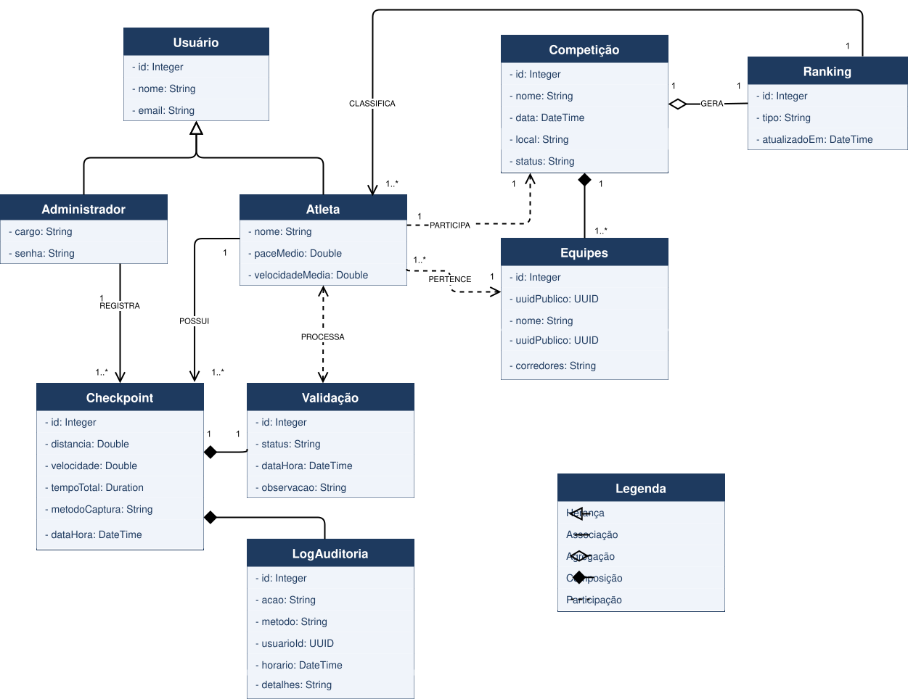
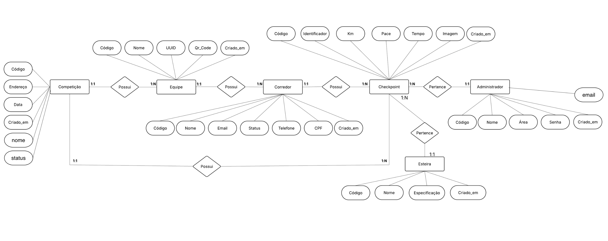

# WAD - Web Application Document - Módulo 2 - Inteli

**_Os trechos em itálico servem apenas como guia para o preenchimento da seção. Por esse motivo, não devem fazer parte da documentação final_**

## Nome do Grupo

#### Ana Clara Tenório Pelegrini
#### Beatriz Okubo Vieira Lima
#### Eduardo Hirohito Izawa Maciel
#### Isabella Sandra Santos
#### Julia Khristina de Oliveira Silva Souza
#### Luiza Nicol Giusti Dias Cardoso
#### Mariana Azevedo Silva
#### Vinícius Tavares Castiglia


## Sumário

[1. Introdução](#c1)

[2. Visão Geral da Aplicação Web](#c2)

[3. Projeto Técnico da Aplicação Web](#c3)

[4. Desenvolvimento da Aplicação Web](#c4)

[5. Testes da Aplicação Web](#c5)

[6. Estudo de Mercado e Plano de Marketing](#c6)

[7. Conclusões e trabalhos futuros](#c7)

[8. Referências](c#8)

[Anexos](#c9)

<br>


# <a name="c1"></a>1. Introdução (sprints 1 a 5)

A Red Bull, marca global atuante em eventos esportivos e experiências de marca, é o parceiro deste projeto por meio de seu time de Field Marketing, responsável pela operação do Red Bull 24 Horas, competição anual em que duas equipes de dezesseis corredores se revezam ininterruptamente em esteiras durante vinte e quatro horas, buscando acumular a maior quilometragem total. Atualmente, o registro dos quilômetros percorridos é realizado de forma manual por operadores, que anotam em pranchetas os momentos de início e término de cada turno, além de checkpoints periódicos. Esse processo é suscetível a erros de anotação, distrações humanas e inconsistências, o que compromete a confiabilidade e a rastreabilidade dos resultados finais. Como as esteiras utilizadas no evento não permitem integração direta com dispositivos externos e alternativas como dispositivos vestíveis sincronizados se mostraram inviáveis diante da dinâmica de trocas rápidas entre corredores, a apuração depende exclusivamente de registros humanos, sem mecanismos estruturados de auditabilidade dos dados.

Diante desse cenário, o projeto propõe o desenvolvimento de uma plataforma web de gestão de performance com atualização periódica dos dados ao longo da competição, projetada para uso em iPads posicionados ao lado das esteiras pelos operadores do evento. A solução substitui o registro manual por uma abordagem de automação assistida, na qual o operador captura imagens do visor da esteira por meio de fotografia, e o sistema realiza a extração automática dos dados por meio de reconhecimento óptico de caracteres (OCR). Considerando as limitações de padronização visual das esteiras e as variáveis do ambiente operacional do evento, a viabilidade da solução ainda depende de validações práticas relacionadas à precisão e consistência da leitura automatizada. Os dados extraídos são submetidos à validação humana, com emissão de alertas em caso de inconsistências, garantindo maior confiabilidade e controle sobre o processo de apuração.

A plataforma é dividida em duas interfaces principais: uma área privada de operação, onde os administradores registram checkpoints, corrigem dados extraídos via OCR, acompanham informações detalhadas de cada equipe e gerenciam a dinâmica da competição; e uma área pública por equipe, acessada sem login por meio de uma URL com UUID único entregue ao capitão de cada equipe, responsável pela exibição do ranking, status individual dos atletas e calculadora de descanso durante a competição.

A criação de valor do sistema se concentra em quatro eixos principais: redução de erros no processo de apuração, aumento da confiabilidade e auditabilidade dos dados, ganho de eficiência operacional para a equipe organizadora da Red Bull e disponibilização de informações atualizadas a cada checkpoint operacional da competição.

# <a name="c2"></a>2. Visão Geral da Aplicação Web (sprint 1)

## 2.1. Escopo do Projeto (sprints 1 e 4)

### 2.1.1. Modelo de 5 Forças de Porter (sprint 1)

O modelo das Cinco Forças de Porter constitui um framework de análise estratégica utilizado para avaliar a atratividade e a intensidade competitiva de uma indústria. O posicionamento estratégico de uma organização não depende exclusivamente da concorrência direta, mas da interação entre cinco forças estruturais: a rivalidade entre concorrentes existentes, a ameaça de novos entrantes, a ameaça de produtos ou serviços substitutos, o poder de barganha dos fornecedores e o poder de barganha dos clientes. A aplicação desse modelo permite identificar oportunidades, vulnerabilidades competitivas e fatores críticos para a sustentabilidade de uma solução (Porter, 2008).

No contexto deste projeto, a análise foi aplicada à operação do Red Bull 24 Horas, considerando o desenvolvimento de uma aplicação web para digitalização do processo de registro de quilometragem durante o evento. A solução proposta busca substituir um processo manual suscetível a erros, transformando a coleta operacional em um fluxo digital mais confiável, ágil e escalável.

<div align="center">
  <sub>Figura 1 - Análise das cinco forças de Porter</sub><br>
  <br>
  <sup>Fonte: Elaborado pelos autores (2026).</sup>
</div>

#### 1. Rivalidade entre concorrentes existentes (ALTA)

A rivalidade competitiva neste contexto é considerada alta, pois existem diversas soluções que podem atender parcialmente à necessidade de registro operacional do evento, incluindo ferramentas genéricas de coleta de dados, como Google Forms, Microsoft Excel, aplicativos móveis de coleta de informações e plataformas genéricas de gestão operacional. Embora essas alternativas sejam amplamente acessíveis e de fácil implementação, elas não foram desenvolvidas para atender às particularidades do Red Bull 24 Horas, como uso contínuo por 24 horas, trocas frequentes de operadores e necessidade de registro rápido sob pressão operacional.

O diferencial competitivo da solução proposta reside na sua especialização funcional, sendo projetada especificamente para o fluxo real do evento, priorizando velocidade de uso, padronização dos registros e redução de retrabalho. Para a Red Bull, essa especialização representa um ganho estratégico ao transformar um processo operacional crítico em uma atividade mais confiável e eficiente.

#### 2. Ameaça de novos entrantes (MÉDIA)

A entrada de novos desenvolvedores de soluções digitais neste mercado é relativamente acessível do ponto de vista técnico, uma vez que as ferramentas de desenvolvimento web são amplamente disponíveis. No entanto, a principal barreira competitiva não está na tecnologia em si, mas na capacidade de adaptação ao contexto operacional específico do evento.

O Red Bull 24 Horas apresenta características próprias, tal qual operações contínuas por 24 horas, rotatividade de usuários, pressão por rapidez e necessidade de confiabilidade no registro dos dados, nesse cenário, é possível verificar que esses fatores dificultam a criação de soluções verdadeiramente aderentes sem conhecimento aprofundado da dinâmica operacional. Dessa forma, embora novos entrantes possam desenvolver sistemas similares, a replicação de uma solução efetivamente integrada à realidade do evento representa uma barreira prática relevante.

#### 3. Ameaça de produtos ou serviços substitutos (MUITO ALTA)

A ameaça de substitutos é considerada alta, pois o principal substituto da solução proposta é o próprio método atualmente utilizado pela operação, baseado em registros manuais realizados em pranchetas pelos operadores do evento. Apesar de apresentar limitações relacionadas a erros de preenchimento, retrabalho e ausência de auditabilidade estruturada, esse processo possui vantagens operacionais relevantes, como baixo custo de implementação, independência tecnológica e elevada familiaridade por parte da equipe responsável pela apuração.

Diferentemente de soluções digitais concorrentes, que disputam espaço tecnológico no mercado, o registro manual representa um substituto diretamente integrado à cultura operacional do evento, já consolidado na dinâmica da competição. Nesse contexto, a principal ameaça não é necessariamente tecnológica, mas comportamental, uma vez que a adoção da nova solução depende da percepção clara de ganhos em rapidez, simplicidade, confiabilidade e redução de esforço operacional.

#### 4. Poder de barganha dos fornecedores (BAIXO)

O poder de barganha dos fornecedores é considerado baixo, uma vez que os recursos necessários para o desenvolvimento da solução são predominantemente tecnológicos, incluindo serviços de hospedagem, infraestrutura web, frameworks de desenvolvimento e bibliotecas de software amplamente disponíveis no mercado.
Esses recursos apresentam alta disponibilidade, baixa diferenciação e facilidade de substituição, reduzindo significativamente a dependência de fornecedores específicos. Além disso, a solução não depende de integrações complexas com hardware proprietário ou tecnologias exclusivas, o que amplia a flexibilidade técnica e financeira do projeto.


#### 5. Poder de barganha dos clientes (MUITO ALTO)

A principal área demandante da solução corresponde ao time operacional de Field Marketing da Red Bull, responsável pelo registro dos dados durante o evento. Esse grupo exerce elevado poder de barganha, pois a adoção da ferramenta depende diretamente da sua aceitação em um ambiente caracterizado por alta pressão operacional, rapidez na tomada de decisão e necessidade de execução contínua. O custo de substituição é praticamente inexistente, uma vez que o método manual atualmente utilizado pode ser retomado a qualquer momento sem impactos financeiros ou contratuais. Além disso, qualquer aumento de complexidade, lentidão ou dificuldade de uso pode comprometer diretamente a aceitação da solução. Dessa forma, a área demandante exerce não apenas poder de escolha, mas também poder de veto, exigindo que a ferramenta seja comprovadamente mais simples, rápida e confiável do que o processo atual para garantir sua adoção efetiva.

#### Conclusão da análise

A aplicação do modelo das Cinco Forças de Porter evidencia que a solução proposta para o Red Bull 24 Horas está inserida em um contexto de elevada pressão competitiva, especialmente em relação à rivalidade entre soluções alternativas, à resistência comportamental associada aos métodos já consolidados e ao elevado poder de decisão da área demandante. Em contrapartida, a baixa dependência de fornecedores e a especialização operacional da ferramenta criam condições favoráveis para a construção de vantagem competitiva sustentável. Dessa forma, o sucesso da solução não depende exclusivamente de sua viabilidade técnica, mas principalmente de sua capacidade de entregar ganhos reais de usabilidade, confiabilidade e eficiência operacional no contexto específico da Red Bull.

### 2.1.2. Análise SWOT da Instituição Parceira (sprint 1)

A análise SWOT (ou FOFA) é uma ferramenta de planejamento estratégico que permite avaliar fatores internos (forças e fraquezas) e externos (oportunidades e ameaças) que impactam o desempenho de uma organização (Casarotto, 2019). Com base nisso, foi realizada a análise do evento Red Bull 24 Horas, conforme apresentado na Figura 2, considerando seu posicionamento no mercado e relação com concorrentes.

<div align="center">
  <sub>Figura 2 - Análise SWOT </sub><br>
  <br>
  <sup>Fonte: Elaborado pelos autores (2026).</sup>
</div>

#### Forças

  No contexto do evento Red Bull 24 Horas, destacam-se como principais forças a existência de uma dinâmica operacional já consolidada, com regras bem definidas de revezamento, checkpoints periódicos e acompanhamento contínuo das equipes ao longo das 24 horas. Além disso, o evento possui alta capacidade de engajamento entre corredores e running crews, favorecendo a participação ativa do público e a valorização de dados de desempenho durante a competição. A estrutura operacional já estabelecida também favorece a implementação de soluções digitais voltadas à padronização e rastreabilidade do processo de apuração.

#### Fraquezas

   Entre as fraquezas, observa-se a ausência de integração com as esteiras, o que limita a automação da coleta de dados e mantém a dependência de processos manuais. Adicionalmente, a baixa consolidação de dados em tempo real compromete a visibilidade geral da competição e pode impactar a confiabilidade das informações durante o evento, reduzindo a qualidade da experiência em comparação a soluções mais automatizadas adotadas por concorrentes.

#### Oportunidades
No ambiente externo, identificam-se oportunidades relacionadas ao uso estratégico de dados para geração de valor em marketing, mídia e engajamento do público, por meio de dashboards e indicadores relevantes. Há potencial de escalabilidade da solução para outros eventos da Red Bull, fortalecendo sua vantagem competitiva. Além disso, a crescente tendência de eventos esportivos orientados a dados e o crescimento das running crews no Brasil ampliam o público-alvo e favorecem a adoção da solução proposta.

#### Ameaças

Entre as ameaças, destacam-se possíveis falhas operacionais ao longo das 24 horas do evento, que podem comprometer o registro correto dos checkpoints e a consolidação da quilometragem total das equipes. Instabilidades técnicas, falhas de conexão ou indisponibilidade momentânea do sistema podem gerar atrasos na sincronização dos dados e impactar diretamente a confiabilidade da apuração durante períodos críticos da competição. Além disso, a existência de processos alternativos já consolidados internamente pode reduzir a adesão à solução proposta, especialmente caso os operadores não percebam ganhos claros de agilidade, simplicidade e confiabilidade em relação ao método atual.

### 2.1.3. Solução (sprints 1 a 5)

#### a) Problema a ser resolvido

Atualmente, o processo de registro de dados dos corredores durante a competição é predominantemente manual, exigindo que operadores realizem anotações periódicas ao longo de 24 horas ininterruptas. Esse modelo gera sobrecarga operacional significativa, além de alta suscetibilidade a erros humanos decorrentes de fadiga, falhas de interpretação e inconsistências de caligrafia. Como consequência, a confiabilidade dos dados é comprometida, impactando diretamente a precisão da apuração, a transparência do evento e a qualidade das análises estratégicas realizadas pela organização.

#### b) Dados disponíveis 

Como base inicial, foi utilizado o site oficial do evento Red Bull 24 Hours, fornecido durante o onboarding, contendo informações institucionais, dinâmica da competição e contexto geral. Complementarmente, foram realizadas interações com o parceiro, nas quais foram identificados os principais fluxos operacionais, limitações do processo atual e requisitos implícitos, especialmente relacionados à necessidade de automatização do registro de checkpoints e à melhoria da confiabilidade dos dados coletados (Red Bull, 2025).

#### c) Solução proposta

Propõe-se o desenvolvimento de uma aplicação web integrada, com foco na automatização da coleta e processamento de dados por meio de tecnologia de Reconhecimento Óptico de Caracteres (OCR). A solução permitirá que operadores capturem imagens dos displays das esteiras, realizando a extração automática das informações relevantes. Além disso, a plataforma contemplará módulos de cadastro de equipes e atletas, atualização periódica dos dados, visualização de rankings globais e geração de relatórios analíticos com indicadores de desempenho, garantindo escalabilidade, padronização e maior robustez no processo.

#### d) Forma de utilização da solução

A solução será estruturada em dois ambientes principais: um administrativo e outro público. No ambiente administrativo, acessado por meio de identificadores UUID únicos previamente disponibilizados aos operadores, será possível cadastrar competições, gerenciar equipes e registrar checkpoints por OCR ou entrada manual. No ambiente público, usuários terão acesso a um painel com ranking atualizado periodicamente, desempenho das equipes e métricas relevantes. Ao final da competição, administradores poderão exportar relatórios detalhados para análise estratégica e tomada de decisão.

#### e) Benefícios esperados

A implementação da solução proporcionará significativa redução de erros operacionais, aumento da eficiência no processo de coleta de dados e maior confiabilidade das informações registradas. A disponibilização de métricas periódicamente permitirá melhor acompanhamento do desempenho das equipes durante o evento. Além disso, os relatórios analíticos contribuirão para decisões mais assertivas, melhoria contínua das edições futuras e fortalecimento da experiência dos participantes e da gestão do evento.

#### f) Critério de sucesso e como será avaliado

O sucesso da solução será mensurado por meio de indicadores objetivos, como a redução da taxa de erro nos registros (meta inferior a 1%), aumento da consistência e integridade dos dados e diminuição do tempo de processamento das informações. A avaliação será realizada em conjunto com o parceiro, considerando o impacto operacional durante a execução do evento, a aderência aos requisitos levantados e a qualidade das análises geradas para suporte à tomada de decisão.

### 2.1.4. Value Proposition Canvas (sprint 1): 

O Canvas da Proposta de Valor permite analisar o alinhamento entre as necessidades do cliente e a solução proposta (Osterwalder; Pigneur, 2011). No contexto deste projeto, evidencia-se o encaixe entre as dificuldades enfrentadas por avaliadores e organizadores no processo de coleta, registro e apuração de dados em competições e a solução proposta, baseada na automatização por meio de reconhecimento óptico de caracteres (OCR) e disponibilização de informações em tempo real. Essa abordagem está alinhada ao uso de tecnologias digitais para aumento de eficiência operacional e redução de erros em processos manuais, amplamente discutido na literatura de transformação digital (Vial, 2019).

A seguir, a Figura 3 ilustra o Canva de Proposta de Valor desenvolvido para o projeto em análise.

<div align="center">
  <sub>Figura 3 - Value Proposition Canvas da Solução </sub><br>
  <br>
  <sup>Fonte: Elaborado pelo próprio grupo (2026).</sup>
</div>

#### A. Perfil do Cliente

Na primeira parte do Canvas da Proposta de Valor é analisado o cenário e o perfil em que o cliente já se encontra. Aqui, é possível explorar quais são as dores do cliente, suas tarefas no contexto atual e o que eles buscam ganhar.

**Tarefas do Cliente**

- Monitorar o desempenho das equipes durante a competição
- Registrar e validar os dados coletados nos checkpoints
- Garantir a consistência e confiabilidade das informações registradas
- Consolidar os dados operacionais da competição
- Acompanhar o tempo e a quilometragem total de cada equipe
- Realizar a apuração final dos resultados de forma eficiente

**Dores do Cliente**
- Processo repetitivo e cansativo
- Risco de erros humanos durante a coleta e digitação dos dados
- Dificuldade na revisão, validação e apuração das informações
- Incerteza quanto à precisão e consistência dos dados coletados
- Falta de visão consolidada e organizada do evento

**Ganhos**
- Menos demanda para os avaliadores
- Automatização do processo de registro e processamento de dados
- Redução de erros operacionais
- Maior confiablidade e precisão das informações
- Maior eficiência operacional durante o evento
- Visão consolidada e organizada do andamento da competição.

#### B. Mapa de Valor

Os elementos do mapa de valor foram estruturados para responder diretamente às dores identificadas e potencializar os ganhos esperados pelos usuários.

**Produtos e Serviços**

A solução proposta oferece os seguintes elementos:

* Plataforma digital de gestão de performance com atualização periódica dos dados
* Sistema de captura de imagens e extração automática de dados por OCR
* Dashboard para visualização de métricas e desempenho por equipe
* Sistema de validação híbrida dos dados (automática e manual)

**Aliviadores de Dores**

A solução atua diretamente na redução das dificuldades enfrentadas pelos usuários:

* Eliminação do registro manual em papel e da digitação em planilhas
* Redução de erros humanos na coleta, registro e processamento dos dados
* Simplificação do processo de revisão, validação e apuração das informações
* Centralização das informações em uma única plataforma
* Aumento da confiabilidade dos dados por meio de validação híbrida

**Criadores de Ganho**

Além de resolver problemas, a solução potencializa ganhos relevantes:

* Geração de informações atualizadas periodicamente para acompanhamento da competição
* Geração de uma visão consolidada e organizada dos dados do evento
* Aumento da produtividade da equipe organizadora
* Apoio à gestão operacional por meio de dados confiáveis e consolidados
* Melhoria da experiência operacional dos avaliadores durante o evento

A partir da análise do Value Proposition Canvas, observa-se que a solução proposta está diretamente alinhada às necessidades dos avaliadores e organizadores, ao automatizar o processo de coleta e registro de dados por meio de OCR, reduzindo erros humanos e esforço operacional. Além disso, a centralização e disponibilização periódica das informações caracterizam uma automação do fluxo de dados, proporcionando maior confiabilidade, eficiência e suporte à tomada de decisão, garantindo uma gestão mais precisa e organizada da competição.

### 2.1.5. Matriz de Riscos do Projeto (sprint 1)

A Matriz de Riscos é uma ferramenta de gestão utilizada para identificar, analisar e priorizar eventos que possam impactar negativamente o desenvolvimento e a execução de um projeto. Por meio da avaliação da probabilidade de ocorrência e do nível de impacto de cada risco, torna-se possível classificá-los conforme sua criticidade e definir estratégias preventivas, corretivas ou de contingência, reduzindo incertezas e aumentando as chances de sucesso do projeto (PMI, 2021).

No contexto deste projeto, a Matriz de Riscos é aplicada para antecipar possíveis desafios relacionados à implementação da solução de captura e processamento periódico de dados durante eventos esportivos da Red Bull GmbH. Considerando fatores técnicos, operacionais e humanos, a análise dos riscos permite estabelecer planos de resposta capazes de minimizar falhas na coleta, processamento e disponibilização das informações, garantindo maior confiabilidade, desempenho e continuidade operacional da solução proposta.

<div align="center">
  <sub>Figura 4 - Matriz de Risco </sub><br>
  <br>
  <sup>Fonte: Elaborado pelos autores (2026).</sup>
</div>

#### 2.1.5.1 - Matriz de Ameaças

Para identificar e priorizar os principais riscos do projeto, foi elaborada a matriz de risco apresentada no Quadro 1 a seguir.

<p align = "center"> Quadro 1 - Matriz de Risco </p>

| Risco                              | Descrição                                                                 | Probabilidade       | Impacto     | Classificação | Plano de Resposta                                                                 |
|-----------------------------------|---------------------------------------------------------------------------|--------------------|-------------|--------------|-----------------------------------------------------------------------------------|
| Falha no Reconhecimento de Imagem  | O sistema pode não identificar corretamente os dados capturados nas imagens da esteira. | 70% (Alta)         | Muito Alto        | Crítico      | Treinar o modelo com imagens reais do ambiente de operação, realizar testes iterativos e disponibilizar validação manual para casos de inconsistência.          |
| Baixa Qualidade das Imagens       | Iluminação inadequada, movimento ou posicionamento incorreto podem comprometer a captura dos dados.  | 60% (Média)  | Muito Alto        | Crítico      | Padronizar os pontos de captura, definir posicionamento fixo dos dispositivos e realizar testes em diferentes condições de iluminação.      |
| Falha de Conexão com a Internet   | Instabilidade de rede pode interromper o envio ou sincronização dos dados.     | 60% (Média)        | Alto        | Crítico      | Utilizar rede dedicada para operação, implementar armazenamento temporário local e sincronização automática quando a conexão for restabelecida.                   |
| Sobrecarga do Sistema             | Alto volume de acessos ou processamento simultâneo pode reduzir o desempenho da aplicação.  | 50% (Média)        | Alto        | Alto         | Realizar testes de carga, otimizar consultas e monitorar métricas de desempenho antes e durante o evento.                       |
| Erro Humano                       | Operadores podem registrar dados incorretamente ou utilizar funcionalidades inadequadamente.           | 40% (Média)         | Médio  | Alto         | Desenvolver interface intuitiva, criar instruções operacionais e realizar treinamento prévio da equipe.                       |
| Falta de Padronização operacional            | Diferenças nos procedimentos de coleta podem gerar inconsistências nos dados.   | 30% (Baixa)       | Médio       | Médio        | Definir protocolos de operação, validações automáticas e checklist de execução.             |
| Bugs ou falhas de software                            | Erros de implementação podem comprometer funcionalidades específicas do sistema.        | 20% (Baixa)          | Baixo       | Baixo        | Executar testes funcionais, testes de integração e monitoramento contínuo com correções rápidas.                   |

<div align="center">
  <sup>Fonte: Elaborado pelos autores (2026).</sup>
</div>

#### 2.1.5.2 - Matriz de Oportunidades

 De forma complementar, o Quadro 2 a seguir apresenta a matriz de oportunidades identificadas para o projeto.

<div align="center">
  <sub>Quadro 2 - Matriz de oportunidades do projeto</sub>
</div>

| Oportunidade | Descrição | Probabilidade | Impacto | Classificação | Plano de Resposta |
|--------------|----------|--------------|--------|--------------|-------------------|
| Maior precisão nos dados coletados | A substituição do input manual por OCR reduz erros de digitação identificados no risco de erro humano. | 90% (Alta) | Alto | Alta Prioridade | Garantir uma alternativa de entrada manual com validação para evitar inconsistências em casos de falhas do OCR. |
| Melhor acompanhamento operacional do evento | Dados atualizados periodicamente permitem maior visibilidade do andamento da competição, facilitando o monitoramento das equipes e a organização operacional do evento. | 60% (Média) | Alto | Alta Prioridade | Desenvolver interfaces claras e dashboards de rápida interpretação. |
| Aumento da eficiência operacional | A automação reduz atividades manuais e retrabalho da equipe operacional durante o evento. | 90% (Alta) | Muito Alto | Alta Prioridade | Automatizar fluxos operacionais e minimizar entradas manuais. |
| Possível reutilização do sistema | Projeto pode ser reutilizado em outros eventos esportivos da Red Bull. | 10% (Baixa) | Médio | Baixa Prioridade | Estruturar sistema modular e escalável. |
| Menor perda de dados durante o evento | O uso de checkpoints digitais periódicamente permite maior precisão histórica e reduz perdas de dados. | 50% (Média) | Alto | Alta Prioridade | Otimizar o processamento das capturas sem comprometer a estabilidade do sistema. |
| Geração de insights de dados | O armazenamento estruturado permite análises de desempenho, ritmo e comportamento para relatórios pós-evento. | 70% (Alta) | Muito Alto | Média Prioridade | Garantir exportação facilitada de dados (ex: CSV) para auditoria e materiais de marketing. |
<div align="center">
  <sup>Fonte: Elaborado pelos autores (2026).</sup>
</div> 

## 2.2. Personas (sprint 1)

Personas são personagens fictícios criados com base em dados plausíveis que representam um tipo de usuário compatível com o projeto. Elas incluem informações como objetivos, necessidades, frustrações e interesses, auxiliando na compreensão do problema e no desenvolvimento da solução.


<div align="center">
  <sub>Figura 5 - Persona 1: Marina Costa, Coordenadora Operacional</sub><br>
  <br>
  <sup>Fonte: Elaborado pelos autores (2026).</sup>
</div>

#### Informações
<ul>
    <li>Idade: 29 anos;</li>
    <li>Localização: Rio de Janeiro - RJ</li>
    <li>Cargo: Coordenadora operacional do evento RedBull 24 horas</li>
    <li>Gênero: Feminino</li>
</ul>

#### Biografia
Marina Costa tem 29 anos e atua como Coordenadora Operacional em eventos esportivos e ativações de marca, sendo responsável pela organização e execução de dinâmicas em campo. No contexto do Red Bull 24 Horas, acompanha a operação das equipes, monitorando as esteiras e registrando manualmente informações essenciais como entrada e saída dos atletas, quilometragem, pace e os checkpoints gerais da prova de 5 em 5 minutos. 

#### Objetivos
<ul>
    <li>Ser reconhecida como uma coordenadora operacional altamente capacitada</li>
    <li>Garantir registros rápidos </li>
    <li>Ter visão consolidada do evento em tempo real</li>
</ul>

#### Necessidades
<ul>
    <li>Uma interface simples e rápida para registrar trocas e checkpoints</li>
    <li>Visualização clara dos dados dos atletas</li>
    <li>Possibilidade de editar registros em caso de inconsistências</li>
</ul>

#### Frustrações
<ul>
    <li>Pressão operacional nas trocas rápidas entre atletas </li>
    <li>Dificuldade de consolidar dados em tempo real </li>
    <li>Dependência de processos manuais </li>
    <li>Risco de erros ou perda de registros manuais</li>
</ul>

#### Interesses
<ul>
    <li>Tecnologia aplicada à operação</li>
    <li>Ferramentas práticas e intuitivas para gestão em campo</li>
    <li>Soluções que aumentem eficiência e confiabilidade</li>
    <li>Dados e métricas que apoiem tanto a operação quanto performance do evento</li>
</ul> <br>

<div align="center">
  <sub>Figura 6 - Persona 2: Bruno Monteiro, Gerente de Field Marketing</sub><br>
  <br>
  <sup>Fonte: Elaborado pelos autores (2026).</sup>
</div>

#### Informações
<ul>
    <li>Idade: 32 anos;</li>
    <li>Localização: São Paulo - SP </li>
    <li>Cargo: Gerente de Field Marketing da RedBull</li>
    <li>Gênero: Masculino</li>
</ul>

#### Biografia
Bruno Monteiro tem 32 anos e atua como Gerente de Field Marketing, sendo responsável pela supervisão e validação das operações em eventos esportivos da marca. No contexto do Red Bull 24 Horas, o Bruno lidera com uma visão geral da prova e acompanha o desempenho das equipes, garantindo que todos os dados coletados, como quilometragem, pace médio e entradas dos atletas,  estejam consistentes e confiáveis para a análise de resultados no fim da prova. 


#### Objetivos
<ul>
    <li>Monitorar a coleta de dados</li>
    <li>Usar dados para melhorar a competição</li>
    <li>Ver métricas dos participantes </li>
    <li>Garantir confiabilidade dos resultados</li>
</ul>

#### Necessidades
<ul>
    <li>Visualização clara de métricas</li>
    <li>Alertas para inconsistências </li>
    <li>Automatização da coleta de dados</li>
    <li>Relatórios exportáveis para análise pós-evento</li>
</ul>

#### Frustrações
<ul>
    <li>Dependência de registros manuais, sujeitos a erro humano</li>
    <li>Dificuldade em identificar inconsistências </li>
    <li>Falta de resultados em tempo real</li>
    <li>Alto esforço operacional para acompanhar múltiplas equipes simultaneamente</li>
</ul>

#### Interesses
<ul>
    <li>Eficiência e redução de erros</li>
    <li>Tecnologias de automação e monitoramento em tempo real</li>
    <li>Melhoria do evento para globalizá-lo</li>
    <li>Experiência fluida para equipe e para os participantes</li>
</ul> <br>

<div align="center">
  <sub>Figura 7 - Persona 3: Amanda Azevedo, Atleta da RedBull 24 horas</sub><br>
  <br>
  <sup>Fonte: Elaborado pelos autores (2026).</sup>
</div>

#### Informações
<ul>
    <li>Idade: 20 anos;</li>
    <li>Localização: São Paulo - SP</li>
    <li>Cargo: Atleta do RedBull 24 horas</li>
    <li>Gênero: Feminino</li>
</ul>

#### Biografia
Amanda Azevedo tem 20 anos e é participante do Red Bull 24 Horas, integrando uma das equipes da competição. Apaixonada por corrida e desafios de resistência, ela participa do evento buscando performance, superação e espírito coletivo. Durante a prova, realiza turnos curtos e intensos na esteira, com trocas rápidas que exigem foco total na corrida e pouca margem para interrupções. 

#### Objetivos
<ul>
    <li>Ganhar o campeonato </li>
    <li>Maximizar sua performance e contribuição para a equipe  </li>
    <li>Garantir que seus quilômetros sejam registrados corretamente</li>
</ul>

#### Necessidades
<ul>
    <li>Confiar no registro manual </li>
    <li>Visualizar métricas da prova</li>
    <li>Focar no seu desempenho durante a prova</li>
    <li>Fazer troca ágil e sem interferências na corrida</li>
</ul>

#### Frustrações
<ul>
    <li>Fadiga física e mental durante a competição</li>
    <li>Possíveis erros manuais que comprometem o resultado  </li>
    <li>Trocas em poucos segundos </li>
    <li>Mudanças frequentes de velocidade dificultam estimativas manuais de desempenho</li>
</ul>

#### Interesses
<ul>
    <li>Que sua quilometragem seja registrada corretamente</li>
    <li>Acompanhar o desempenho da equipe em tempo real </li>
    <li>Ganhar a competição </li>
</ul> <br>

## 2.3. User Stories (sprints 1 a 5)

User stories são descrições curtas e objetivas de funcionalidades escritas sob a perspectiva do usuário final. Elas seguem geralmente o formato: “Como (papel/perfil), posso (ação/meta), para (benefício/razão)”, com foco no valor entregue e não em detalhes técnicos (Interaction Design Foundation, 2024). Esse modelo é amplamente utilizado em metodologias ágeis, como o Scrum, pois facilita a comunicação entre equipe de desenvolvimento e stakeholders, além de permitir a divisão dos requisitos em partes menores e testáveis.

A partir das user stories, torna-se necessário compreender quem são os usuários que estão sendo representados. Nesse contexto, entram as personas, que são representações fictícias baseadas em dados reais de usuários. Elas descrevem características como necessidades, objetivos, comportamentos e desafios, permitindo que a equipe tenha uma visão mais concreta do público-alvo (Nielsen Norman Group, 2024). Dessa forma, as decisões de design e desenvolvimento passam a ser guiadas por perfis realistas, garantindo maior alinhamento com as expectativas dos usuários e contribuindo para soluções mais eficazes e centradas na experiência.

Com as user stories definidas e as personas estabelecidas, é necessário garantir que as funcionalidades descritas estejam claras e possam ser validadas. Para isso, utilizam-se os critérios de aceitação, que são condições específicas, mensuráveis e verificáveis que determinam quando uma user story pode ser considerada concluída (Tymoshchenko, 2023). Esses critérios reduzem ambiguidades, facilitam testes e garantem que o sistema desenvolvido atenda às expectativas do usuário. Por exemplo, um critério de aceitação pode ser: “Dado que o usuário adiciona um produto ao carrinho de compras (ambiente digital), quando ele acessa o carrinho, então o item deve ser exibido com o nome, quantidade e preço corretos”.

Além dos critérios de aceitação, há mais uma bússola que norteia a equipe no momento de definir as user stories, garantindo qualidade e relevância ao projeto: os critérios INVEST (Independent, Negotiable, Valuable, Estimable, Small, Testable) (Ben Salem, 2023). De modo geral, cada US precisa ser independente, ou seja, não deve depender de outras para gerar valor; negociável, permitindo ajustes conforme o entendimento do projeto evolui; valiosa, entregando benefícios claros ao usuário; estimável, possibilitando que o time dimensione o esforço necessário e gerencie o cronograma de entregas; pequena, de modo que possa ser implementada em uma única iteração, facilitando a implementação e o acompanhamento; e testável, garantindo que seja possível verificar objetivamente se foi concluída com sucesso.

Sendo assim, por meio das user stories, mantém-se o foco no valor gerado ao usuário, além de orientar a priorização das tarefas e facilitar a comunicação entre stakeholders e desenvolvedores. Elas também servem como referência para a definição e compreensão dos requisitos funcionais e não funcionais do projeto, evidenciando as necessidades do usuário por meio de entregas objetivas. Além disso, contribuem para o planejamento iterativo, auxiliam na estimativa de esforço das atividades e permitem a validação contínua das funcionalidades por meio de critérios de aceitação, favorecendo a adaptação do produto conforme o feedback obtido ao longo do desenvolvimento.

A seguir, são apresentadas as histórias de usuário definidas até o momento para o projeto em análise.

<div align="center">
  <sub>Quadro 3 - User Story 1 </sub>
</div>

| Identificação | US01 |
---| ---
| **Persona** | Bruno Monteiro (Gerente de Field Marketing) |
| **User Story** | "Como Bruno Monteiro, Gerente de Field Marketing, posso acessar o painel do admin, para gerenciar a competição e acessar todas as funcionalidades do sistema de forma centralizada." |
| **Critério de aceite 1** | CR1: O sistema deve permitir o acesso ao painel do admin em ambiente controlado. **Teste**: Dado que o administrador acessa o sistema, quando entra na plataforma, então deve ser direcionado ao painel do admin. |
| **Critério de aceite 2** | CR2: O painel deve exibir as principais seções do sistema. **Teste**: Dado que o admin acessa o painel, quando a página carrega, então deve visualizar opções como "criar competição", "equipes", "ranking" e "relatórios". |
| **Critério de aceite 3** | CR3: O painel deve exibir o estado atual do sistema (com ou sem competição). **Teste**: Dado que não há competição cadastrada, quando o painel é exibido, então deve mostrar a opção "Criar competição". Além disso, dado que existe uma competição cadastrada, quando o painel é exibido, então deve mostrar status, tempo e equipes. |
| Critérios INVEST | Independente: Esta US não depende de outras para ser desenvolvida, pois o painel do admin pode ser construído sem que o sistema de login ou o ranking estejam finalizados. <br> Negociável: A forma de acesso ao painel e as seções exibidas podem ser redefinidas conforme as necessidades identificadas durante o projeto. <br> Valorosa: Centraliza o controle do sistema, oferecendo ao administrador um ponto único de acesso a todas as funcionalidades da competição. <br> Estimável: Escopo claro e limitado a uma tela principal com exibição condicional de estado. <br> Pequena: Compreende apenas a tela principal do admin e sua lógica de exibição de estado. <br> Testável: Os comportamentos de redirecionamento e exibição condicional são verificáveis objetivamente para cada estado do sistema. |

<div align="center">
  <sup>Fonte: Elaborado pelos autores (2026).</sup>
</div> 

<div align="center">
  <sub>Quadro 4 - User Story 2 </sub>
</div>

| Identificação | US02 |
---| ---
| **Persona** | Bruno Monteiro (Gerente de Field Marketing) |
| **User Story** | "Como Bruno Monteiro, Gerente de Field Marketing, posso cadastrar uma nova competição com data e localização, para estruturar e iniciar um evento de corrida." |
| **Critério de aceite 1** | CR1: O sistema deve permitir o preenchimento dos dados do evento. **Teste**: Dado que o admin acessa o formulário, quando preenche nome, data e local, então os campos devem aceitar os valores corretamente. |
| **Critério de aceite 2** | CR2: O sistema deve validar campos obrigatórios. **Teste**: Dado que há campos vazios, quando o admin tenta criar o evento, então o sistema deve impedir a criação e exibir erro. |
| **Critério de aceite 3** | CR3: O sistema deve criar o evento com status inicial. **Teste**: Dado que os dados são válidos, quando o admin confirma, então o evento deve ser criado com status "não iniciado". |
| Critérios INVEST | Independente: Esta US não depende de outras para ser desenvolvida, pois o formulário de cadastro pode ser construído de forma isolada. <br> Negociável: Os campos do formulário podem ser revisados conforme necessidade do projeto. <br> Valorosa: É a base do sistema, pois sem um evento cadastrado nenhuma outra funcionalidade pode ser utilizada. <br> Estimável: Escopo claro e limitado a um formulário com validações simples. <br> Pequena: Compreende apenas um formulário de criação de evento. <br> Testável: Validações bem definidas permitem testes objetivos de cada critério. |

<div align="center">
  <sup>Fonte: Elaborado pelos autores (2026).</sup>
</div> 

<div align="center">
  <sub>Quadro 5 - User Story 3 </sub>
</div>

| Identificação | US03 |
---| ---
| **Persona** | Bruno Monteiro (Gerente de Field Marketing) |
| **User Story** | "Como Bruno Monteiro, Gerente de Field Marketing, posso cadastrar e editar equipes com seus atletas, para garantir que todos os participantes estejam registrados corretamente." |
| **Critério de aceite 1** | CR1: O sistema deve permitir criar uma equipe. **Teste**: Dado que o admin insere nome e líder, quando salva, então a equipe deve aparecer na lista. |
| **Critério de aceite 2** | CR2: O sistema deve permitir adicionar atletas. **Teste**: Dado que o admin adiciona atletas à equipe, quando salva, então os atletas devem estar corretamente vinculados à equipe. |
| **Critério de aceite 3** | CR3: O sistema deve permitir edição e remoção de atletas. **Teste**: Dado que o admin altera ou remove dados de um atleta, quando salva, então as mudanças devem ser refletidas corretamente na equipe. |
| **Critério de aceite 4** | CR4: Quando não há equipes cadastradas, a tela deve exibir um botão de adição com instrução visual. **Teste**: Dado que o admin acessa /admin/equipes sem nenhuma equipe cadastrada, quando a página carrega, então deve exibir o botão "+ Adicionar equipe" acompanhado de instrução visual, sem exibir uma lista vazia. |
| Critérios INVEST | Independente: Esta US pode ser desenvolvida sem depender de outras funcionalidades, pois o cadastro de equipes é uma operação isolada. <br> Negociável: A estrutura dos dados da equipe, como campos obrigatórios e opcionais, pode ser ajustada conforme as necessidades do projeto. <br> Valorosa: É essencial para o funcionamento da competição, pois sem equipes e atletas cadastrados nenhuma corrida pode ser realizada. <br> Estimável: Trata-se de um CRUD simples com escopo bem definido. <br> Pequena: Compreende apenas as operações de criação, edição e remoção dentro do cadastro de equipes. <br> Testável: Cada operação de CRUD possui comportamento verificável e resultado esperado claro. |

<div align="center">
  <sup>Fonte: Elaborado pelos autores (2026).</sup>
</div> 

<div align="center">
  <sub>Quadro 6 - User Story 4 </sub>
</div>

| Identificação | US04 |
---| ---
| **Persona** | Bruno Monteiro (Gerente de Field Marketing) |
| **User Story** | "Como Bruno Monteiro, Gerente de Field Marketing, posso acessar relatórios detalhados da competição, para analisar desempenho e inconsistências." |
| **Critério de aceite 1** | CR1: O sistema deve exibir relatórios da competição. **Teste**: Dado que o admin acessa a seção de relatórios, quando seleciona um tipo — visão geral da competição, relatório por equipe ou relatório de inconsistências —, então os dados correspondentes devem ser exibidos corretamente. |
| **Critério de aceite 2** | CR2: O sistema deve identificar e listar inconsistências. **Teste**: Dado que existem divergências entre os dados capturados via OCR e os inseridos manualmente, quando o relatório de inconsistências é gerado, então o sistema deve listar todas as ocorrências identificadas. |
| **Critério de aceite 3** | CR3: O sistema deve permitir a exportação dos dados. **Teste**: Dado que o admin solicita a exportação de um relatório, quando executa a ação, então o sistema deve gerar e disponibilizar um arquivo CSV com os dados correspondentes. |
| Critérios INVEST | Independente: Esta US pode ser desenvolvida de forma isolada, pois a geração de relatórios não depende de outras funcionalidades estarem finalizadas. <br> Negociável: Os tipos de relatório, filtros disponíveis e formatos de exportação podem evoluir conforme as necessidades identificadas durante o projeto. <br> Valorosa: Gera insights estratégicos para o administrador, permitindo análise de desempenho e identificação de problemas durante a competição. <br> Estimável: Possui complexidade média, com escopo definido em exibição, identificação de inconsistências e exportação de dados. <br> Pequena: É modular e pode ser dividida em partes — exibição de relatórios, detecção de inconsistências e funcionalidade de exportação. <br> Testável: Cada critério possui resultados verificáveis e comportamentos esperados claramente definidos. |

<div align="center">
  <sup>Fonte: Elaborado pelos autores (2026).</sup>
</div> 

<div align="center">
  <sub>Quadro 7 - User Story 5 </sub>
</div>

| Identificação | US05 |
---| ---
| **Persona** | Bruno Monteiro (Gerente de Field Marketing) |
| **User Story** | "Como Bruno Monteiro, Gerente de Field Marketing, posso gerar uma URL única (UUID) automaticamente ao cadastrar uma equipe, para que o link possa ser distribuído ao capitão da equipe sem necessidade de login." |
| **Critério de aceite 1** | CR1: O sistema deve gerar automaticamente um UUID ao salvar uma equipe. **Teste**: Dado que o administrador clica em "Salvar equipe" no modal de criação, quando a equipe é salva, então o sistema deve gerar um UUID único e exibi-lo na tela com um botão "Copiar link". Além disso, dado que dois cadastros distintos são realizados, quando comparados, então os UUIDs gerados devem ser diferentes. |
| **Critério de aceite 2** | CR2: O UUID e o botão "Copiar link" devem estar visíveis no card da equipe na listagem. **Teste**: Dado que o admin navega para a tela de equipes, quando a página carrega, então cada card deve exibir seu UUID e o botão "Copiar link". Além disso, dado que o admin clica em "Copiar link", quando a ação é executada, então o link deve ser copiado corretamente para a área de transferência. |
| **Critério de aceite 3** | CR3: O UUID não deve expirar enquanto o evento estiver ativo. **Teste**: Dado que o evento está em andamento, quando o link gerado é acessado, então a página deve carregar corretamente. |
| Critérios INVEST | Independente: Esta US não depende de outras para ser desenvolvida, pois a geração do UUID ocorre de forma isolada no momento do cadastro da equipe. <br> Negociável: A implementação pode ser simplificada ou refinada em conjunto com o parceiro e os demais envolvidos no projeto. <br> Valorosa: Elimina a necessidade de login para a equipe, facilitando o acesso ao painel sem barreiras de autenticação. <br> Estimável: O fluxo de geração do UUID no momento do cadastro é claro e bem delimitado. <br> Pequena: Escopo limitado à geração, exibição e cópia do link. <br> Testável: O comportamento é verificável via criação de equipes e acesso ao link gerado. |

<div align="center">
  <sup>Fonte: Elaborado pelos autores (2026).</sup>
</div> 

<div align="center">
  <sub>Quadro 8 - User Story 6 </sub>
</div>

| Identificação | US06 |
---| ---
| **Persona** | Bruno Monteiro (Gerente de Field Marketing) |
| **User Story** | "Como Bruno Monteiro, Gerente de Field Marketing, posso acessar a aba de equipes pelo menu de navegação ou pelo card de atalho na Home, para gerenciar o cadastro de equipes e atletas da competição." |
| **Critério de aceite 1** | CR1: O menu fixo deve exibir o item "Equipes" em todas as telas do admin e redirecionar corretamente. **Teste**: Dado que o admin está em qualquer tela do sistema, quando clica em "Equipes" no menu fixo, então deve ser redirecionado para /admin/equipes e o item deve ficar destacado como ativo no menu. |
| **Critério de aceite 2** | CR2: O card "Gerenciar equipes" na Home deve redirecionar para a tela de gestão de equipes. **Teste**: Dado que o admin está na Home, quando clica no card "Gerenciar equipes", então deve ser redirecionado para /admin/equipes. |
| Critérios INVEST | Independente: Esta US não depende de outros fluxos, pois a navegação até a tela de equipes pode ser desenvolvida de forma isolada. <br> Negociável: Os atalhos, ícones e rótulos do menu podem ser ajustados conforme necessidade do projeto. <br> Valorosa: Centraliza o gerenciamento de equipes e oferece acesso rápido por dois pontos de entrada distintos. <br> Estimável: O padrão de navegação é bem definido e de complexidade baixa. <br> Pequena: Escopo limitado à navegação entre telas por dois pontos de entrada distintos, sem envolver lógica de exibição de conteúdo ou estado da listagem. <br> Testável: As rotas e os estados de tela são verificáveis objetivamente. |

<div align="center">
  <sup>Fonte: Elaborado pelos autores (2026).</sup>
</div> 

<div align="center">
  <sub>Quadro 9 - User Story 7 </sub>
</div>

| Identificação | US07 |
---| ---
| **Persona** | Marina Costa (Coordenadora Operacional) |
| **User Story** | "Como Marina Costa, Coordenadora Operacional, posso clicar no botão 'Acessar competição' no card de uma equipe, para abrir o painel operacional completo da equipe e gerenciar os registros em tempo real." |
| **Critério de aceite 1** | CR1: O sistema deve navegar para o painel operacional da equipe selecionada ao clicar em "Acessar competição". **Teste**: Dado que o admin clica em "Acessar competição" no card de uma equipe, quando a navegação ocorre, então o sistema deve exibir o painel em /admin/equipes/operacional com os dados da equipe correta. |
| **Critério de aceite 2** | CR2: O painel operacional deve conter os três blocos definidos na especificação. **Teste**: Dado que o admin abre o painel operacional, quando a página carrega, então devem estar presentes a área de controle do juiz, o fluxo de registro de checkpoint e a tabela de dados da equipe. Além disso, o dropdown de atletas deve listar todos os membros da equipe selecionada. |
| Critérios INVEST | Independente: Esta US depende apenas do cadastro prévio da equipe, sendo desenvolvível de forma isolada após essa etapa. <br> Negociável: O layout e a organização dos blocos do painel podem ser reorganizados conforme feedback do parceiro. <br> Valorosa: É a tela operacional principal da competição, centralizando o controle em tempo real. <br> Estimável: Escopo bem delimitado pela especificação, com dois critérios de aceite claros. <br> Pequena: Limitada ao acesso e ao carregamento correto do painel operacional. <br> Testável: A navegação e a presença dos componentes são verificáveis objetivamente. |

<div align="center">
  <sup>Fonte: Elaborado pelos autores (2026).</sup>
</div> 

<div align="center">
  <sub>Quadro 10 - User Story 8 </sub>
</div>

| Identificação | US08 |
---| ---
| **Persona** | Marina Costa (Coordenadora Operacional) |
| **User Story** | "Como Marina Costa, Coordenadora Operacional, posso selecionar o atleta ativo na tela de checkpoint, para controlar com precisão quem está em corrida." |
| **Critério de aceite 1** | CR1: O dropdown deve exibir todos os atletas da equipe com seu status atual. **Teste**: Dado que o juiz abre o dropdown na tela de checkpoint, quando a lista é exibida, então todos os atletas da equipe devem aparecer com seu respectivo status — Em corrida, Em descanso ou Pronto para entrar — visível ao lado do nome. |
| **Critério de aceite 2** | CR2: Os botões de status devem ser atualizados automaticamente após a troca de atleta. **Teste**: Dado que o juiz clica em "Trocar atleta" e confirma a entrada do próximo atleta, quando a ação é concluída, então o atleta anterior deve ter seu status alterado para "Em descanso" e o atleta atual para "Em corrida". |
| Critérios INVEST | Independente: Esta US funciona de forma independente do fluxo OCR e pode ser desenvolvida separadamente. <br> Negociável: O número de status possíveis e o fluxo de troca podem ser expandidos ou ajustados conforme necessidade. <br> Valorosa: Garante controle preciso da operação durante a prova, evitando inconsistências no registro de atletas. <br> Estimável: O fluxo de seleção e troca de atletas é bem definido e de complexidade controlada. <br> Pequena: Limitada ao controle de atleta ativo, sem envolver o registro de performance. <br> Testável: Os estados dos atletas após cada ação são verificáveis objetivamente. |

<div align="center">
  <sup>Fonte: Elaborado pelos autores (2026).</sup>
</div> 

<div align="center">
  <sub>Quadro 11 - User Story 9 </sub>
</div>

| Identificação | US09 |
---| ---
| **Persona** | Marina Costa (Coordenadora Operacional) |
| **User Story** | "Como Marina Costa, Coordenadora Operacional, posso fotografar a tela da esteira durante a corrida, para que o sistema extraia automaticamente os dados de performance via OCR e os registre no checkpoint do atleta." |
| **Critério de aceite 1** | CR1: O sistema deve capturar a imagem e extrair os dados via OCR. **Teste**: Dado que o admin clica em "Tirar foto da esteira", quando a câmera integrada é aberta e a foto é capturada, então o sistema deve exibir o preview da imagem ao lado dos dados extraídos — distância (km), pace (min/km) e tempo total. |
| **Critério de aceite 2** | CR2: O sistema deve alertar visualmente quando o valor extraído apresentar discrepância. **Teste**: Dado que o OCR extrai um valor que diverge da média histórica do atleta ou da meta da prova, quando o dado é exibido, então o campo deve ser marcado em vermelho com mensagem de alerta. Além disso, dado que o valor está dentro do esperado, quando exibido, então nenhum alerta deve ser apresentado. |
| **Critério de aceite 3** | CR3: O sistema deve registrar se o dado foi confirmado via OCR ou corrigido manualmente. **Teste**: Dado que o juiz confirma o dado extraído pelo OCR, quando salvo, então o log de auditoria deve registrar o método como "OCR". Além disso, dado que o juiz corrige o dado manualmente, quando salvo, então o log deve registrar o método como "manual". |
| Critérios INVEST | Independente: O fluxo OCR é autossuficiente; o modo de entrada manual é tratado como US separada. <br> Negociável: A engine de OCR utilizada e o limiar de discrepância podem ser ajustados conforme os resultados obtidos em testes. <br> Valorosa: Elimina erros de digitação e agiliza o registro de checkpoints durante a competição. <br> Estimável: O fluxo de cinco etapas — captura, extração, alerta, revisão e confirmação — está bem especificado. <br> Pequena: Limitada à captura, extração e confirmação de um único checkpoint. <br> Testável: Os dados extraídos, os alertas de discrepância e os logs de auditoria são verificáveis objetivamente. |

<div align="center">
  <sup>Fonte: Elaborado pelos autores (2026).</sup>
</div> 

<div align="center">
  <sub>Quadro 12 - User Story 10 </sub>
</div>

| Identificação | US10 |
---| ---
| **Persona** | Marina Costa (Coordenadora Operacional) |
| **User Story** | "Como Marina Costa, Coordenadora Operacional, posso registrar um checkpoint manualmente digitando os dados quando a câmera falhar ou a foto estiver ilegível, para que nenhum registro seja perdido por falha técnica." |
| **Critério de aceite 1** | CR1: O modo manual deve disponibilizar um formulário com os campos de distância, pace e tempo total. **Teste**: Dado que o admin acessa o modo de entrada manual, quando preenche os campos de distância (km), pace (min/km) e tempo total e clica em "Salvar registro manual", então os dados devem ser salvos corretamente no checkpoint da equipe e do atleta. |
| **Critério de aceite 2** | CR2: O sistema deve registrar automaticamente que o checkpoint foi inserido em modo manual. **Teste**: Dado que o admin salva um registro pelo modo manual, quando o dado é persistido, então o log de auditoria deve exibir a flag "manual" para distingui-lo dos registros inseridos via OCR. |
| Critérios INVEST | Independente: É o caminho de contingência do sistema e pode ser desenvolvido de forma independente do fluxo OCR. <br> Negociável: Os campos disponíveis no modo manual podem ser expandidos conforme necessidade identificada durante o projeto. <br> Valorosa: Garante continuidade operacional em situações de falha técnica, evitando perda de registros durante a competição. <br> Estimável: Trata-se de um formulário simples com campos bem definidos e comportamento claro. <br> Pequena: Escopo limitado à entrada e ao salvamento manual de um único checkpoint. <br> Testável: Os dados salvos e a flag de método no log de auditoria são verificáveis objetivamente. |

<div align="center">
  <sup>Fonte: Elaborado pelos autores (2026).</sup>
</div> 

<div align="center">
  <sub>Quadro 13 - User Story 11 </sub>
</div>

| Identificação | US11 |
---| ---
| **Persona** | Marina Costa (Coordenadora Operacional) |
| **User Story** | "Como Marina Costa, Coordenadora Operacional, posso visualizar uma tabela com os dados consolidados da equipe que se atualiza automaticamente a cada 5 minutos, para acompanhar a evolução da performance sem precisar recarregar a página." |
| **Critério de aceite 1** | CR1: A tabela deve exibir os dados consolidados da equipe com todos os campos definidos. **Teste**: Dado que o admin registra um checkpoint, quando a tabela é exibida, então devem estar presentes os últimos checkpoints registrados com timestamp e atleta, o pace médio atualizado, a distância total acumulada e o tempo total ativo, todos com valores coerentes. |
| **Critério de aceite 2** | CR2: A tabela deve ser atualizada automaticamente a cada 5 minutos sem ação do usuário. **Teste**: Dado que um novo checkpoint é registrado, quando o intervalo de 5 minutos é atingido, então o novo registro deve aparecer na tabela sem que o admin recarregue a página. Além disso, deve ser exibido um indicador visual ou timestamp da última atualização. |
| **Critério de aceite 3** | CR3: Os valores de pace médio e distância total devem ser recalculados corretamente a cada atualização. **Teste**: Dado que múltiplos checkpoints foram registrados, quando a tabela é atualizada, então o pace médio deve corresponder à média ponderada correta e a distância total deve ser a soma de todos os checkpoints da sessão. |
| Critérios INVEST | Independente: Esta US depende apenas dos checkpoints já registrados, podendo ser desenvolvida de forma isolada. <br> Negociável: O intervalo de atualização de 5 minutos pode ser tornado configurável em versões futuras. <br> Valorosa: Oferece ao juiz uma visão consolidada e atualizada da performance da equipe em tempo real. <br> Estimável: A lógica de auto-refresh e os cálculos de métricas estão bem definidos. <br> Pequena: Limitada à exibição e à atualização automática da tabela de dados. <br> Testável: Os dados exibidos, o timing do refresh e os cálculos de métricas são verificáveis objetivamente. |

<div align="center">
  <sup>Fonte: Elaborado pelos autores (2026).</sup>
</div> 

<div align="center">
  <sub>Quadro 14 - User Story 12 </sub>
</div>

| Identificação | US12 |
---| ---
| **Persona** | Amanda Azevedo (Atleta) |
| **User Story** | "Como Amanda Azevedo, atleta da competição, posso acessar a URL única da minha equipe (UUID) sem necessidade de login, para visualizar as informações da equipe em tempo real diretamente pelo link recebido do administrador." |
| **Critério de aceite 1** | CR1: O painel deve ser acessível publicamente sem exigir autenticação. **Teste**: Dado que qualquer pessoa acessa o link em modo anônimo ou aba privada, quando a URL é carregada, então a tela deve ser exibida corretamente sem campos de login ou solicitação de senha. Além disso, dado que um UUID inválido é acessado, quando a requisição é feita, então o sistema deve exibir uma mensagem de erro. |
| **Critério de aceite 2** | CR2: A tela deve exibir apenas os dados correspondentes à equipe vinculada ao UUID acessado. **Teste**: Dado que dois links de equipes diferentes são acessados, quando cada um é carregado, então cada painel deve exibir exclusivamente os dados da equipe correta, sem expor informações de outras equipes. |
| Critérios INVEST | Independente: Esta US depende apenas do UUID gerado pelo administrador, sendo desenvolvível de forma isolada. <br> Negociável: O tempo de expiração do link pode ser configurável em versões futuras do sistema. <br> Valorosa: Elimina barreiras de acesso para corredores e torcida, permitindo acompanhamento em tempo real sem cadastro. <br> Estimável: O comportamento de rota pública está bem definido e é de complexidade baixa. <br> Pequena: Limitada ao acesso e ao carregamento inicial da tela pública da equipe. <br> Testável: O acesso sem autenticação e a exibição correta dos dados são verificáveis objetivamente. |

<div align="center">
  <sup>Fonte: Elaborado pelos autores (2026).</sup>
</div> 

<div align="center">
  <sub>Quadro 15 - User Story 13 </sub>
</div>

| Identificação            | US13  |
| ------------------------ | ------------------------------------------------------------------------------------------------------------------------------------------------------------------------------------------------------------------------------------------------------------------------------------------------------------------------------------------------------------------------------------------------------------------------------------------------------------------------------------------------------------------------------------------------------------------------ |
| **Persona**              | Amanda Azevedo (Atleta)   |
| **User Story**           | "Como Amanda Azevedo, atleta da competição, posso visualizar o ranking global da competição no painel da equipe, para acompanhar a posição da minha equipe durante o evento."  |
| **Critério de aceite 1** | CR1: O painel deve exibir o ranking global com atualização automática a cada 1 hora. **Teste**: Dado que a atleta acessa o painel, quando a página carrega, então devem ser exibidos a posição atual da equipe, a distância para o líder e a diferença para a equipe na posição anterior.  |
| **Critério de aceite 2** | CR2: O ranking não deve ser atualizado antes do intervalo definido. **Teste**: Dado que menos de 1 hora se passou desde a última atualização, quando o painel é acessado novamente, então o ranking exibido deve permanecer inalterado. |
| Critérios INVEST         | Independente: O ranking pode ser desenvolvido separadamente das demais funcionalidades do painel público. <br> Negociável: As métricas exibidas no ranking podem ser alteradas conforme feedback dos usuários. <br> Valorosa: Permite que a atleta acompanhe o desempenho geral da equipe durante a competição. <br> Estimável: O comportamento de atualização e exibição do ranking é claro e bem delimitado. <br> Pequena: Escopo limitado à exibição do ranking global. <br> Testável: Os dados exibidos e o intervalo de atualização são verificáveis objetivamente. |


<div align="center">
  <sup>Fonte: Elaborado pelos autores (2026).</sup>
</div> 

<div align="center">
  <sub>Quadro 16 - User Story 14 </sub>
</div>

| Identificação            | US14 |
| ------------------------ | ---------------------------------------------------------------------------------------------------------------------------------------------------------------------------------------------------------------------------------------------------------------------------------------------------------------------------------------------------------------------------------------------------------------------------------------------------------------------------------------------------------------------------------------------------------------- |
| **Persona**              | Amanda Azevedo (Atleta) |
| **User Story**           | "Como Amanda Azevedo, atleta da competição, posso visualizar o status individual e as métricas dos atletas da minha equipe, para acompanhar o desempenho coletivo durante a prova." |
| **Critério de aceite 1** | CR1: O painel deve exibir os dados individuais dos atletas da equipe. **Teste**: Dado que a atleta acessa o painel, quando a página carrega, então devem estar presentes pace médio geral, velocidade máxima, distância acumulada, timestamp do último checkpoint, tempo parado desde o último turno e status atual de cada atleta. |
| **Critério de aceite 2** | CR2: Os dados devem refletir novos checkpoints registrados. **Teste**: Dado que um checkpoint é registrado pelo administrador, quando o painel é atualizado, então os dados do atleta correspondente devem refletir as novas informações.|
| Critérios INVEST         | Independente: A exibição das métricas dos atletas pode ser desenvolvida independentemente do ranking e da calculadora de descanso. <br> Negociável: As métricas exibidas podem ser ajustadas conforme necessidade do parceiro. <br> Valorosa: Permite acompanhamento detalhado do desempenho da equipe durante a competição. <br> Estimável: Os campos e comportamentos esperados estão claramente definidos. <br> Pequena: Escopo limitado à visualização de métricas dos atletas. <br> Testável: Todos os campos exibidos podem ser verificados objetivamente. |


<div align="center">
  <sup>Fonte: Elaborado pelos autores (2026).</sup>
</div> 

<div align="center">
  <sub>Quadro 17 - User Story 15 </sub>
</div>

| Identificação            | US15|
| ------------------------ | ------------------------------------------------------------------------------------------------------------------------------------------------------------------------------------------------------------------------------------------------------------------------------------------------------------------------------------------------------------------------------------------------------------------------------------------------------------------------------------------------------------------------ |
| **Persona**              | Amanda Azevedo (Atleta) |
| **User Story**           | "Como Amanda Azevedo, atleta da competição, posso visualizar uma calculadora de descanso inteligente, para entender meu tempo recomendado de recuperação entre turnos." |
| **Critério de aceite 1** | CR1: A calculadora deve exibir indicador visual baseado no estado físico do atleta. **Teste**: Dado que o status do atleta varia, quando o indicador é exibido, então a barra deve mudar de cor conforme o estado — verde, amarelo ou vermelho. |
| **Critério de aceite 2** | CR2: A calculadora deve exibir o tempo recomendado de descanso e a contagem regressiva. **Teste**: Dado que um atleta realizou uma corrida recente e intensa, quando o cálculo é executado, então o sistema deve exibir o tempo recomendado de descanso acompanhado de contagem regressiva. |
| Critérios INVEST         | Independente: A calculadora pode ser implementada sem dependência das demais funcionalidades do painel público. <br> Negociável: As regras de cálculo e os indicadores podem ser ajustados conforme testes futuros. <br> Valorosa: Auxilia atletas no gerenciamento de descanso durante a competição. <br> Estimável: A lógica de cálculo e exibição possui escopo claro. <br> Pequena: Escopo limitado à recomendação de descanso. <br> Testável: Os indicadores e tempos exibidos podem ser verificados objetivamente. |


<div align="center">
  <sup>Fonte: Elaborado pelos autores (2026).</sup>
</div> 

<div align="center">
  <sub>Quadro 18 - User Story 16 </sub>
</div>

| Identificação            | US16 |
| ------------------------ | --------------------------------------------------------------------------------------------------------------------------------------------------------------------------------------------------------------------------------------------------------------------------------------------------------------------------------------------------------------------------------------------------------------------------------------------------------------------------------------------------------------------------------- |
| **Persona**              | Amanda Azevedo (Atleta) |
| **User Story**           | "Como Amanda Azevedo, atleta da competição, posso compartilhar o ranking simplificado da equipe, para divulgar o desempenho da competição sem expor dados sensíveis dos atletas."|
| **Critério de aceite 1** | CR1: O sistema deve gerar um link simplificado de compartilhamento. **Teste**: Dado que a atleta clica em "Compartilhar ranking", quando o link é gerado, então deve ser criado um link contendo apenas o leaderboard simplificado da competição. |
| **Critério de aceite 2** | CR2: O link compartilhado não deve expor dados individuais sensíveis. **Teste**: Dado que o link é acessado por terceiros, quando a página carrega, então apenas informações gerais do ranking devem ser exibidas, sem métricas individuais dos atletas. |
| Critérios INVEST         | Independente: O compartilhamento pode ser desenvolvido separadamente das demais funcionalidades do painel público. <br> Negociável: Os formatos de compartilhamento podem evoluir conforme necessidade do projeto. <br> Valorosa: Facilita divulgação da competição e engajamento das equipes. <br> Estimável: O comportamento do link e dos dados exibidos é bem definido. <br> Pequena: Escopo limitado à geração e exibição do link compartilhável. <br> Testável: O conteúdo exibido no link pode ser validado objetivamente. |


<div align="center">
  <sup>Fonte: Elaborado pelos autores (2026).</sup>
</div> 

# <a name="c3"></a>3. Projeto da Aplicação Web (sprints 1 a 5)

## 3.1. Requisitos do Sistema (sprints 1 a 5)

Esta seção apresenta os requisitos funcionais, regras de negócio e requisitos não funcionais do sistema. Eles definem o comportamento esperado da aplicação, suas restrições e critérios de qualidade, servindo como base para implementação e validação ao longo das sprints.

### 3.1.1. Requisitos Funcionais (sprint 1, refinar até sprint 5)

O Quadro 19 contempla os requisitos funcionais do sistema, evidenciando as ações e comportamentos que o sistema deve apresentar para cumprir seus objetivos.

<div align="center">
  <sub>Quadro 19 - Requisitos Funcionais </sub>
</div>

| ID    | Descrição                                                                                                                                                             | Prioridade | Status    |
| ----- | --------------------------------------------------------------------------------------------------------------------------------------------------------------------- | ---------- | --------- |
RF001 | O sistema deve permitir a criação de uma sala administrativa vinculada a uma competição                                                  | Alta       | Planejado |
RF002 | O sistema deve permitir o cadastro de uma competição contendo nome, data e local                                                                           | Alta       | Planejado |
| RF003 | O sistema deve permitir o cadastro, edição e exclusão de equipes, com suporte para até 16 atletas por equipe                                                          | Alta       | Planejado |
RF004 | O sistema deve permitir acesso à área administrativa por meio de URLs identificadas por UUID único e senha da sala                                | Alta       | Planejado |
| RF005 | O sistema deve capturar automaticamente dados do painel da esteira a partir de imagens fotografadas utilizando OCR. | Alta       | Planejado |
| RF006 | O sistema deve disponibilizar os dados capturados via API para validação antes de serem persistidos.                                | Alta       | Planejado |
| RF007 | O sistema deve permitir a edição manual dos dados capturados via OCR antes da confirmação do checkpoint                                                               | Alta       | Planejado |
| RF008 | O sistema deve registrar checkpoints contendo distância, pace, velocidade e tempo total somente após validação do usuário                                             | Alta       | Planejado |
| RF009 | O sistema deve identificar inconsistências nos dados capturados via OCR e sinalizar ao usuário antes da validação                                                     | Média      | Planejado |
RF010 | O sistema deve atualizar automaticamente o ranking das equipes no painel administrativo em intervalos máximos de 5 minutos durante a competição                                                        | Média      | Planejado |
| RF011 | O sistema deve exibir o atleta em execução e o próximo atleta escalado por equipe no painel administrativo                                                            | Baixa      | Planejado |
| RF012 | O sistema deve permitir o encerramento da competição pelo usuário, bloqueando novos registros de checkpoints                                                          | Alta       | Planejado |
| RF013 | O sistema deve exportar os dados da competição em formato CSV, incluindo checkpoints, timestamps e logs de validação                                                  | Alta       | Planejado |
| RF014 | O sistema deve gerar automaticamente ao final da competição relatórios e highlights de desempenho por atleta, equipe e geral                                          | Baixa      | Planejado |
RF015 | O sistema deve atualizar periodicamente o ranking exibido no painel público das equipes em intervalos máximos de 1 hora                                                   | Média      | Planejado |

<div align="center">
  <sup>Fonte: Elaborado pelos autores (2026).</sup>
</div> 

### 3.1.1.1 Critérios de Aceite dos Requisitos Funcionais

| RF    | Critério de Aceite                                                                                                                                                                    |
| ----- | ------------------------------------------------------------------------------------------------------------------------------------------------------------------------------------- |
| RF001 | Dado que o usuário informe nome da sala e senha válida, quando a operação for confirmada, então a sala deve ser criada e persistida no banco de dados.                                |
| RF002 | Dado que o usuário informe nome, data e local válidos, quando a operação for confirmada, então a competição deve ser registrada no sistema. |
| RF003 | Dado que o usuário realize o cadastro de uma equipe, quando os dados forem confirmados, então o sistema deve permitir registrar até 16 atletas vinculados à equipe. |
| RF004 | Dado que o operador possua URL válida e senha da sala, quando acessar a área administrativa, então o sistema deve permitir acesso às funcionalidades administrativas. |
| RF005 | Dado que o operador envie uma imagem válida da esteira, quando o OCR for executado, então o sistema deve retornar distância, pace, velocidade e tempo em até 3 segundos.              |
| RF006 | Dado que os dados sejam extraídos via OCR, quando o processamento for concluído, então o sistema deve disponibilizar os dados para validação antes da persistência. |
| RF007 | Dado que os dados extraídos via OCR sejam exibidos, quando o operador editar os campos e confirmar, então o sistema deve registrar os dados corrigidos no checkpoint.                 |
| RF008 | Dado que os dados do checkpoint estejam validados, quando o usuário confirmar o registro, então o sistema deve persistir distância, pace, velocidade e tempo total no banco de dados. |
| RF009 | Dado que o sistema identifique inconsistências nos dados extraídos, quando o OCR finalizar o processamento, então o sistema deve sinalizar os campos divergentes ao usuário. |
| RF010 | Dado que existam novos checkpoints validados, quando o intervalo máximo de atualização do painel administrativo for atingido, então o sistema deve atualizar automaticamente o ranking das equipes.                                          |
| RF011 | Dado que exista escalação cadastrada para a equipe, quando o painel administrativo for atualizado, então o sistema deve exibir o atleta em corrida e o próximo atleta previsto. |
| RF012 | Dado que a competição seja encerrada, quando o usuário confirmar a operação, então o sistema deve bloquear novos registros de checkpoints.                                            |
| RF013 | Dado que o usuário solicite exportação, quando a operação for executada, então o sistema deve gerar arquivo CSV contendo checkpoints, timestamps e logs de validação.                 |
| RF014 |	Dado que a competição seja encerrada, quando o processamento final for executado, então o sistema deve gerar relatórios e highlights de desempenho por atleta, equipe e geral.  |
| RF015	| Dado que existam novos checkpoints consolidados, quando o intervalo máximo de atualização do painel público for atingido, então o sistema deve atualizar o ranking exibido às equipes.  |


### 3.1.2. Regras de Negócio (sprint 1, refinar até sprint 5)

No Quadro 20, são apresentadas as regras de negócio do sistema, as quais definem as  restrições e condições que orientam o funcionamento e o comportamento das funcionalidades ao longo do desenvolvimento.

<div align="center">
  <sub>Quadro 20 - Regras de Negócio </sub>
</div>

| ID   | Descrição                                                                                                                                                                                                                         | RF associado       |
| ---- | --------------------------------------------------------------------------------------------------------------------------------------------------------------------------------------------------------------------------------- | ------------------ |
| RN01 | Ao salvar uma equipe, o sistema deve gerar automaticamente um UUID único e criar um link público acessível sem autenticação.                                                                                                      | RF003, RF001       |
| RN02 | O UUID gerado deve permanecer válido enquanto o evento estiver ativo e expirar automaticamente ao término do evento.                                                                                                              | RF001, RF004       |
| RN03 | O acesso ao painel administrativo deve exigir autenticação via senha definida na criação da sala, válida apenas para aquela sala.                                                                                                 | RF001, RF004       |
| RN04 | O registro de checkpoint deve exigir obrigatoriamente os campos: distância (km), pace (min/km) e tempo total, independentemente do método de entrada.                                                                             | RF008              |
| RN05 | Todo checkpoint registrado deve incluir no log de auditoria o método de entrada utilizado (OCR ou manual).                                                                                                                        | RF005, RF007, RF008|
| RN06 | Valores extraídos via OCR que divergirem da média histórica do atleta ou da meta da prova devem ser destacados e exigir confirmação ou correção manual antes do salvamento.                                                       | RF009, RF007       |
| RN07 | O sistema deve garantir que apenas um atleta por equipe esteja com status "Em corrida" simultaneamente; ao confirmar troca, o atleta anterior deve ser automaticamente definido como "Em descanso".                               | RF003, RF011       |
| RN08 | A calculadora de descanso deve utilizar o pace da última corrida, a duração do último turno e os parâmetros do evento, classificando o resultado em categorias (verde, amarelo ou vermelho).                                      | RF011              |
| RN09 | O ranking exibido no painel da equipe deve ser atualizado a cada 1 hora, enquanto o painel administrativo deve atualizar o leaderboard a cada novo checkpoint registrado.                                                         | RF010, RF015       |
| RN10 | O painel administrativo deve exibir automaticamente o atleta atualmente em corrida e o próximo atleta previsto, sem necessidade de atualização manual.                                                                            | RF011              |
RN11 | O painel administrativo deve recalcular automaticamente métricas operacionais, incluindo pace médio e distância acumulada, a cada 5 minutos. | RF010 |
| RN12 | Edições retroativas em checkpoints devem registrar obrigatoriamente no log de auditoria o usuário responsável pela alteração e o motivo informado.                                                                                | RF007, RF008       |
| RN13 | O link de compartilhamento gerado pela equipe deve conter apenas o leaderboard simplificado do geral das equipes. E também mostrando quem são os atletas mas sem expor dados individuais que ofereçam vantagens aos concorrentes. | RF001, RF010       |
| RN14 | O encerramento do evento deve ser permitido apenas ao administrador da sala e deve bloquear novos registros de checkpoint após sua execução.                                                                                      | RF012              |
| RN15 | A exportação em CSV deve incluir todos os checkpoints com timestamps, referências às fotos vinculadas e logs de validação para auditoria.                                                                                         | RF013              |
| RN16 | Os highlights pós-evento devem ser gerados automaticamente ao encerrar a competição, sem necessidade de configuração manual.                                                                                                      | RF012, RF014       |
| RN17 | Os highlights devem incluir recordes nas categorias: individual (pace, velocidade, distância, tempo total), por equipe (consistência, volume, sincronismo de troca) e geral da edição.                                            | RF014              |
| RN18 | O cadastro da competição deve exigir obrigatoriamente nome, data e local válidos antes da criação da sala. | RF002 |

<div align="center">
  <sup>Fonte: Elaborado pelos autores (2026).</sup>
</div> 

### 3.1.3. Requisitos Não Funcionais — 8 Eixos ISO/IEC 25010 (sprints 1 a 5)

A seguir, são apresentados, no Quadro 21, os requisitos não funcionais do sistema, responsáveis por definir restrições, atributos e métricas de qualidade, como desempenho, segurança e usabilidade, que devem ser considerados ao longo do desenvolvimento.

<div align="center">
  <sub>Quadro 21 - Requisitos Não Funcionais </sub>
</div>

| Eixo                        | Requisito                                                                                                | Métrica / Critério                                   | Como atendido                                      |
| --------------------------- | -------------------------------------------------------------------------------------------------------- | ---------------------------------------------------- | -------------------------------------------------- |
| USAB — Usabilidade          | O sistema deve permitir execução das funções principais sem treinamento extensivo                        | ≥ 80% dos usuários concluem tarefas em até 5 minutos | Testes de usabilidade com usuários representativos |
| CONF — Confiabilidade       | O sistema deve manter consistência entre captura OCR, validação do usuário e persistência de checkpoints | Taxa de falha < 1% no processamento de checkpoints   | Logs e testes automatizados                        |
| DES — Desempenho | O sistema deve atualizar o painel administrativo periodicamente durante a competição | Atualização concluída em até 5 minutos após novos checkpoints | Testes de performance no fluxo completo |
| SUP — Suportabilidade | O sistema deve permitir manutenção sem interromper competições | Correções críticas aplicadas em até 15 minutos sem perda de checkpoints | Estrutura modular e separação em camadas |
| SEG — Segurança             | O sistema deve garantir autenticação segura de usuário único com controle de sessão                      | Sessão autenticada válida durante uso do sistema     | Login por senha e gerenciamento de sessão          |
| CAP — Capacidade            | O sistema deve suportar múltiplos usuários simultâneos durante a competição                              | ≥ 100 usuários simultâneos estáveis                  | Testes de carga                                    |
| REST — Restrições de Design | O sistema deve operar com captura via OCR, validação humana e processamento via API centralizada         | Fluxo obrigatório OCR → validação → API → backend    | Arquitetura centralizada                           |
| ORG — Organizacionais | O desenvolvimento deve seguir metodologia ágil com entregas por sprint | 100% das entregas versionadas e rastreáveis por sprint | Uso de Git, commits e organização de branches |

<div align="center">
  <sup>Fonte: Elaborado pelos autores (2026).</sup>
</div> 

#### 3.1.3.1 Derivação dos RNFs a partir do contexto do parceiro

Os requisitos não funcionais definidos para o sistema foram derivados diretamente das restrições operacionais identificadas no contexto do evento Red Bull 24 Horas e dos requisitos funcionais levantados durante as reuniões com o parceiro.

O eixo de Usabilidade (USAB) foi definido considerando que os operadores atuam sob alta pressão operacional durante 24 horas contínuas, exigindo que as principais funcionalidades do sistema sejam executadas rapidamente e sem necessidade de treinamento extensivo. Esse requisito se relaciona principalmente aos RFs de registro e validação de checkpoints.

O eixo de Confiabilidade (CONF) foi derivado da necessidade de reduzir inconsistências presentes no processo manual atual. Como a apuração da competição depende diretamente da precisão dos checkpoints registrados, foi estabelecida uma taxa máxima de falha inferior a 1% no processamento dos dados via OCR e validação.

O eixo de Desempenho (DES) está relacionado à necessidade de atualização frequente dos rankings administrativos durante a competição, permitindo acompanhamento contínuo da operação sem atrasos perceptíveis aos operadores.

O eixo de Suportabilidade (SUP) foi definido considerando a necessidade de continuidade operacional durante o evento. Como a competição ocorre ininterruptamente por 24 horas, eventuais correções críticas não podem comprometer o registro dos checkpoints já realizados.

O eixo de Segurança (SEG) deriva da necessidade de restringir o acesso às áreas administrativas do sistema apenas aos operadores autorizados pelo evento, protegendo os dados operacionais e evitando alterações indevidas nos registros da competição.

O eixo de Capacidade (CAP) foi estabelecido considerando o acesso simultâneo de operadores, organizadores e usuários acompanhando os rankings públicos durante períodos de pico da competição, exigindo estabilidade da aplicação mesmo sob múltiplas requisições concorrentes.

O eixo de Restrições de Design (REST) foi derivado diretamente da arquitetura definida para o projeto, baseada em captura via OCR, validação humana e processamento centralizado via API, garantindo padronização do fluxo de dados.

Por fim, o eixo Organizacional (ORG) está relacionado ao modelo de desenvolvimento adotado pelo grupo e às exigências acadêmicas do projeto, garantindo rastreabilidade, versionamento e controle das entregas realizadas ao longo das sprints.

### 3.1.4. Matriz RF → RN → Endpoint (sprints 3 a 5)

Os endpoints foram definidos seguindo as boas práticas de design de APIs RESTful descritas pela Microsoft Azure Architecture Center, que recomenda o uso de substantivos no plural para nomear recursos, hierarquia de URIs para expressar relações entre entidades e verbos HTTP como única forma de expressar a ação sobre o recurso (Microsoft, 2023). Dessa forma, cada linha da matriz conecta um requisito funcional às regras de negócio que o governam e ao contrato HTTP que o implementa.

<div align="center">
  <sub>Quadro 22 - Matriz RF → RN → Endpoint  </sub>
</div>

| RF    | RN associadas | Endpoint                                                      | Método |
| ----- | ------------- | ------------------------------------------------------------- | ------ |
| RF001 | RN03          | `/competitions`                                               | POST   |
| RF002 | RN18 | `/competitions` | POST |
| RF003 | RN01, RN07    | `/competitions/:id/teams`                                     | POST   |
| RF003 | RN01, RN07    | `/competitions/:id/teams/:teamId`                             | PUT    |
| RF003 | RN01, RN07    | `/competitions/:id/teams/:teamId`                             | DELETE |
| RF003 | RN01          | `/competitions/:id/teams/:teamId/athletes`                    | POST   |
| RF003 | RN01          | `/competitions/:id/teams/:teamId/athletes/:athleteId`         | PUT    |
| RF003 | RN01          | `/competitions/:id/teams/:teamId/athletes/:athleteId`         | DELETE |
| RF004 | RN02, RN03    | `/auth/sessions`                                              | POST   |
| RF005 | RN06          | `/ocr/extractions`                                            | POST   |
| RF006 | RN04, RN05    | `/ocr/extractions`                                            | POST   |
| RF007 | RN06, RN12    | `/ocr/extractions/:extractionId`                              | PATCH  |
| RF008 | RN04, RN05    | `/competitions/:id/checkpoints`                               | POST   |
| RF009 | RN06          | `/competitions/:id/checkpoints/inconsistencies`               | GET    |
| RF010 | RN09, RN11    | `/competitions/:id/ranking`                                   | GET    |
| RF011 | RN07, RN10    | `/competitions/:id/teams/:teamId/runners`                     | GET    |
| RF012 | RN14          | `/competitions/:id`                                           | PATCH  |
| RF013 | RN15          | `/competitions/:id/exports`                                   | GET    |
| RF014 | RN16, RN17    | `/competitions/:id/reports`                                   | GET    |
| RF015 | RN09, RN11    | `/competitions/:id/ranking`                                   | GET    |

<div align="center">
  <sup>Fonte: Elaborado pelos autores (2026).</sup>
</div> 

## 3.2. Arquitetura (sprints 1 a 5)

### 3.2.1 Arquitetura em Camadas

#### 3.2.3.1 Diagrama de Classes Arquitetural

```txt
CompeticaoController

Atributos
- competicaoService: CompeticaoService

Métodos
+ listar(req, res) : void
+ buscarPorId(req, res) : void
+ criar(req, res) : void
+ atualizar(req, res) : void
+ iniciarCompeticao(req, res) : void
+ encerrarCompeticao(req, res) : void


CompeticaoService

Atributos
- competicaoRepository: CompeticaoRepository

Métodos
+ listar() : Competicao[]
+ buscarPorId(id) : Competicao
+ criar(dados) : Competicao
+ atualizar(id, dados) : Competicao
+ iniciar(id) : Competicao
+ encerrar(id) : Competicao


CompeticaoRepository

Atributos
- db: Database

Métodos
+ findAll() : Competicao[]
+ findById(id) : Competicao
+ create(dados) : Competicao
+ update(id, dados) : Competicao


CompeticaoModel

Métodos
+ schema: JoiSchema
+ validate(dados) : ValidationResult


EquipeController

Atributos
- equipeService: EquipeService

Métodos
+ listar(req, res) : void
+ buscarPorId(req, res) : void
+ criar(req, res) : void
+ atualizar(req, res) : void
+ excluir(req, res) : void
+ buscarPorCompeticao(req, res) : void


EquipeService

Atributos
- equipeRepository: EquipeRepository

Métodos
+ listar() : Equipe[]
+ buscarPorId(id) : Equipe
+ buscarPorCompeticao(idCompeticao) : Equipe[]
+ criar(dados) : Equipe
+ atualizar(id, dados) : Equipe
+ excluir(id) : void


EquipeRepository

Atributos
- db: Database

Métodos
+ findAll() : Equipe[]
+ findById(id) : Equipe
+ findByCompeticao(idCompeticao) : Equipe[]
+ create(dados) : Equipe
+ update(id, dados) : Equipe
+ delete(id) : void


EquipeModel

Métodos
+ schema: JoiSchema
+ validate(dados) : ValidationResult


CorredorController

Atributos
- corredorService: CorredorService

Métodos
+ listar(req, res) : void
+ buscarPorId(req, res) : void
+ criar(req, res) : void
+ atualizar(req, res) : void
+ excluir(req, res) : void
+ buscarPorEquipe(req,res): void


CorredorService

Atributos
- corredorRepository: CorredorRepository

Métodos
+ listar() : Corredor[]
+ buscarPorId(id) : Corredor
+ buscarPorEquipe(idEquipe) : Corredor[]
+ criar(dados) : Corredor
+ atualizar(id, dados) : Corredor
+ atualizarStatus(id,status): Corredor
+ excluir(id) : void


CorredorRepository

Atributos
- db: Database

Métodos
+ findAll() : Corredor[]
+ findById(id) : Corredor
+ findByEquipe(idEquipe) : Corredor[]
+ create(dados) : Corredor
+ update(id, dados) : Corredor
+ delete(id) : void


CorredorModel

Métodos
+ schema: JoiSchema
+ validate(dados) : ValidationResult


CheckpointController

Atributos
- checkpointService: CheckpointService

Métodos
+ listar(req, res) : void
+ buscarPorId(req, res) : void
+ criar(req, res) : void
+ atualizar(req, res) : void
+ registrarOCR(req,res): void
+ confirmarManual(req,res): void


CheckpointService

Atributos
- checkpointRepository: CheckpointRepository
- corredorService: CorredorService
- esteiraService: EsteiraService
- validacaoService: ValidacaoService

Métodos
+ listar() : Checkpoint[]
+ buscarPorId(id) : Checkpoint
+ criar(dados) : Checkpoint
+ registrarViaOCR(dados): Checkpoint
+ confirmarManual(id): Checkpoint
+ atualizar(id, dados) : Checkpoint


CheckpointRepository

Atributos
- db: Database

Métodos
+ findAll() : Checkpoint[]
+ findById(id) : Checkpoint
+ findByCorredor(idCorredor): Checkpoint[]
+ create(dados) : Checkpoint
+ update(id, dados) : Checkpoint


CheckpointModel

Métodos
+ schema: JoiSchema
+ validate(dados) : ValidationResult


ValidacaoService

Métodos
+ validar(dados): ValidationResult
+ validarEsteira(esteira): boolean
+ validarKm(km: number): boolean
+ validarTempo(tempoSegundos: number): boolean
+ validarPace(paceSegundos: number): boolean


AdministradorController

Atributos
- administradorService: AdministradorService

Métodos
+ listar(req, res) : void
+ buscarPorId(req, res) : void
+ criar(req, res) : void
+ atualizar(req, res) : void
+ excluir(req, res) : void


AdministradorService

Atributos
- administradorRepository: AdministradorRepository

Métodos
+ listar() : Administrador[]
+ buscarPorId(id) : Administrador
+ criar(dados) : Administrador
+ atualizar(id, dados) : Administrador
+ excluir(id) : void


AdministradorRepository

Atributos
- db: Database

Métodos
+ findAll() : Administrador[]
+ findById(id) : Administrador
+ create(dados) : Administrador
+ update(id, dados) : Administrador
+ delete(id) : void


AdministradorModel

Métodos
+ schema: JoiSchema
+ validate(dados) : ValidationResult


AuthController

Atributos
- authService: AuthService

Métodos
+ login(req,res): void
+ logout(req,res): void
+ verificarToken(req,res): void


AuthService

Atributos
- administradorService: AdministradorService

Métodos
+ autenticar(email, senha): Token
+ gerarToken(usuario): string
+ validarToken(token): boolean


EsteiraController

Atributos
- esteiraService: EsteiraService

Métodos
+ listar(req, res) : void
+ buscarPorId(req, res) : void
+ criar(req, res) : void
+ atualizar(req, res) : void
+ excluir(req, res) : void


EsteiraService

Atributos
- esteiraRepository: EsteiraRepository

Métodos
+ listar() : Esteira[]
+ buscarPorId(id) : Esteira
+ criar(dados) : Esteira
+ atualizar(id, dados) : Esteira
+ atualizarStatus(id,status): Esteira
+ excluir(id) : void


EsteiraRepository

Atributos
- db: Database

Métodos
+ findAll() : Esteira[]
+ findById(id) : Esteira
+ create(dados) : Esteira
+ update(id, dados) : Esteira
+ delete(id) : void


EsteiraModel

Métodos
+ schema: JoiSchema
+ validate(dados) : ValidationResult


RankingController

Atributos
- rankingService: RankingService

Métodos
+ rankingEquipes(req,res): void
+ rankingCorredores(req,res): void


RankingService

Atributos
- checkpointService: CheckpointService
- equipeService: EquipeService

Métodos
+ gerarRankingEquipes() : : Ranking[]
+ calcularPosicoes() : : Ranking[]
+ calcularPaceMedio() : : number


OCRService

Métodos
+ processarImagem(imagem) : : OCRResult
+ extrairDados(texto) : : DadosOCR
```

#### 3.2.3.1 Diagrama de Classes Arquitetural

<div align="center">
  <sub>Figura 8 - Diagrama de Classes Arquitetural</sub><br>
  <br>
  <sup>Fonte: Elaborado pelos autores (2026).</sup>
</div>

### 3.2.2. Diagrama de Casos de Uso (sprint 1)

O Diagrama de Casos de Uso é uma representação gráfica da Linguagem de
Modelagem Unificada (UML) que descreve as funcionalidades de um sistema
do ponto de vista de seus usuários, evidenciando as interações entre
atores externos e os casos de uso disponíveis (BOOCH; RUMBAUGH;
JACOBSON, 2006). No contexto deste projeto, o diagrama cumpre três
funções centrais: delimita o escopo do sistema ao explicitar quais
funcionalidades estão dentro e fora de sua fronteira, comunica de forma
visual as interações entre os atores e o sistema para todos os
envolvidos no projeto, e serve de base para a derivação dos requisitos
funcionais, garantindo rastreabilidade entre o que os usuários precisam
fazer e o que o sistema deve oferecer.

A Figura 8 apresenta o diagrama de casos de uso do Sistema Red Bull 24
Horas, modelando as interações entre os três atores identificados,
Administrador / Juiz, Corredor e Sistema OCR, e os principais fluxos
do sistema.

Figura 8 - Diagrama de Casos de Uso do Sistema Red Bull 24 Horas


Fonte: Material produzido pelos autores (2026).

O **Administrador / Juiz** unifica as personas Mariana (Coordenadora
Operacional) e Bruno (Gerente de Field Marketing), responsáveis pela
operação e supervisão do evento. É o ator com maior número de casos de
uso, atuando desde a criação da competição e cadastro de equipes até o
registro de checkpoints, acompanhamento do ranking, acesso ao relatório
e encerramento da competição. O **Corredor** representa atletas e
capitães das equipes, acessando o sistema via URL única sem autenticação
para acompanhar o ranking, o status dos atletas e a calculadora de
descanso. O **Sistema OCR**, marcado com o estereótipo «system», é um
serviço externo consumido via API que extrai dados das fotos do visor
da esteira e alerta inconsistências.

O diagrama emprega relações «include» e «extend» para representar
dependências entre casos de uso. A geração do UUID é «include» de
"Cadastrar equipes/atletas", refletindo que o identificador único é
gerado automaticamente ao salvar uma equipe. A seleção do atleta ativo
é «include» dos dois fluxos de registro de checkpoint, sendo etapa
obrigatória antes do registro. O fluxo manual de registro estende o
fluxo via OCR como caminho alternativo em caso de falha técnica, e
ambos incluem a confirmação humana dos dados antes do salvamento. O
alerta de inconsistência estende a confirmação de dados quando há
divergência relevante. A exportação em CSV é «include» de "Acessar
relatório", visto que a exportação é parte integrante da tela de
relatório.

### 3.2.3. Diagrama de Classes do Domínio (sprint 2)

O diagrama de classes de domínio é uma representação visual que modela todos os elementos principais e os relacionamentos de um sistema. O objetivo do diagrama é descrever as entidades presentes no domínio do problema proposto de forma conceitual, descrever seus atributos e descrever como as entidades se conectam. Ele auxilia na compreensão da estrutura do sistema antes de ser implementado, facilitando a comunicação e entendimento de todos os membros da equipe e servindo como base para o desenvolvimento. 

<div align="center">
  <sub>Figura 15 - Diagrama de Classes de Domínio </sub><br>
  <br>
  <sup>Fonte: Elaborado pelos autores (2026).</sup>
</div>


### 3.2.4. Diagrama de Sequência UML (sprint 3)

Os diagramas de sequência UML apresentados modelam a comunicação entre as camadas da arquitetura da aplicação seguindo o fluxo Controller → Service → Repository → Banco de Dados, evidenciando a separação de responsabilidades no backend. As mensagens síncronas representam operações que aguardam resposta imediata para continuidade do fluxo, enquanto mensagens assíncronas foram utilizadas em processos de maior latência, como o processamento OCR e atualização de dados em tempo quase real. Os retornos tracejados representam as respostas das operações executadas entre os componentes da aplicação e a persistência no banco de dados.

O PlantUML é uma ferramenta de código aberto que permite a criação de diagramas UML a partir de descrições textuais simples, eliminando a necessidade de ferramentas gráficas manuais. Por meio de uma sintaxe própria e intuitiva, o texto é interpretado e convertido automaticamente em imagens, o que favorece a legibilidade, o versionamento e a manutenção dos diagramas ao longo do ciclo de desenvolvimento do projeto. Os diagramas de sequência apresentados nesta seção foram elaborados utilizando essa abordagem, com o código-fonte escrito em formato .puml e a geração das imagens realizada pela plataforma disponível em plantuml.com (PLANTUML, 2025).

O código-fonte dos diagramas em PlantUML pode ser consultado no documento [diagramas-sequencia-puml.md](./outros/diagramas-sequencia-puml.md), localizado na pasta `documentos/outros`. Esse arquivo reúne os blocos textuais utilizados para gerar as imagens apresentadas a seguir, permitindo que os diagramas sejam versionados, revisados e atualizados com maior facilidade.

O primeiro diagrama representa o fluxo de registro de checkpoint via OCR. Nele, o operador envia a imagem para o Controller, que encaminha a solicitação ao Service; o Service registra a extração por meio do Repository, persiste os dados iniciais no Banco de Dados, executa o processamento OCR de forma assíncrona e, após a validação humana, salva o checkpoint com retorno tracejado entre as camadas.

<div align="center">
  <sub>Figura 9 - Diagrama de sequência do registro de checkpoint via OCR</sub><br>
  <br>
  <sup>Fonte: Elaborado pelos autores (2026).</sup>
</div>

O segundo diagrama descreve o fluxo de cadastro de equipe e geração de UUID. O administrador cadastra a equipe em uma competição, o Controller aciona o Service, o Service utiliza o Repository para persistir equipes e atletas no Banco de Dados, e a aplicação retorna o link público após registrar os dados. O fluxo também evidencia a atualização assíncrona de ranking em segundo plano e a consulta posterior da equipe por meio da mesma arquitetura em camadas.

<div align="center">
  <sub>Figura 10 - Diagrama de sequência do cadastro de equipe e geração de UUID</sub><br>
  <br>
  <sup>Fonte: Elaborado pelos autores (2026).</sup>
</div>

### 3.2.5. Diagrama de Atividades ou Estados (sprint 3)

*Ao menos um fluxo relevante em UML ou BPMN. Use a notação da ferramenta escolhida de forma consistente (sem misturar convenções).*

### 3.2.6. Diagrama de Implantação (sprints 4 e 5)

*Diagrama UML de deployment mostrando nós físicos, artefatos e canais de comunicação. Representa a visão Engineering + Technology do RM-ODP.*

### 3.2.7. Padrões de Projeto Aplicados (sprints 3 a 5)

*Documente os design patterns utilizados (Repository, Strategy, Factory, DTO etc.) e quais princípios SOLID se aplicam. Justifique a adoção de cada padrão com base em uma necessidade real do projeto.*

## 3.3. Wireframes (sprint 2)

Os wireframes apresentados nesta seção têm como objetivo representar visualmente os principais fluxos de navegação da solução proposta para o evento Red Bull 24 Horas, evidenciando a organização das funcionalidades priorizadas. Os artefatos foram desenvolvidos com foco na compreensão da experiência do usuário, permitindo validar rapidamente a estrutura da aplicação, os componentes principais das telas e a sequência de interação entre os módulos do sistema.

A organização desta seção foi estruturada por persona, separando os fluxos administrativos e operacionais do fluxo público da equipe. Essa divisão facilita a compreensão da navegação do sistema e evidencia como cada perfil interage com a plataforma ao longo da competição.

Os wireframes de baixa fidelidade foram utilizados para validar arquitetura da informação, hierarquia visual e fluxo de navegação inicial da aplicação, enquanto os wireframes de alta fidelidade representam uma visão mais próxima da interface final, incluindo layout, organização visual e distribuição dos componentes.

### 3.3.1 Personas Administrativas — Marina Costa e Bruno Monteiro

As personas Marina Costa e Bruno Monteiro compartilham o mesmo fluxo principal de navegação dentro da plataforma administrativa da solução. Enquanto Marina atua diretamente na preparação operacional da competição, realizando cadastro de equipes, organização dos atletas e acompanhamento dos checkpoints, Bruno é responsável pela supervisão geral do evento, monitoramento da prova e análise estratégica das informações geradas pelo sistema.

Por utilizarem o mesmo ambiente administrativo e acessarem funcionalidades complementares dentro da mesma arquitetura operacional, os wireframes apresentados nesta subseção foram organizados de forma conjunta. O fluxo contempla desde o acesso inicial ao painel administrativo até o gerenciamento operacional da competição, incluindo cadastro de equipes, geração de UUIDs, captura OCR, validação de checkpoints, visualização consolidada dos dados e geração de relatórios operacionais.

#### Fluxo de Cenas — Operadores

O fluxo abaixo representa a navegação realizada pelas personas administrativas durante a preparação e operação da competição, evidenciando o caminho percorrido desde o acesso inicial ao painel até a configuração das equipes participantes.

<div align="center">
  <sub>Figura 11 - Fluxo de Navegação das Personas Administrativas</sub><br>
  <br>
  <sup>Fonte: Material produzido pelos autores (2026).</sup>
</div>

- O fluxo completo de navegação das personas administrativas pode ser consultado em: [Fluxo do Operador](outros/fluxo_operador.md).

O fluxo apresentado evidencia a sequência de navegação utilizada pelos administradores durante a competição. A partir do dashboard principal, os operadores conseguem acessar rapidamente módulos de equipes, checkpoints, ranking e relatórios operacionais, reduzindo a quantidade de interações necessárias durante a execução operacional da prova e centralizando todas as funcionalidades críticas em um único ambiente.

#### Wireframe de Baixa Fidelidade — Operadores

Os wireframes de baixa fidelidade das personas administrativas foram desenvolvidos para validar rapidamente a arquitetura da informação, a organização estrutural das telas e os principais fluxos de navegação da solução antes da definição visual definitiva da interface.

A utilização desse tipo de prototipação permitiu testar hierarquia visual, distribuição dos componentes e sequência de interação entre os módulos administrativos da plataforma, reduzindo retrabalho durante as etapas posteriores de desenvolvimento e refinamento visual.


O principal objetivo deste wireframe é 
representar de forma rápida e simplificada o fluxo de navegação da persona 1 (Marina) ao preparar uma nova edição do Red Bull 24h antes da prova começar, explorando desde o primeiro acesso ao painel até as equipes cadastradas e prontas para receber o link público (UUID).

 Persona 1: Marina Costa, 29, Coordenadora Operacional (Administradora)

 <div align="center">
  <sub>Quadro 23 - User Stories cobertas: </sub>
</div>


| ID   | User Story | Descrição |
|------|-------------|------------|
| US01 | Acessar painel admin | Estados sem e com competição |
| US02 | Cadastrar nova competição | Cadastro com data e localização |
| US03 | Cadastrar e editar equipes | Gerenciamento de equipes e atletas |
| US05 | Gerar URL UUID automaticamente | Geração automática ao cadastrar equipe |
| US06 | Acessar aba de equipes | Navegação pelo menu ou atalho |
| US07 | Acessar painel operacional completo da equipe | Visualização de informações da equipe, atletas e checkpoints em tempo real |
| US08 | Selecionar o atleta ativo | Controle realizado pelo juiz para definir o atleta atualmente monitorado |
| US09 | Fotografar a esteira para extração via OCR | Captura da imagem da esteira para leitura automática de dados utilizando OCR |
| US10 | Registrar checkpoint manualmente | Inserção manual de checkpoint como alternativa em caso de falha do OCR |
| US11 | Visualizar tabela com auto-refresh a cada 5 min | Atualização automática periódica das informações operacionais da competição |
<div align="center">
  <sup>Fonte: Elaborado pelos autores (2026).</sup>
</div> 


<div align="center"> 
  <sub>Quadro 24 - Critérios de baixa fidelidade adotados</sub> 
</div>

| Critério | Descrição |
|-----------|------------|
| Paleta em P&B | Uso apenas de preto e branco |
| Placeholders de imagem | Representados com X cortado |
| Blocos de texto | Indicados com linhas zigzag |
| Elementos visuais | Ausência de elementos decorativos |
| Foco estrutural | Ênfase em hierarquia, navegação e organização espacial |

<div align="center"> 
  <sup>Fonte: Elaborado pelos autores (2026).</sup> 
</div>

---

**Configuração inicial da competição**

O primeiro conjunto de telas representa o fluxo inicial de configuração da competição, incluindo criação da sala administrativa e definição das informações básicas do evento.

<div align="center">
  <sub>Figura 12 - Wireframe de baixa fidelidade do fluxo inicial de configuração da competição</sub><br>
  <br>
  <sup>Fonte: Material produzido pelos autores (2026).</sup>
</div>

---

**Cadastro e gerenciamento das equipes**

O segundo conjunto de telas representa o processo de cadastro, edição e gerenciamento das equipes e atletas participantes da competição.

<div align="center">
  <sub>Figura 13 - Wireframe de baixa fidelidade do gerenciamento das equipes</sub><br>
  <br>
  <sup>Fonte: Material produzido pelos autores (2026).</sup>
</div>

---

**Gerenciamento operacional da competição**

O terceiro fluxo demonstra as telas relacionadas ao gerenciamento operacional da prova, incluindo registro de checkpoints e acompanhamento das informações da competição.

<div align="center">
  <sub>Figura 14 - Wireframe de baixa fidelidade do gerenciamento operacional da competição</sub><br>
  <br>
  <sup>Fonte: Material produzido pelos autores (2026).</sup>
</div>

---

**Revisão e análise da competição**

O último conjunto de telas representa as funcionalidades de revisão, validação e análise consolidada dos dados registrados durante a competição.

<div align="center">
  <sub>Figura 15 - Wireframe de baixa fidelidade da revisão operacional da competição</sub><br>
  <br>
  <sup>Fonte: Material produzido pelos autores (2026).</sup>
</div>

#### Wireframe de Alta Fidelidade — Operadores

Os wireframes de alta fidelidade representam uma versão visual mais próxima da interface final da solução, incluindo organização espacial dos componentes, tipografia, hierarquia visual e estrutura de navegação da plataforma. O nível de fidelidade de um protótipo está diretamente relacionado à sua proximidade com a experiência real do usuário, tornando esse tipo de artefato fundamental para validação visual e operacional antes da implementação definitiva do sistema (Garrett, 2011).

As interfaces apresentadas a seguir representam o painel operacional administrativo da competição Red Bull 24 Horas, desenvolvido para centralizar o monitoramento dos atletas, o controle dos checkpoints e o gerenciamento operacional das equipes participantes durante a execução da prova.

A construção das telas priorizou rápida interpretação das informações, organização visual dos dados e redução da sobrecarga operacional dos administradores durante a competição.

---

As Figuras 16 e 17 apresentam o início do fluxo administrativo, desde a tela principal do painel até o formulário de criação de uma nova competição.

<div align="center" style="display: flex; justify-content: center; gap: 30px; flex-wrap: wrap;">

  <div>
    <sub>Figura 16 - Dashboard principal do painel administrativo</sub><br>
    <br>
    <sup>Fonte: Elaborado pelos autores (2026).</sup>
  </div>

  <div>
    <sub>Figura 17 - Criação de nova competição</sub><br>
    <br>
    <sup>Fonte: Elaborado pelos autores (2026).</sup>
  </div>

</div>

---

As Figuras 18 e 19 mostram a etapa de preparação das equipes, contemplando o estado inicial sem equipes cadastradas e o formulário de cadastro com capitão e atletas.

<div align="center" style="display: flex; justify-content: center; gap: 30px; flex-wrap: wrap;">

  <div>
    <sub>Figura 18 - Estado inicial da tela de equipes</sub><br>
    <br>
    <sup>Fonte: Elaborado pelos autores (2026).</sup>
  </div>

  <div>
    <sub>Figura 19 - Cadastro de equipe e atletas</sub><br>
    <br>
    <sup>Fonte: Elaborado pelos autores (2026).</sup>
  </div>

</div>

---

As Figuras 20 e 21 apresentam a continuidade do gerenciamento das equipes, incluindo o retorno ao estado de cadastro e a visualização das equipes com URLs públicas geradas por UUID.

<div align="center" style="display: flex; justify-content: center; gap: 30px; flex-wrap: wrap;">

  <div>
    <sub>Figura 20 - Competição cadastrada sem equipes</sub><br>
    <br>
    <sup>Fonte: Elaborado pelos autores (2026).</sup>
  </div>

  <div>
    <sub>Figura 21 - Equipes cadastradas com URLs públicas</sub><br>
    <br>
    <sup>Fonte: Elaborado pelos autores (2026).</sup>
  </div>

</div>

---

As Figuras 22 e 23 apresentam a visão geral do painel operacional administrativo e a interface de seleção do atleta ativo, utilizadas para acompanhamento da competição e gerenciamento dos corredores em tempo real.

<div align="center" style="display: flex; justify-content: center; gap: 30px; flex-wrap: wrap;">

  <div>
    <sub>Figura 22 - Painel operacional administrativo da competição</sub><br>
    <br>
    <sup>Fonte: Elaborado pelos autores (2026).</sup>
  </div>

  <div>
    <sub>Figura 23 - Seleção do atleta ativo</sub><br>
    <br>
    <sup>Fonte: Elaborado pelos autores (2026).</sup>
  </div>

</div>

---

As Figuras 24 e 25 demonstram o processo de captura da imagem da esteira e a validação dos dados extraídos via OCR, funcionalidade central da proposta de automação da solução.

<div align="center" style="display: flex; justify-content: center; gap: 30px; flex-wrap: wrap;">

  <div>
    <sub>Figura 24 - Captura da imagem da esteira</sub><br>
    <br>
    <sup>Fonte: Elaborado pelos autores (2026).</sup>
  </div>

  <div>
    <sub>Figura 25 - Validação dos dados extraídos via OCR</sub><br>
    <br>
    <sup>Fonte: Elaborado pelos autores (2026).</sup>
  </div>

</div>

---

As Figuras 26, 27 e 28 apresentam funcionalidades complementares da plataforma, incluindo o registro manual de checkpoints, a visualização consolidada das informações da competição e a geração de relatórios operacionais.

<div align="center" 
     style="display: flex; justify-content: center; align-items: flex-start; gap: 20px; flex-wrap: nowrap;">

  <div>
    <sub>Figura 26 - Registro manual de checkpoint</sub><br>
    <br>
    <sup>Fonte: Elaborado pelos autores (2026).</sup>
  </div>

  <div>
    <sub>Figura 27 - Visualização consolidada dos dados da competição</sub><br>
    <br>
    <sup>Fonte: Elaborado pelos autores (2026).</sup>
  </div>

  <div>
    <sub>Figura 28 - Relatório operacional da competição</sub><br>
    <br>
    <sup>Fonte: Elaborado pelos autores (2026).</sup>
  </div>

</div>

Os wireframes apresentados permitiram validar visualmente os principais fluxos administrativos da solução, evidenciando como as funcionalidades operacionais se integram dentro da plataforma e como os administradores interagem com o sistema durante a execução da competição.

### 3.3.2 Persona Corredor — Amanda Azevedo

Amanda Azevedo representa os atletas participantes da competição, utilizando o painel público da equipe para acompanhar métricas da prova, ranking geral, desempenho dos corredores e informações estratégicas relacionadas ao descanso e posicionamento da equipe durante o evento.

Diferentemente das personas administrativas, Amanda interage exclusivamente com a área pública da plataforma, acessada por meio do link gerado automaticamente pelo sistema. Seu fluxo prioriza rapidez na visualização das informações, simplicidade de navegação e acompanhamento contínuo da competição em tempo real.

<div align="center"> 
  <sub>Quadro 25 - User Stories cobertas pela Persona Corredor</sub> 
</div>

| ID | User Story | Descrição |
|----|-------------|------------|
| US13 | Visualizar ranking global | Acompanhamento da posição da equipe |
| US14 | Visualizar métricas dos atletas | Desempenho individual e coletivo |
| US15 | Utilizar calculadora de descanso | Apoio operacional ao atleta |
| US16 | Compartilhar ranking | Compartilhamento simplificado da equipe |

<div align="center"> 
  <sup>Fonte: Elaborado pelos autores (2026).</sup> 
</div>

---

#### Fluxo de Cenas — Corredores

O fluxo abaixo representa a navegação realizada pelos corredores ao acessarem o painel público da equipe por meio do link compartilhado da competição. O fluxo contempla o acesso via UUID, validação do link, visualização das métricas da equipe e compartilhamento simplificado do ranking.

<div align="center">
  <sub>Figura 23 - Fluxo de navegação da Persona Corredor</sub><br>
  <br>
  <sup>Fonte: Material produzido pelos autores (2026).</sup>
</div>

O fluxo completo de navegação da persona corredor pode ser consultado em:

- [Fluxo do Corredor](outros/fluxo-corredor.md).

O fluxo apresentado demonstra a navegação simplificada utilizada pelos corredores ao acessarem o painel público da equipe por meio do link gerado automaticamente pelo sistema. A estrutura prioriza acesso rápido às informações estratégicas da competição, permitindo acompanhamento contínuo do desempenho da equipe durante a prova e reduzindo a quantidade de interações necessárias para visualização dos dados mais relevantes da competição.

#### Wireframe de Baixa Fidelidade — Corredores

O wireframe de baixa fidelidade da persona corredor foi desenvolvido para validar rapidamente a organização estrutural do painel público da equipe, priorizando hierarquia visual, distribuição das informações e fluxo simplificado de navegação.

A prototipação buscou representar os principais elementos utilizados pelos atletas durante a competição, incluindo ranking geral, métricas da equipe, informações dos corredores e funcionalidades estratégicas relacionadas ao acompanhamento da prova.

<div align="center">
  <sub>Figura 24 - Wireframe de baixa fidelidade do painel público da equipe</sub><br>
  <br>
  <sup>Fonte: Material produzido pelos autores (2026).</sup>
</div>

O wireframe apresentado permitiu validar rapidamente a disposição das informações estratégicas da competição, garantindo uma navegação simplificada e rápida interpretação dos dados pelos corredores durante o evento.

#### Wireframe de Alta Fidelidade — Corredores

Os wireframes de alta fidelidade da persona corredor representam uma versão visual mais próxima da interface final da solução, incluindo organização espacial dos componentes, hierarquia visual, tipografia e estrutura de navegação do painel público da equipe. Conforme Garrett (2011), o nível de fidelidade de um protótipo está diretamente relacionado à sua proximidade com a experiência real do usuário, tornando esse tipo de artefato essencial para validações visuais e operacionais antes da implementação definitiva da interface.

As telas abaixo representam o painel público da equipe, desenvolvido para acompanhamento da competição pelos atletas participantes durante a prova. A interface foi projetada para apresentar de forma clara e organizada as principais informações estratégicas da competição, permitindo rápida interpretação dos dados durante o evento.

O layout utiliza cartões informativos, tabelas e indicadores visuais para facilitar a leitura de métricas como ranking, pace, velocidade, distância percorrida e descanso dos atletas. Além disso, a interface contempla funcionalidades estratégicas, como a Calculadora de Descanso e o compartilhamento simplificado do ranking da equipe, priorizando legibilidade, organização visual e rápida navegação durante a competição.

<div align="center">
  <sub>Figura 25 - Painel público da equipe</sub><br>
  <br>
  <sup>Fonte: Material produzido pelos autores (2026).</sup>
</div>

## 3.4. Guia de estilos (sprint 3)

O Guia de Estilos é um documento que define as diretrizes visuais e os padrões utilizados no desenvolvimento de um produto digital, incluindo elementos como cores, tipografia, iconografia, espaçamentos e componentes de interface. Seu objetivo é garantir consistência visual ao longo de todo o produto, orientando as equipes durante o processo de desenvolvimento e assegurando uma experiência coesa e de qualidade para o usuário. Ao sistematizar decisões de design, o guia também facilita a aplicação de princípios de UI e UX de forma integrada e contínua (PM3, s.d.).

Para garantir essa padronização, o guia de estilos desenvolvido pelo grupo foi baseado no Logo Package oficial da Red Bull (julho de 2025), documento que estabelece as diretrizes globais de identidade visual da marca. Dessa forma, será facilitada a integração entre a aplicação desenvolvida e os padrões já consolidados pela Red Bull, proporcionando ao usuário uma experiência visual alinhada à identidade da marca e coerente com suas plataformas existentes.


### 3.4.1 Cores

A paleta de cores da solução foi definida com base na identidade visual da Red Bull, sendo composta por três cores primárias e cinco cores secundárias. As cores primárias são utilizadas nos principais elementos da interface e na comunicação visual do sistema, enquanto as cores secundárias auxiliam na composição de fundos, textos, componentes de apoio e detalhes visuais, contribuindo para a padronização e harmonia da interface.

<div align="center">
  <sub>Figura 7 - Paleta de cores</sub><br>
    <br>
      <sup>Fonte: Elaborado pelos autores (2026).</sup>
</div>

### 3.4.2 Tipografia

*Apresente aqui a tipografia da solução, com famílias de fontes e suas respectivas funções*

### 3.4.3 Iconografia e imagens 

*(esta subseção é opcional, caso não existam ícones e imagens, apague esta subseção)*

*posicione aqui imagens e textos contendo exemplos padronizados de ícones e imagens, com seus respectivos atributos de aplicação, utilizadas na solução*

## 3.5. <a name="prototipo-alta-fidelidade"></a>Protótipo de alta fidelidade (sprint 3)

*posicione aqui algumas imagens demonstrativas de seu protótipo de alta fidelidade e o link para acesso ao protótipo completo (mantenha o link sempre público para visualização)*

## 3.6. Modelagem do banco de dados (sprints 2 e 4)

### 3.6.1. Modelo Entidade-Relacionamento (ER) (sprint 2)

O Modelo Entidade-Relacionamento (MER), também conhecido como modelo ER, é uma modelagem conceitual utilizada para representar os objetos envolvidos em um domínio de negócio, suas características e os relacionamentos existentes entre eles (DEVMEDIA, 2014). Essa modelagem é composta por entidades, atributos e relacionamentos, permitindo transformar informações em uma representação visual, o que facilita a compreensão e a validação da estrutura do sistema por diferentes integrantes da equipe, como desenvolvedores, Scrum Master, Product Owner e Stakeholders.

De forma mais detalhada, as entidades, representadas por retângulos, correspondem aos elementos relevantes do domínio do sistema, como pessoas, objetos, locais, eventos ou conceitos. As entidades possuem atributos, representados por elipses, responsáveis por descrever suas características, como nome, endereço e CPF na entidade Aluno. Esses atributos são essenciais para o armazenamento de informações relevantes dentro do contexto do banco de dados. Além disso, existem os relacionamentos, representados por losangos contendo o verbo que descreve a interação entre as entidades, responsáveis por demonstrar as associações existentes entre elas.

Além disso, o relacionamento entre entidades é feito através de uma linha, que contém as cardinalidades, representação numérica que identifica quantas instâncias de uma entidade podem se relacionar com instâncias de outra. A seguir, o Quadro 25 apresenta as principais cardinalidades e a sua utilização.

<div align="center">
  <sub>Quadro 25 - Cardinalidades </sub>
</div>

| Cardinalidade |  Leitura | Exemplo de Aplicação |
| -------- | --------- | --------- |  
| 1:1 | Um para Um | Cada pessoa tem exatamente um CPF |
| 1:N | Um para Muitos | Um cliente pode ter vários pedidos, mas cada pedido pertence a um único cliente |
| N:M | Muitos para Muitos | Um pedido pode conter vários produtos, e um produto pode aparecer em vários pedidos. |

<div align="center">
  <sup>Fonte: Elaborado pelos autores (2026).</sup>
</div> 

A seguir, a Figura 26 ilustra o Modelo Entidade Relacionamento desenvolvido para o projeto.

<div align="center">
  <sub>Figura 26 - Modelo Entidade Relacionamento</sub><br>
    <br>
      <sup>Fonte: Elaborado pelos autores (2026).</sup>
</div>

#### Descrição das entidades e relacionamentos

A seguir, o Quadro 26 apresenta cada entidade, seu papel e os relacionamentos que desempenha no sistema.

<div align="center">
  <sub>Quadro 26 - Descrição das entidades e relacionamentos</sub>
</div>

| Entidade | Papel no sistema | Relacionamentos |
| --------- | ---------------- | --------------- |
| Competição | Representa o evento Red Bull 24h | Possui N Equipes, Possui N Esteiras |
| Equipe | Agrupa corredores sob um identificador único | Pertence a 1 Competição, Possui N Corredores |
| Corredor | Atleta participante vinculado a uma equipe | Pertence a 1 Equipe, Possui N Checkpoints |
| Checkpoint | Registro de performance do corredor na esteira | Pertence a 1 Corredor, Pertence a 1 Esteira, Possui N:1 Administrador | 
| Administrador | Operador responsável por registrar checkpoints | Possui N Checkpoints |
| Esteira | Equipamento onde a corrida é realizada | Pertence a N Competições, possui N Checkpoints |

<div align="center">
  <sup>Fonte: Elaborado pelos autores (2026).</sup>
</div> 

Em relação à diferença entre o modelo conceitual (MER) e o modelo físico (SQL), o MER representa de forma abstrata a estrutura que o banco de dados deverá possuir, focando apenas na organização das informações e em seus relacionamentos. Já o modelo físico apresenta a implementação prática no banco de dados, contendo elementos adicionais, como chaves estrangeiras, tabelas associativas e definições específicas da linguagem SQL, necessários para o funcionamento do sistema em um contexto relacional.

A seguir, o Quadro 27 exemplifica os elementos da notação de Chen utilizados no MER.

<div align="center">
  <sub>Quadro 27 - Exemplificação dos elementos da notação de Chen </sub>
</div>

| Elemento |  Símbolo  | Aplicação ao MER |
| -------- | --------- | ---------------- |
| Entidade | Retângulo | Competição, Equipe, Corredor, Checkpoint, Administrador e Esteira |
| Atributo | Elipse    | endereço em "Competição", nome em "Corredor" |
| Relacionamento | Losango | Equipe possui Corredor |
| Cardinalidade | 1, N nas arestas | Um corredor possui N checkpoints |

<div align="center">
  <sup>Fonte: Elaborado pelos autores (2026).</sup>
</div>

#### Dicionário de dados

Por meio de quadros, será detalhado cada entidade, listando seus atributos baseados no tipo semântico e descrição afim de contextualizar a implementação ao sistema.

O Quadro 28 apresenta a entidade e os atributos de "Competição".

<div align="center">
  <sub>Quadro 28 - Dicionário de Dados da Entidade Competição</sub>
</div>

| Entidade | Atributo | Tipo semântico | Descrição |
| -------- | --------- | -------------- | --------- | 
| Competição | Código | Identificador | Identifica unicamente cada competição | 
| Competição | Endereço | Texto | Local onde a competição ocorre | 
| Competição | Data | Data | Data de realização da competição |
| Competição | Criado_em | Data/Hora | Armazena a data e o horário em que o registro foi inserido no sistema |

<div align="center">
  <sup>Fonte: Elaborado pelos autores (2026).</sup>
</div> 

A seguir, o Quadro 29 ilustra a entidade Equipe e os seus atributos.

<div align="center">
  <sub>Quadro 29 - Dicionário de Dados da Entidade Equipe</sub>
</div>

| Entidade | Atributo | Tipo semântico | Descrição |
| -------- | --------- | -------------- | --------- | 
| Equipe | Código | Identificador | Identifica unicamente cada equipe |
| Equipe | Nome | Texto | Nome da equipe |
| Equipe | UUID | Identificador único público | Código distribuído ao capitão para acesso sem login |
| Equipe | Qr_Code | Imagem | Representação visual gerada a partir do UUID |
| Equipe | Criado_em | Data/Hora | Armazena a data e o horário em que o registro foi inserido no sistema |

<div align="center">
  <sup>Fonte: Elaborado pelos autores (2026).</sup>
</div> 

O Quadro 30 representa o dicionário de dados da entidade Corredor.

<div align="center">
  <sub>Quadro 30 - Dicionário de Dados da Entidade Corredor</sub>
</div>

| Entidade | Atributo | Tipo semântico | Descrição |
| -------- | --------- | -------------- | --------- | 
| Corredor | Código | Identificador | Identifica unicamente cada corredor | 
| Corredor | Nome | Texto | Nome completo do corredor |
| Corredor | CPF | Texto | Documento de identificação civil único |
| Corredor | Email | Texto | Endereço de e-mail do corredor | 
| Corredor | Telefone | Texto | Contato telefônico do corredor | 
| Corredor | Status | Categórico | Papel do corredor na equipe: corredor ou capitão |
| Corredor | Criado_em | Data/Hora | Armazena a data e o horário em que o registro foi inserido no sistema |

<div align="center">
  <sup>Fonte: Elaborado pelos autores (2026).</sup>
</div> 

O Quadro 31 apresenta a entidade e os atributos de "Checkpoint".

<div align="center">
  <sub>Quadro 31 - Dicionário de Dados da Entidade Checkpoint</sub>
</div>

| Entidade | Atributo | Tipo semântico | Descrição |
| -------- | --------- | -------------- | --------- | 
| Checkpoint | Código | Identificador | Identifica unicamente cada checkpoint |
| Checkpoint | Identificador | Número | Identifica cada checkpoint e possibilita rastreabilidade e auditoria dos registros |
| Checkpoint | Km | Numérico decimal | Distância percorrida registrada |
| Checkpoint | Pace | Numérico decimal | Ritmo médio em minutos por km |
| Checkpoint | Tempo | Duração | Tempo total na esteira |
| Checkpoint | Imagem | Arquivo | Foto do painel da esteira capturada via OCR |
| Checkpoint | Criado_em | Data/Hora | Armazena a data e o horário em que o registro foi inserido no sistema |

<div align="center">
  <sup>Fonte: Elaborado pelos autores (2026).</sup>
</div> 

A seguir, o Quadro 32 ilustra a entidade Administrador e os seus atributos.

<div align="center">
  <sub>Quadro 32 - Dicionário de Dados da Entidade Administrador</sub>
</div>

| Entidade | Atributo | Tipo semântico | Descrição |
| -------- | --------- | -------------- | --------- | 
| Administrador | Código | Identificador | Identifica unicamente cada administrador |
| Administrador | Nome | Texto | Nome do administrador |
| Administrador | Área | Texto | Área de atuação do administrador | 
| Administrador | Senha | Texto protegido | Credencial de acesso ao painel administrativo |
| Administrador | Criado_em | Data/Hora | Armazena a data e o horário em que o registro foi inserido no sistema |

<div align="center">
  <sup>Fonte: Elaborado pelos autores (2026).</sup>
</div> 

O Quadro 33 representa o dicionário de dados da entidade Esteira.

<div align="center">
  <sub>Quadro 33 - Dicionário de Dados da Entidade Esteira </sub>
</div>

| Entidade | Atributo | Tipo semântico | Descrição |
| -------- | --------- | -------------- | --------- | 
| Esteira | Código | Identificador | Identifica unicamente cada esteira |
| Esteira | Nome | Texto | Nome ou apelido da esteira |
| Esteira | Especificação | Texto | Descrição técnica do equipamento |
| Esteira | Criado_em | Data/Hora | Armazena a data e o horário em que o registro foi inserido no sistema |

<div align="center">
  <sup>Fonte: Elaborado pelos autores (2026).</sup>
</div> 

#### Rastreabilidade entidade → RF → RN

A seguir, o Quadro 34 apresenta a rastreabilidade entre as entidades criadas com os Requisitos Funcionais e Não Funcionais, para assim, ser possível o entendimento e compreensão integral do sistema:

<div align="center">
  <sub>Quadro 34 - Rastreabilidade entidade → RF → RN </sub>
</div>

| Entidade | RF que origina | RN que governa |
| --------- | -------------- | -------------|
| Competição | RF001, RF002 | RN14 |
| Equipe | RF003 | RN01, RN02, RN07 | 
| Corredor | RF003 | RN07 | 
| Checkpoint | RF005, RF008 | RN04, RN05, RN12 |
| Administrador | RF004 | RN03 |
| Esteira | RF005 | — |

<div align="center">
  <sup>Fonte: Elaborado pelos autores (2026).</sup>
</div> 

### 3.6.2. Diagrama Entidade-Relacionamento (DER) (sprint 2)

O Diagrama Entidade-Relacionamento (DER) é uma ferramenta utilizada na modelagem de bancos de dados para representar, de forma visual, as entidades de um sistema, seus atributos e os relacionamentos existentes entre elas. Esse diagrama auxilia na organização e estruturação das informações que serão armazenadas no banco de dados, permitindo uma melhor compreensão da lógica do sistema antes de seu desenvolvimento (LUCID SOFTWARE INC., s.d.).

A principal finalidade do DER é facilitar o planejamento do banco de dados, reduzindo erros de estrutura e garantindo que os dados sejam armazenados de maneira organizada e eficiente. Além disso, o diagrama contribui para a comunicação entre os membros da equipe, pois apresenta, de forma clara, como as informações se conectam dentro do sistema (DEVMEDIA, 2014).

No contexto do projeto, o DER é importante para representar os elementos fundamentais da plataforma, como competições, equipes, corredores e registros de desempenho. A partir dele, é possível visualizar como essas entidades se relacionam, garantindo que o banco de dados suporte corretamente as funcionalidades do sistema, como cadastro de atletas, monitoramento em tempo real e atualização de rankings. Dessa forma, o DER contribui diretamente para a organização, integridade e funcionamento adequado do banco de dados do projeto.

### Notação Crow's Foot

Para a construção do Diagrama Entidade-Relacionamento (ER) deste projeto, foi utilizada a notação Crow’s Foot. O nome Crow’s Foot (“pé de corvo”) vem do símbolo utilizado para representar relações do tipo “muitos”, que possui um formato semelhante às patas de um corvo. 

Por meio dessa representação, é possível identificar de forma clara relações como um-para-um (1:1), um-para-muitos (1:N) e muitos-para-muitos (N:N). Além das cardinalidades, a notação também permite representar a opcionalidade e a obrigatoriedade dos relacionamentos por meio de símbolos específicos, como círculos e barras, indicando se a participação de uma entidade em um relacionamento é opcional ou obrigatória. Dessa forma, a modelagem do banco de dados se torna mais organizada e compreensível. (PERERA, 2026)


### Glossário de cardinalidades  

| Símbolo | Nome | Significado |
|---|---|---|
| `\|` | Um obrigatório | Representa exatamente 1 ocorrência obrigatória |
| `<` | Muitos | Representa várias ocorrências relacionadas |
| `\|———\|` | 1:1 (Um para Um) | Uma entidade se relaciona obrigatoriamente com exatamente uma ocorrência da outra |
| `\|———\|<` | 1:N obrigatório | Uma entidade se relaciona com uma ou mais ocorrências obrigatórias da outra entidade |
| `>\|———\|` | N:1 obrigatório | Várias entidades se relacionam obrigatoriamente com uma única ocorrência da outra entidade |

> A mesma linha carrega as duas direções. Não é preciso desenhar duas setas,


<div align="center">
  <sub>Figura 27 - Diagrama Entidade Relacionamento</sub><br>
    <br>
      <sup>Fonte: Elaborado pelos autores (2026).</sup>
</div>


### Relacionamentos do DER

| # | Entidade A | Entidade B | A → B | B → A |
|---|---|---|---|---|
| 1 | COMPETICAO | EQUIPE | 1 competição tem muitas equipes (1:N) | Muitas equipes pertencem a 1 única competição (N:1) |
| 2 | EQUIPE | CORREDOR | 1 equipe tem muitos corredores (1:N) | Muitos corredores pertencem a 1 única equipe (N:1) |
| 3 | CORREDOR | CHECKPOINT | 1 corredor possui muitos checkpoints (1:N) | Muitos checkpoints pertencem a 1 único corredor (N:1) |
| 4 | ADMINISTRADOR | CHECKPOINT | 1 administrador supervisiona muitos checkpoints (1:N) | Muitos checkpoints são supervisionados por 1 único administrador (N:1) |
| 5 | ESTEIRA | CHECKPOINT | 1 esteira é usada em muitos checkpoints (1:N) | Muitos checkpoints usam 1 única esteira (N:1) |
| 6 | COMPETICAO | CHECKPOINT | 1 competição possui muitos checkpoints (1:N) | Muitos checkpoints pertencem a 1 única competição (N:1) |

### Coerência com o Diagrama de Classes

| Diagrama de Classes                                         | DER                                   |
| ----------------------------------------------------------- | ------------------------------------- |
| Classe `Competição`                                         | Tabela `COMPETICAO`                   |
| Classe `Equipe`                                             | Tabela `EQUIPE`                       |
| Classe `Corredor / Atleta`                                  | Tabela `CORREDOR`                     |
| Classe `Administrador / Juiz`                               | Tabela `ADMINISTRADOR`                |
| Classe `Checkpoint`                                         | Tabela `CHECKPOINT`                   |
| Classe `Esteira`                                            | Tabela `ESTEIRA`                      |
| Associação `Competição` possui `Equipe`                     | FK `competicao_id` em `EQUIPE`        |
| Associação `Equipe` possui `Corredor`                       | FK `equipe_id` em `CORREDOR`          |
| Associação `Corredor` registra `Checkpoint`                 | FK `corredor_id` em `CHECKPOINT`      |
| Associação `Competição` possui `Checkpoint`                 | FK `competicao_id` em `CHECKPOINT`    |
| Associação `Esteira` é usada em `Checkpoint`                | FK `esteira_id` em `CHECKPOINT`       |
| Associação `Administrador` valida/supervisiona `Checkpoint` | FK `administrador_id` em `CHECKPOINT` |


### 3.6.3. Modelo Relacional e Modelo Físico (sprints 2 e 4)

O modelo relacional consiste em uma abordagem de organização e gerenciamento de dados baseada na representação das informações por meio de relações, normalmente implementadas como tabelas compostas por linhas e colunas. Esse modelo possibilita a definição de entidades, atributos e relacionamentos, além de mecanismos que garantem integridade, consistência e redução de redundâncias no armazenamento das informações. Sua estrutura fundamenta-se em conceitos como chaves primárias, chaves estrangeiras e restrições de integridade, permitindo representar de forma estruturada as regras de negócio de um sistema (Codd, 1970).

No contexto deste projeto, o modelo relacional foi desenvolvido a partir dos requisitos funcionais e das regras de negócio levantadas nas etapas anteriores, com o objetivo de estruturar o armazenamento das informações referentes às competições, equipes, corredores, esteiras, registros de desempenho e processos de auditoria. A modelagem proposta busca garantir integridade referencial, rastreabilidade das operações e escalabilidade para futuras evoluções do sistema.

#### 3.6.3.1 Modelo Relacional

Com base nos requisitos funcionais, nas regras de negócio e na modelagem conceitual definida nas etapas anteriores, foi elaborado o modelo relacional do sistema, contemplando as principais entidades, seus atributos e os relacionamentos necessários para garantir integridade e consistência dos dados. A Figura 28 apresenta a estrutura relacional proposta para o projeto.

<div align="center">
  <sub>Figura 28 - Modelo Relacional</sub><br>
  <br>
  <sup>Fonte: Elaborado pelos autores (2026).</sup>
</div>

##### Descrição das entidades

**Tabela `competicao`**  
A tabela `competicao` armazena as informações referentes aos eventos esportivos cadastrados na plataforma, incluindo dados relacionados ao endereço e à data de realização de cada competição. Essa entidade representa a base organizacional do sistema, servindo como referência para o cadastro das equipes participantes e para os registros operacionais gerados durante a competição.

**Tabela `equipe`**  
A tabela `equipe` registra os grupos participantes vinculados a uma competição específica. Além de sua chave primária, contempla atributos de identificação que permitem individualizar cada equipe dentro da plataforma e associá-la ao respectivo evento esportivo.

**Tabela `corredor`**  
A tabela `corredor` armazena os dados cadastrais dos participantes, incluindo informações de identificação e contato, como nome, email, telefone e CPF, além de um indicador de status operacional, utilizado para representar a situação atual do participante no sistema. Por meio da chave estrangeira `equipe_id`, cada corredor é associado à sua respectiva equipe.

**Tabela `esteira`**  
A tabela `esteira` representa os equipamentos utilizados durante a coleta das métricas de desempenho dos participantes, armazenando informações que permitem identificar individualmente cada dispositivo utilizado durante a competição.

**Tabela `administrador`**  
A tabela `administrador` armazena os dados dos usuários responsáveis pela gestão operacional da plataforma, incluindo informações de identificação, autenticação e rastreabilidade temporal.

**Tabela `checkpoint`**  
A tabela `checkpoint` centraliza os registros operacionais das corridas, armazenando um identificador único de registro, métricas de desempenho e evidências capturadas pelo sistema. Além disso, essa entidade mantém relacionamento com as tabelas `corredor`, `competicao`, `esteira` e `administrador`, permitindo rastrear a origem, o contexto e a validação administrativa associada a cada registro.

Adicionalmente, todas as entidades contemplam atributos temporais, como `criado_em`, permitindo rastreabilidade histórica das operações realizadas na plataforma.

##### Relacionamentos e integridade referencial

Os relacionamentos entre as entidades foram definidos por meio de chaves primárias (*Primary Keys*) e chaves estrangeiras (*Foreign Keys*), respeitando as dependências identificadas durante a modelagem conceitual e garantindo integridade referencial entre as tabelas. Nesse contexto:

- uma `competicao` pode possuir múltiplas `equipes` *(1:N)*;
- uma `equipe` pode possuir múltiplos `corredores` *(1:N)*;
- um `corredor` pode gerar múltiplos `checkpoints` *(1:N)*;
- uma `competicao` pode possuir múltiplos `checkpoints` *(1:N)*;
- uma `esteira` pode estar associada a múltiplos `checkpoints` *(1:N)*;
- Um `administrador` pode validar múltiplos checkpoints (1:N).

##### Constraints do modelo relacional

As constraints do modelo relacional definem as regras de integridade que serão implementadas posteriormente no modelo físico. Elas indicam quais campos identificam unicamente cada registro, quais relacionamentos devem ser preservados entre as tabelas e quais valores precisam respeitar regras específicas do domínio do sistema.

| Tabela | Constraint | Campo(s) | Finalidade |
| :--- | :--- | :--- | :--- |
| Todas as tabelas | `PRIMARY KEY` | `id` | Garante a identificação única dos registros principais do sistema. |
| `equipe` | `FOREIGN KEY` | `competicao_id` | Indica que cada equipe pertence a uma competição. |
| `corredor` | `FOREIGN KEY` | `equipe_id` | Indica que cada corredor pertence a uma equipe. |
| `checkpoint` | `FOREIGN KEY` | `corredor_id`, `competicao_id`, `esteira_id`, `administrador_id` | Indica que cada checkpoint deve estar associado a um corredor, uma competição, uma esteira e um administrador. |
| `equipe` | `UNIQUE` | `uuid` | Define que o identificador público da equipe não pode se repetir. |
| `corredor` | `UNIQUE` | `cpf`, `email` | Define que CPF e email devem ser exclusivos para cada corredor. |
| `checkpoint` | `UNIQUE` | `identificador` | Define que cada registro operacional possui um identificador próprio. |
| `corredor` | `CHECK` | `status` | Limita o status do participante aos papéis previstos no sistema. |
| `checkpoint` | `CHECK` | `km` | Impede valores incompatíveis com a regra de distância percorrida. |
| Principais campos obrigatórios | `NOT NULL` | Campos de identificação, relacionamento e rastreabilidade | Define quais informações mínimas precisam existir para manter a consistência dos cadastros e registros operacionais. |


#### 3.6.3.2 Modelo Físico
Segundo a empresa de tecnologia AMAZON (2024), o modelo físico é a última etapa da modelagem do banco de dados, refinando aquilo que já foi trabalhado e passando a organização para uma tecnologia específica. Ou seja, representa a implementação do banco de dados no SGBD escolhido, detalhando tabelas, atributos, tipos de dados, chaves primárias, chaves estrangeiras e constraints. Nesta seção, serão apresentados os scripts SQL responsáveis pela criação da estrutura da aplicação do evento Red Bull 24 Horas, garantindo integridade, consistência e suporte às regras de negócio do sistema.

O arquivo pode ser visto aqui: [Modelo Físico](outros/migration.sql).

A implementação física do banco de dados foi elaborada com base na estrutura relacional definida na subseção anterior, contemplando a tradução das entidades, atributos e relacionamentos em instruções DDL (Data Definition Language) executáveis no PostgreSQL. O arquivo migration.sql reúne todas as instruções necessárias para a criação do esquema, respeitando a ordem de dependências entre as tabelas e aplicando as restrições de integridade identificadas durante a modelagem conceitual e relacional.

#### Tabela Competição

 
##### Tabela `competicao`
 
```sql
CREATE TABLE competicao (
    id          SMALLINT        NOT NULL GENERATED ALWAYS AS IDENTITY,
    endereco    VARCHAR(255)    NOT NULL,
    data        DATE            NOT NULL,
    criado_em   TIMESTAMP       NOT NULL DEFAULT NOW(),
 
    PRIMARY KEY (id)
);
 
CREATE INDEX idx_competicao_data ON competicao (data);
```

A tabela **competição** não possui dependências externas e, portanto, é criada em primeiro lugar. O campo **id** é do tipo `SMALLINT` — equivalente ao `int2` definido no modelo relacional — e utiliza `GENERATED ALWAYS AS IDENTITY` para geração automática e sequencial de identificadores. O campo **endereço** é definido como `NOT NULL`, pois toda competição deve possuir um local de realização. O campo **data** armazena exclusivamente a data do evento, sem componente horária. O atributo `criado_em` recebe `DEFAULT NOW()`, garantindo rastreabilidade automática da criação do registro sem exigir intervenção da aplicação. Um **índice** é criado sobre `data` para otimizar consultas por período de realização.

#### Tabela equipe
```sql
CREATE TABLE equipe (
    id              SMALLINT        NOT NULL GENERATED ALWAYS AS IDENTITY,
    nome            VARCHAR(100)    NOT NULL,
    uuid            UUID            NOT NULL DEFAULT gen_random_uuid(),
    qr_code         JSON            NULL,
    competicao_id   SMALLINT        NOT NULL,
    criado_em       TIMESTAMP       NOT NULL DEFAULT NOW(),
 
    PRIMARY KEY (id),
    UNIQUE (uuid)
);
 
ALTER TABLE equipe
    ADD CONSTRAINT equipe_competicao_id_foreign
    FOREIGN KEY (competicao_id) REFERENCES competicao (id);
 
CREATE INDEX idx_equipe_competicao_id ON equipe (competicao_id);
```
A tabela **equipe** depende de **competição** por meio da chave estrangeira `competicao_id`. O campo **uuid** utiliza `gen_random_uuid()` como valor padrão e possui restrição `UNIQUE`, garantindo que cada equipe possua um identificador público único e não sequencial, adequado para exposição em QR Codes sem revelar o `id` interno numérico. O campo **qr_code** é armazenado como `JSON` e definido como `NULL`, pois pode ser gerado em etapa posterior ao cadastro inicial. O índice sobre `competicao_id` otimiza operações de junção entre as tabelas.

#### Tabela corredor
 
```sql
CREATE TABLE corredor (
    id          SMALLINT        NOT NULL GENERATED ALWAYS AS IDENTITY,
    nome        VARCHAR(100)    NOT NULL,
    status      VARCHAR(50)     NOT NULL DEFAULT 'corredor',
    email       VARCHAR(150)    NOT NULL,
    telefone    VARCHAR(20)     NULL,
    cpf         VARCHAR(14)     NOT NULL,
    equipe_id   SMALLINT        NOT NULL,
    criado_em   TIMESTAMP       NOT NULL DEFAULT NOW(),
 
    PRIMARY KEY (id),
    UNIQUE (cpf),
    UNIQUE (email),
    CHECK (status IN ('corredor', 'capitao'))
);
 
ALTER TABLE corredor
    ADD CONSTRAINT corredor_equipe_id_foreign
    FOREIGN KEY (equipe_id) REFERENCES equipe (id);
 
CREATE INDEX idx_corredor_equipe_id ON corredor (equipe_id);
CREATE INDEX idx_corredor_cpf       ON corredor (cpf);
```
 
A tabela **corredor** depende de **equipe** por meio da chave estrangeira `equipe_id`. Os campos **cpf** e **email** possuem restrição `UNIQUE` para garantir que não existam dois participantes cadastrados com os mesmos dados de identificação. O `cpf` é armazenado como `VARCHAR(14)` para comportar o formato com máscara (`000.000.000-00`). O campo **status** recebe `DEFAULT 'corredor'` no momento do cadastro e é validado pela restrição `CHECK`, que restringe os valores aceitos a `'corredor'` e `'capitao'`, diferenciando participantes comuns dos responsáveis pela equipe. O campo **telefone** é opcional e, por isso, definido como `NULL`. Dois índices são criados: um sobre `equipe_id` para otimizar junções e outro sobre `cpf` para acelerar buscas por identificação.
 

#### Tabela esteira
 
```sql
CREATE TABLE esteira (
    id              SMALLINT    NOT NULL GENERATED ALWAYS AS IDENTITY,
    nome            TEXT        NOT NULL,
    especificacao   TEXT        NULL,
    criado_em       TIMESTAMP   NOT NULL DEFAULT NOW(),
 
    PRIMARY KEY (id)
);
```
 
A tabela **esteira** não possui chaves estrangeiras e pode ser criada de forma independente. Os campos **nome** e **especificacao** utilizam o tipo `TEXT`, adequado para descrições sem limite de comprimento predefinido. O campo **especificacao** é opcional, pois nem todos os equipamentos exigem detalhamento técnico no momento do cadastro.

#### Tabela administrador
 
```sql
CREATE TABLE administrador (
    id          SMALLINT        NOT NULL GENERATED ALWAYS AS IDENTITY,
    nome        VARCHAR(100)    NOT NULL,
    area        VARCHAR(100)    NULL,
    senha       VARCHAR(255)    NOT NULL,
    criado_em   TIMESTAMP       NOT NULL DEFAULT NOW(),
 
    PRIMARY KEY (id)
);
```
A tabela **administrador** também não possui chaves estrangeiras, sendo criada de forma independente antes da tabela **checkpoint**, da qual é referenciada. O campo **senha** utiliza `VARCHAR(255)` para armazenar o hash gerado por algoritmos como bcrypt ou Argon2, que produzem saídas de até 100 caracteres — nunca a senha em texto puro. O campo **area** é opcional e representa a área de atuação do usuário dentro da plataforma, podendo ser preenchido em etapa posterior ao cadastro.
 
 #### Tabela checkpoint
 
```sql
CREATE TABLE checkpoint (
    id                  SMALLINT        NOT NULL GENERATED ALWAYS AS IDENTITY,
    identificador       VARCHAR(100)    NOT NULL,
    km                  NUMERIC(6, 3)   NOT NULL,
    pace                VARCHAR(20)     NULL,
    tempo               VARCHAR(20)     NULL,
    imagem              JSON            NULL,
    corredor_id         SMALLINT        NOT NULL,
    competicao_id       SMALLINT        NOT NULL,
    esteira_id          SMALLINT        NOT NULL,
    administrador_id    SMALLINT        NOT NULL,
    criado_em           TIMESTAMP       NOT NULL DEFAULT NOW(),
 
    PRIMARY KEY (id),
    UNIQUE (identificador),
    CHECK (km >= 0)
);
 
ALTER TABLE checkpoint
    ADD CONSTRAINT checkpoint_corredor_id_foreign
    FOREIGN KEY (corredor_id) REFERENCES corredor (id);
 
ALTER TABLE checkpoint
    ADD CONSTRAINT checkpoint_competicao_id_foreign
    FOREIGN KEY (competicao_id) REFERENCES competicao (id);
 
ALTER TABLE checkpoint
    ADD CONSTRAINT checkpoint_esteira_id_foreign
    FOREIGN KEY (esteira_id) REFERENCES esteira (id);
 
ALTER TABLE checkpoint
    ADD CONSTRAINT checkpoint_administrador_id_foreign
    FOREIGN KEY (administrador_id) REFERENCES administrador (id);
 
CREATE INDEX idx_checkpoint_corredor_id       ON checkpoint (corredor_id);
CREATE INDEX idx_checkpoint_competicao_id     ON checkpoint (competicao_id);
CREATE INDEX idx_checkpoint_esteira_id        ON checkpoint (esteira_id);
CREATE INDEX idx_checkpoint_administrador_id  ON checkpoint (administrador_id);
CREATE INDEX idx_checkpoint_criado_em         ON checkpoint (criado_em);
```
 
A tabela **checkpoint** é a entidade central do sistema operacional e a última a ser criada, pois concentra quatro chaves estrangeiras: `corredor_id`, `competicao_id`, `esteira_id` e `administrador_id`. O campo **km** utiliza o tipo `NUMERIC(6, 3)`, que suporta até três casas decimais de precisão, adequado para registros de distância como `42,195 km`. A restrição `CHECK (km >= 0)` assegura que nenhum valor negativo seja inserido. Os campos **pace** e **tempo** são armazenados como `VARCHAR`, pois seguem formatos textuais como `"5:30/km"` e `"01:23:45"`, sendo opcionais pois podem não estar disponíveis em todos os registros. O campo **imagem** é definido como `JSON` para armazenar metadados ou referências das evidências capturadas no ponto de controle. O campo **identificador** possui restrição `UNIQUE` para garantir unicidade entre os registros operacionais. O campo **administrador_id** registra qual usuário administrativo foi responsável pelo checkpoint, refletindo a relação *1:N* entre administrador e checkpoints — um administrador pode estar associado a múltiplos registros ao longo de uma competição. Cinco índices são criados: quatro sobre as chaves estrangeiras para otimizar junções e um sobre `criado_em` para acelerar relatórios cronológicos de desempenho.

##### Considerações gerais sobre a implementação
 
A implementação física adota o padrão de separar a definição das colunas e restrições estruturais (`PRIMARY KEY`, `UNIQUE`, `CHECK`) dentro do bloco `CREATE TABLE`, enquanto os relacionamentos externos são adicionados via `ALTER TABLE ... ADD CONSTRAINT` logo após cada tabela. Essa abordagem favorece a legibilidade, facilita a manutenção incremental do esquema e permite que as instruções DDL sejam executadas de forma modular.
 
Todos os campos de identificação seguem o tipo `SMALLINT` — equivalente ao `int2` definido no modelo relacional — com geração automática por `GENERATED ALWAYS AS IDENTITY`. Adicionalmente, todos os campos de auditoria temporal (`criado_em`) são preenchidos automaticamente por meio de `DEFAULT NOW()`, garantindo rastreabilidade histórica sem exigir intervenção da aplicação. A implementação completa e executável encontra-se no arquivo `migration.sql`, disponível no repositório do projeto.

### 3.6.4. Consultas SQL e lógica proposicional (sprint 2)

A presente subseção apresenta um conjunto de consultas SQL utilizadas pela aplicação, selecionadas para demonstrar a diversidade de operações (`SELECT`, `UPDATE`, `DELETE`) e de combinações lógicas (`AND`, `OR`, `NOT`, `LIKE`, `NOT LIKE`, `IN`, `NOT IN`, `BETWEEN`) suportadas pela modelagem definida nas seções anteriores. Cada consulta é apresentada com seu código SQL, descrição em palavras, e a estrutura prevista para o preenchimento das proposições lógicas, da expressão lógica proposicional e da tabela-verdade.

#### Q01 — `SELECT` com `AND` e `OR`

<div align="center">
  <sub>Quadro X - Consulta Q01</sub>
</div>

| Atributo | Conteúdo |
|----------|----------|
| **Tipo de operação** | `SELECT` |
| **Operadores lógicos** | `AND`, `OR` |
| **Operadores relacionais** | `=`, `>`, `<` |
| **Contexto de negócio** | Identificar checkpoints com quilometragem fora da faixa esperada em uma competição, sinalizando registros candidatos a revisão manual. |

<div align="center">
  <sup>Fonte: Elaborado pelos autores (2026).</sup>
</div>

**Expressão SQL:**

```sql
SELECT id, identificador, km, criado_em
FROM checkpoint
WHERE competicao_id = 1
  AND (km > 10 OR km < 2);
```

**Descrição em palavras:** seleciona o identificador, a quilometragem e a data de criação dos checkpoints pertencentes à competição de identificador `1` cuja quilometragem registrada está fora da faixa esperada de 2 a 10 km. A cláusula `WHERE` combina três condições: o filtro obrigatório por competição é exigido em conjunto (`AND`) com uma disjunção (`OR`) entre dois extremos de quilometragem, agrupada por parênteses para garantir a precedência correta entre `AND` e `OR`.

#### Proposições lógicas

Considerando a cláusula `WHERE`, definem-se as seguintes proposições atômicas:

- **P:** o checkpoint pertence à competição de ID 1.  
  `competicao_id = 1`

- **Q:** o checkpoint possui quilometragem maior que 10 km.  
  `km > 10`

- **R:** o checkpoint possui quilometragem menor que 2 km.  
  `km < 2`

#### Expressão lógica proposicional

A expressão lógica correspondente à consulta é:

```text
P ∧ (Q ∨ R)
```

Em palavras:  
o checkpoint será selecionado se pertencer à competição 1 e possuir quilometragem maior que 10 km ou menor que 2 km.

#### Identificação dos conectivos lógicos

- **∧ (AND):** exige que ambas as condições relacionadas sejam verdadeiras em conjunto;
- **∨ (OR):** permite que pelo menos uma das condições de quilometragem seja verdadeira.

#### Tabela-verdade

| P | Q | R | Q ∨ R | P ∧ (Q ∨ R) | Resultado |
|---|---|---|---|---|---|
| V | V | V | V | V | Seleciona |
| V | V | F | V | V | Seleciona |
| V | F | V | V | V | Seleciona |
| V | F | F | F | F | Não seleciona |
| F | V | V | V | F | Não seleciona |
| F | V | F | V | F | Não seleciona |
| F | F | V | V | F | Não seleciona |
| F | F | F | F | F | Não seleciona |

### Interpretação da tabela-verdade

A tabela demonstra que a consulta retorna registros apenas quando o checkpoint pertence à competição de identificador 1 e, ao mesmo tempo, apresenta quilometragem fora da faixa esperada. Caso o checkpoint não pertença à competição especificada ou esteja dentro da faixa entre 2 e 10 km, o registro não será selecionado.

#### Q02 — `SELECT` com `LIKE`, `AND` e `NOT`

| Atributo | Conteúdo |
|----------|----------|
| **Tipo de operação** | `SELECT` |
| **Operadores lógicos** | `AND`, `NOT` |
| **Operadores especiais** | `LIKE` |
| **Operadores relacionais** | `=` |
| **Contexto de negócio** | Listar corredores ativos cujo nome começa com uma letra específica, útil em buscas rápidas durante a operação da competição. |

**Expressão SQL:**

```sql
SELECT id, nome, status, equipe_id
FROM corredor
WHERE nome LIKE 'A%'
  AND NOT status = 'Em descanso';
```

**Descrição em palavras:** seleciona os corredores cujo nome inicia com a letra "A" e que não estão com status "Em descanso". A cláusula `WHERE` aplica três operadores distintos: o `LIKE` para correspondência por padrão textual com curinga (`%`), o `AND` para exigir simultaneidade entre as duas condições e o `NOT` como operador lógico de negação aplicado diretamente sobre a comparação de igualdade — forma equivalente a `<>`, escolhida aqui para evidenciar o uso do `NOT` como conectivo proposicional.

#### Proposições lógicas

Considerando a cláusula `WHERE`, definem-se as seguintes proposições atômicas:

- **P:** o nome do corredor inicia com a letra “A”.  
  `nome LIKE 'A%'`

- **Q:** o corredor está com status “Em descanso”.  
  `status = 'Em descanso'`

#### Expressão lógica proposicional

A expressão lógica correspondente à consulta é:

```text
P ∧ ¬Q
```

Em palavras:  
o corredor será selecionado se o nome iniciar com a letra “A” e o corredor não estiver em descanso.

#### Identificação dos conectivos lógicos

- **∧ (AND):** exige que ambas as condições sejam verdadeiras simultaneamente;
- **¬ (NOT):** inverte o valor lógico da proposição relacionada ao status do corredor.

#### Tabela-verdade

| P | Q | ¬Q | P ∧ ¬Q | Resultado |
|---|---|---|---|---|
| V | V | F | F | Não seleciona |
| V | F | V | V | Seleciona |
| F | V | F | F | Não seleciona |
| F | F | V | F | Não seleciona |

### Interpretação da tabela-verdade

A tabela demonstra que a consulta retorna registros apenas quando o nome do corredor inicia com a letra “A” e, conjutamente, o corredor não está com status “Em descanso”. Caso o nome não comece com “A” ou o corredor esteja em descanso, o registro não será selecionado.

#### Q03 — `UPDATE` com `AND` e `IN`

| Atributo | Conteúdo |
|----------|----------|
| **Tipo de operação** | `UPDATE` |
| **Operadores lógicos** | `AND`, `OR` |
| **Operadores especiais** | `IN` |
| **Operadores relacionais** | `=` |
| **Contexto de negócio** | Ao final de um turno de corrida, marcar como "Em descanso" todos os corredores de uma equipe que estavam em corrida ou previstos para entrar (RN07). |

**Expressão SQL:**

```sql
UPDATE corredor
SET status = 'Em descanso'
WHERE equipe_id = 1
  AND status IN ('Em corrida', 'Próximo');
```

**Descrição em palavras:** atualiza o status para "Em descanso" de todos os corredores pertencentes à equipe de identificador `1` cujo status atual seja "Em corrida" ou "Próximo". A cláusula `WHERE` utiliza o operador lógico `AND` em conjunto com o operador `IN`, que representa uma verificação de pertencimento a um conjunto de valores e pode ser expandido logicamente como uma disjunção (`OR`) entre comparações de igualdade.

#### Proposições lógicas

Considerando a cláusula `WHERE`, definem-se as seguintes proposições atômicas:

- **P:** o corredor pertence à equipe de identificador 1.  
  `equipe_id = 1`

- **Q:** o corredor está com status “Em corrida”.  
  `status = 'Em corrida'`

- **R:** o corredor está com status “Próximo”.  
  `status = 'Próximo'`

#### Expressão lógica proposicional

A expressão lógica correspondente à consulta é:

```text
P ∧ (Q ∨ R)
```

Em palavras:  
o status do corredor será atualizado para “Em descanso” se ele pertencer à equipe 1 e estiver com status “Em corrida” ou “Próximo”.

#### Identificação dos conectivos lógicos

- **∧ (AND):** exige que o corredor pertença à equipe especificada e satisfaça uma das condições de status;
- **∨ (OR):** representa a expansão lógica do operador `IN`, permitindo que o status seja “Em corrida” ou “Próximo”.

#### Tabela-verdade

| P | Q | R | Q ∨ R | P ∧ (Q ∨ R) | Resultado |
|---|---|---|---|---|---|
| V | V | V | V | V | Atualiza |
| V | V | F | V | V | Atualiza |
| V | F | V | V | V | Atualiza |
| V | F | F | F | F | Não atualiza |
| F | V | V | V | F | Não atualiza |
| F | V | F | V | F | Não atualiza |
| F | F | V | V | F | Não atualiza |
| F | F | F | F | F | Não atualiza |

### Interpretação da tabela-verdade

A tabela demonstra que a atualização ocorrerá apenas quando o corredor pertencer à equipe de identificador `1` e, simultaneamente, estiver com status “Em corrida” ou “Próximo”. Caso o corredor pertença a outra equipe ou possua um status diferente dos especificados, o registro não será atualizado.

#### Q04 — `DELETE` com `AND` e `NOT LIKE`

| Atributo | Conteúdo |
|----------|----------|
| **Tipo de operação** | `DELETE` |
| **Operadores lógicos** | `AND` |
| **Operadores especiais** | `NOT LIKE` |
| **Operadores relacionais** | `=` |
| **Contexto de negócio** | Remover registros de checkpoint criados fora do padrão esperado de identificador (por exemplo, registros provenientes de testes ou inserções manuais inválidas), para uma competição específica. |

**Expressão SQL:**

```sql
DELETE FROM checkpoint
WHERE competicao_id = 1
  AND identificador NOT LIKE 'CP-%';
```

**Descrição em palavras:** remove da tabela de checkpoints todos os registros pertencentes à competição de identificador `1` cujo campo `identificador` não segue o padrão `CP-` seguido de qualquer sequência de caracteres. A cláusula `WHERE` combina uma igualdade simples (`=`) com a negação de um padrão textual (`NOT LIKE`), conectadas pelo operador `AND`, garantindo que apenas registros que satisfazem ambas as condições sejam removidos.

**Proposições lógicas:** *a ser preenchido pelo grupo (identificar as proposições atômicas de cada condição da cláusula `WHERE`).*

**Expressão lógica proposicional:** *a ser preenchido pelo grupo (montar a expressão combinando as proposições com os conectivos lógicos correspondentes).*

**Tabela Verdade:** *a ser preenchido pelo grupo (construir a tabela-verdade contemplando todas as combinações possíveis das proposições identificadas).*

---

#### Q05 — `SELECT` com `BETWEEN`, `AND` e `NOT IN`

| Atributo | Conteúdo |
|----------|----------|
| **Tipo de operação** | `SELECT` |
| **Operadores lógicos** | `AND` |
| **Operadores especiais** | `BETWEEN`, `NOT IN` |
| **Contexto de negócio** | Listar checkpoints com quilometragem dentro de uma faixa típica de desempenho, excluindo corredores específicos (por exemplo, atletas de equipes desclassificadas ou substituídos durante a competição). |

**Expressão SQL:**

```sql
SELECT id, identificador, km, pace, corredor_id
FROM checkpoint
WHERE km BETWEEN 4 AND 6
  AND corredor_id NOT IN (1, 7);
```

**Descrição em palavras:** seleciona os checkpoints cuja quilometragem está entre 4 e 6 km (inclusive nos extremos, conforme a semântica do `BETWEEN`) e cujo identificador de corredor não pertence ao conjunto `{1, 7}`. A cláusula `WHERE` combina o operador `BETWEEN` — equivalente a uma conjunção entre `>=` e `<=` — com o operador `NOT IN`, conectados pelo `AND`, permitindo restringir simultaneamente intervalo numérico e exclusão por conjunto de identificadores.

**Proposições lógicas:** *a ser preenchido pelo grupo (identificar as proposições atômicas de cada condição da cláusula `WHERE`, considerando a expansão do `BETWEEN` em uma conjunção de comparações e do `NOT IN` em uma conjunção de desigualdades).*

**Expressão lógica proposicional:** *a ser preenchido pelo grupo (montar a expressão combinando as proposições com os conectivos lógicos correspondentes).*

**Tabela Verdade:** *a ser preenchido pelo grupo (construir a tabela-verdade contemplando todas as combinações possíveis das proposições identificadas).*

## 3.7. WebAPI e endpoints (sprints 3 e 4)

*Utilize um link para outra página de documentação contendo a descrição completa de cada endpoint. Ou descreva aqui cada endpoint criado para seu sistema.* 

*Cada endpoint deve conter endereço, método (GET, POST, PUT, PATCH, DELETE), header, body, formatos de response e os status codes possíveis (200, 201, 204, 400, 401, 403, 404, 409, 422, 500).*

## 3.8. Autenticação, Autorização e Resiliência (sprint 5)

### 3.8.1. Autenticação

*Descreva o fluxo de autenticação implementado: persistência de senha com hash bcrypt/argon2 (parâmetros de custo explícitos e justificados), validação de credenciais e criação de sessão. Senhas em texto plano no banco não são aceitas.*

### 3.8.2. Controle de sessão

*Descreva o controle de sessão baseado em `session id` persistido em tabela própria, com expiração. Se optar por JWT, justifique a escolha explicando os trade-offs (stateless, não revogável, payload exposto).*

### 3.8.3. Autorização

*Descreva as regras de autorização por rota e por operação, baseadas no perfil do usuário autenticado. A verificação deve ocorrer no backend — o frontend nunca é fonte de verdade para autorização.*

### 3.8.4. Estratégias de Resiliência

*Descreva as estratégias aplicadas no tratamento de falhas de rede: timeout, retry com backoff exponencial, circuit breaker e idempotência em operações críticas (`PUT`, `DELETE`, operações de pagamento etc.).*

## 3.9. Matriz de Rastreabilidade (RTM) (sprints 3 a 5)

*A RTM consolida a rastreabilidade completa do sistema. Um elo quebrado invalida toda a cadeia — mantenha-a atualizada a cada sprint. A partir da sprint 3 não deve haver lacunas nos fluxos centrais.*

| Persona | RF    | RN   | Endpoint    | Tela     | Teste | Evidência        |
|---------|-------|------|-------------|----------|-------|------------------|
| ...     | RF001 | RN01 | `/usuarios` | Cadastro | CT02  | print, log, relatório de cobertura |

# <a name="c4"></a>4. Desenvolvimento da Aplicação Web

## 4.1. Primeira versão da aplicação web (sprint 3)

### (a) O que foi implementado

Nesta sprint foi consolidada a base do backend da aplicação, estruturada em **Node.js + TypeScript + Supabase**, seguindo arquitetura em camadas (Routes → Controllers → Services → Repositories) para garantir separação de responsabilidades e aderência aos princípios SOLID (Martin,2002).

<div align="center">
  <sub>Figura 1 - Estrutura de pastas</sub><br>
    <br>
      <sup>Fonte: Elaborado pelos autores (2026).</sup>
</div>

<div align="center">
  <sub>Figura 1 - Pasta supabaseClient.ts</sub><br>
    <br>
      <sup>Fonte: Elaborado pelos autores (2026).</sup>
</div>

**- Configuração do ambiente e gestão de dependências:** o arquivo `package.json` foi estruturado contendo as dependências de produção e de desenvolvimento, além de scripts padronizados de execução (`dev`, `build`, `start`, `test`, `test:e2e`, `test:unit`, `test:integration`), garantindo que qualquer membro da equipe consiga rodar o projeto e os testes de forma consistente. Foi configurado também o arquivo `.env` para gerenciamento seguro de variáveis sensíveis (URL e chave do Supabase, porta da aplicação, ambiente de execução), com um `.env.example` versionado no repositório para servir de referência, mantendo o arquivo real fora do controle de versão via `.gitignore`. Essa estrutura padroniza o setup local, evita o vazamento de credenciais e prepara o projeto para deploy em diferentes ambientes (desenvolvimento, teste e produção).

<div align="center">
  <sub>Figura 1 - Pasta Package.json</sub><br>
    <br>
      <sup>Fonte: Elaborado pelos autores (2026).</sup>
</div>

<div align="center">
  <sub>Figura 2 - Representação do .env</sub><br>
    <br>
      <sup>Fonte: Elaborado pelos autores (2026).</sup>
</div>

**- Infraestrutura base:** servidor Express configurado, integração com Supabase, sistema de erros customizados (`ValidationError`, `NotFoundError`, `ConflictError`, `UnprocessableError`), middleware centralizado de tratamento de erros e helper `asyncHandler` para padronização do fluxo assíncrono.

<div align="center">
  <sub>Figura 1 - Pasta appError.ts</sub><br>
    <br>
      <sup>Fonte: Elaborado pelos autores (2026).</sup>
</div>

**- Módulo de Competições (RF002, RF012):** CRUD completo com endpoint adicional de encerramento (`PATCH`), validação dos campos obrigatórios (nome, data e local — RN18) e controle de status da competição (não iniciada / em andamento / encerrada), garantindo o bloqueio de novos registros após o encerramento.
** Módulo de Equipes (RF003):** CRUD completo com rotas aninhadas sob competição, refletindo a hierarquia do domínio.

**- Módulo de Atletas (RF003):** CRUD completo com rotas aninhadas sob equipe, limite de 16 atletas por equipe (RN17), validação de CPF, unicidade de CPF e e-mail, controle de status (corredor/capitão) e proteção contra remoção de atletas com checkpoints vinculados.

**- Módulo de Checkpoints (RF005 a RF009):** CRUD completo sob rota aninhada de atleta, contemplando tanto o fluxo manual quanto o fluxo via OCR, com persistência dos campos obrigatórios definidos pela RN04 (distância, pace e tempo total) e log de auditoria registrando o método de entrada (OCR ou manual) conforme RN05.

**- Módulo de Rankings (RF010, RF011, RF015):** endpoints de leitura agregada para o painel administrativo e para o painel público, calculando distância total por equipe, pace médio, atleta em corrida e próximo atleta da escalação, com atualização periódica via polling.

**- Módulo de Reports (RF013, RF014):** endpoints de relatório consolidado da competição, relatório por equipe e exportação CSV contendo checkpoints, timestamps e logs de validação, incluindo o relatório de inconsistências derivado do log de auditoria.

**- Módulo de Autenticação (RF001, RF004, RN03):** controle de acesso por sala administrativa via senha definida na criação da sala, com escopo limitado à área administrativa e mantendo o acesso público sem autenticação para o painel da equipe via UUID (US12).

**- Protótipo de alta fidelidade de todas as telas finalizado:** o design system, os fluxos de navegação e o layout completo das interfaces administrativas e públicas estão concluídos no Figma, contemplando todas as telas previstas no escopo (painel administrativo, gestão de equipes e atletas, painel operacional da competição, captura e validação OCR, registro manual de checkpoint, tabela consolidada da equipe, relatórios e painel público acessado via UUID). Essa entrega serve de base direta para a implementação do frontend funcional na sprint 4.

Para mais informações acesse a [Seção 3.5 — Protótipo de alta fidelidade](#prototipo-alta-fidelidade)


**- Protótipo do OCR finalizado:** o fluxo de captura, extração e validação dos dados da esteira já está validado em protótipo funcional, com o funcionamento end-to-end definido (captura da imagem → processamento → retorno dos campos extraídos → validação humana antes da persistência). A solução foi implementada com **OpenCV** em conjunto com **Tesseract.js**, rodando inteiramente no próprio navegador (client-side), o que elimina a dependência de serviços externos de OCR e mantém o processamento sob controle da aplicação. Nesta versão, o OCR opera de forma isolada e ainda não realiza detecção automática de campos — a segmentação das regiões do display correspondentes a distância, pace e tempo total será refinada na sprint 4. O comportamento atual está alinhado com os critérios de aceite da US09, restando apenas a aprovação final do parceiro e a integração refinada com o módulo de Checkpoints.

<div align="center">
  <sub>Figura 1 - Adicionar imagem</sub><br>
    <br>
      <sup>Fonte: Elaborado pelos autores (2026).</sup>
</div>

<div align="center">
  <sub>Figura 1 - Leitura da imagem</sub><br>
    <br>
      <sup>Fonte: Elaborado pelos autores (2026).</sup>
</div>

<div align="center">
  <sub>Figura 1 - Registro das informações</sub><br>
    <br>
      <sup>Fonte: Elaborado pelos autores (2026).</sup>
</div>

**- Desenvolvimento orientado a testes (TDD) em todos os módulos:** a equipe adotou a prática de **Test-Driven Development** durante toda a sprint, escrevendo primeiro os testes com **Jest** e **Supertest** para cada funcionalidade planejada, executando-os para confirmar que falhavam como esperado (fase *red* do ciclo) e somente então implementando os endpoints, services e repositories necessários para fazê-los passar (fase *green*), seguida da refatoração quando aplicável (fase *refactor*). Essa abordagem foi aplicada nos três níveis de teste — E2E, unitário e integração — garantindo que toda regra de negócio e contrato de API entregue na sprint nasceu a partir de um teste falho e, portanto, possui cobertura automatizada associada desde o primeiro commit.

<div align="center">
  <sub>Figura 1 - Testes jest e supertest</sub><br>
    <br>
      <sup>Fonte: Elaborado pelos autores (2026).</sup>
</div>


### (b) O que não foi concluído

**- Refinamento do OCR:** apesar do protótipo estar finalizado e do fluxo estar definido, ainda é necessário aprimorar a precisão da captura das informações da imagem (distância, pace e tempo total), tratar variações de iluminação e posicionamento do display da esteira, ajustar o limiar de discrepância para acionamento dos alertas visuais (RN06) e refinar detalhes de integração para entregar o módulo em nível de MVP funcional.

**- Frontend funcional integrado:** entregue até o momento apenas o protótipo de alta fidelidade; a integração com o backend será iniciada na sprint 4.

### (c) Dificuldades técnicas

**- Tratamento manual de erros de constraint do PostgreSQL** via Supabase, especificamente os códigos `23505` (violação de UNIQUE) e `23503` (violação de FK), que exigiram interceptação e conversão para os erros customizados da aplicação em cada repository.

**- Estruturação de rotas aninhadas respeitando o escopo do recurso pai**, garantindo que operações sobre atletas estejam sempre vinculadas a uma equipe válida, operações sobre equipes vinculadas a uma competição válida e operações sobre checkpoints vinculadas a um atleta válido.

**- Ambiente de testes E2E com banco real evitando colisão de dados únicos entre execuções** — mitigado parcialmente com geração de dados aleatórios por run; solução definitiva (uso de prefixos ou IDs descartáveis padronizados) prevista para a sprint 4.

## 4.2. Segunda versão da aplicação web (sprint 4)

*Descreva e ilustre aqui o desenvolvimento da segunda versão do sistema web, com foco no que foi consolidado entre a primeira versão funcional e o sistema operacional integrado. Utilize prints de tela para ilustrar. Indique obrigatoriamente: (a) o que foi implementado, (b) o que não foi concluído, (c) dificuldades técnicas enfrentadas e próximos passos.*

## 4.3. Versão final da aplicação web (sprint 5)

*Descreva e ilustre aqui o desenvolvimento da versão final do sistema web, com foco em refatorações, correções finais e na camada de autenticação/autorização entregue. Utilize prints de tela para ilustrar. Indique obrigatoriamente: (a) o que foi refinado ou adicionado desde a sprint 4, (b) pendências remanescentes, (c) dificuldades técnicas enfrentadas.*

# <a name="c5"></a>5. Testes

## 5.1. Relatório de testes de integração de endpoints automatizados (sprint 4)

*Liste e descreva os testes automatizados dos endpoints criados e planejados para sua solução, implementados com **Jest**. Cubra as duas abordagens:*

- ***White-box*** *— testes unitários de Service que exercitam ramos internos, exceções e regras de negócio (conhecimento da implementação).*
- ***Black-box*** *— testes de integração dos endpoints via Jest + Supertest, verificando apenas o contrato HTTP (status, body, efeito observável), sem depender da implementação interna.*

*Posicione aqui também o relatório de cobertura de testes Jest se houver (através de link ou transcrito para estrutura markdown).*

## 5.2. Testes de usabilidade (sprint 5)

### 5.2.1. Relatório de testes de guerrilha

*Posicione aqui as tabelas com enunciados de tarefas, etapas e resultados de testes de usabilidade. Ou utilize um link para seu relatório de testes (mantenha o link sempre público para visualização).*

### 5.2.2. Relatório de testes SUS (System Usability Scale)

*Posicione aqui o relatório dos testes SUS realizados.*

# <a name="c6"></a>6. Estudo de Mercado e Plano de Marketing (sprint 4)

## 6.1 Resumo Executivo

*Preencher com até 300 palavras, sem necessidade de fonte*

*Apresente de forma clara e objetiva os principais destaques do projeto: oportunidades de mercado, diferenciais competitivos da aplicação web e os objetivos estratégicos pretendidos.*

## 6.2 Análise de Mercado

*a) Visão Geral do Setor (até 250 palavras)*
*Contextualize o setor no qual a aplicação está inserida, considerando aspectos econômicos, tecnológicos e regulatórios. Utilize fontes confiáveis.*

*b) Tamanho e Crescimento do Mercado (até 250 palavras)*
*Apresente dados quantitativos sobre o tamanho atual e projeções de crescimento do mercado. Utilize fontes confiáveis.*

*c) Tendências de Mercado (até 300 palavras)*
*Identifique e analise tendências relevantes (tecnológicas, comportamentais e mercadológicas) que influenciam o setor. Utilize fontes confiáveis.*

## 6.3 Análise da Concorrência

*a) Principais Concorrentes (até 250 palavras)*
*Liste os concorrentes diretos e indiretos, destacando suas principais características e posicionamento no mercado.*

*b) Vantagens Competitivas da Aplicação Web (até 250 palavras)*
*Descreva os diferenciais da sua aplicação em relação aos concorrentes, sem necessidade de citação de fontes.*


## 6.4 Público-Alvo

*a) Segmentação de Mercado (até 250 palavras)*
Descreva os principais segmentos de mercado a serem atendidos pela aplicação. Utilize bases de dados e fontes confiáveis.*

*b) Perfil do Público-Alvo (até 250 palavras)*
*Caracterize o público-alvo com dados demográficos, psicográficos e comportamentais, incluindo necessidades específicas. Utilize fontes obrigatórias.*


## 6.5 Posicionamento

*a) Proposta de Valor Única (até 250 palavras)*
*Defina de maneira clara o que torna a sua aplicação única e valiosa para o mercado.*

*b) Estratégia de Diferenciação (até 250 palavras)*
*Explique como sua aplicação se destacará da concorrência, evidenciando a lógica por trás do posicionamento.*

## 6.6 Estratégia de Marketing 

*a) Produto/Serviço (até 200 palavras)*
*Descreva as funcionalidades, benefícios e diferenciais da aplicação*

*b) Preço (até 200 palavras)*
*Explique o modelo de precificação adotado e justifique com base nas análises anteriores.*

*c) Praça (Distribuição) (até 200 palavras)*
*Apresente os canais digitais utilizados para distribuir e entregar a aplicação ao público.*

*d) Promoção (até 200 palavras)*
*Descreva as estratégias digitais planejadas, como SEO, redes sociais, marketing de conteúdo e campanhas pagas.*

# <a name="c7"></a>7. Conclusões e trabalhos futuros (sprint 5)

*Escreva de que formas a solução da aplicação web atingiu os objetivos descritos na seção 2 deste documento. Indique pontos fortes e pontos a melhorar de maneira geral.*

*Relacione os pontos de melhorias evidenciados nos testes com planos de ações para serem implementadas. O grupo não precisa implementá-las, pode deixar registrado aqui o plano para ações futuras*

*Relacione também quaisquer outras ideias que o grupo tenha para melhorias futuras*

# <a name="c8"></a>8. Referências (sprints 1 a 5)

MARTIN, Robert C. Agile Software Development: Principles, Patterns, and Practices. Upper Saddle River: Prentice Hall, 2002. Disponível em: https://openlibrary.org/books/OL9297484M/Agile_Software_Development_Principles_Patterns_and_Practices. Acesso em: 28 maio 2026.

PM3. Style guide: o que é e como criar um guia de estilo para produtos digitais. PM3, [s.d.]. Disponível em: https://pm3.com.br/blog/style-guide/?utm_source=chatgpt.com. Acesso em: 13 maio 2026.

AMAZON WEB SERVICES. A diferença entre modelo de dados lógico e físico. Disponível em: https://aws.amazon.com/pt/compare/the-difference-between-logical-and-physical-data-model/. Acesso em: 11 maio 2026.

PERERA, Nuwan. Understanding Crow’s Foot Notation: Symbols & Usage Guide. Creately, 18 fev. 2026. Disponível em: https://creately.com/guides/crows-foot-notation/. Acesso em: 11 maio 2026.

BEN SALEM, Hela. INVEST in good user stories. 2023. Disponível em: https://www.bensalem.dev. Acesso em: 1 maio 2026.

CASAROTTO, Camila. Análise SWOT: o que é e como fazer. 2019. Disponível em: https://rockcontent.com/br/blog/analise-swot/. Acesso em: 1 maio 2026.

DEVMEDIA. MER e DER: modelagem de bancos de dados. Disponível em: https://www.devmedia.com.br/mer-e-der-modelagem-de-bancos-de-dados/14332. Acesso em: 6 maio 2026.

Interaction Design Foundation. User stories in UX. 2024. Disponível em: https://www.interaction-design.org. Acesso em: 1 maio 2026.

LUCID SOFTWARE INC. O que é um diagrama entidade relacionamento?. Disponível em: https://www.lucidchart.com/pages/pt/o-que-e-diagrama-entidade-relacionamento. Acesso em: 6 maio 2026.  

Microsoft. Best practices for RESTful web API design. 2023. Microsoft Azure Architecture Center. Disponível em: https://learn.microsoft.com. Acesso em: 1 maio 2026.

Nielsen Norman Group. Personas and user-centered design. 2024. Disponível em: https://www.nngroup.com. Acesso em: 1 maio 2026.

OSTERWALDER, Alexander; PIGNEUR, Yves. Value proposition design: how to create products and services customers want. Hoboken: John Wiley & Sons, 2011.

PMI (PROJECT MANAGEMENT INSTITUTE). A guide to the project management body of knowledge (PMBOK® Guide). 7. ed. Newtown Square: Project Management Institute, 2021.

PORTER, Michael E. The five competitive forces that shape strategy. Harvard Business Review, Boston, v. 86, n. 1, p. 78–93, 2008.

RED BULL. Red Bull 24 Hours. 2025. Disponível em: https://www.redbull.com/se-en/events/24-hours. Acesso em: 1 maio 2026.

TYMOSHCHENKO, Kateryna. Acceptance criteria in agile development. 2023. Disponível em: https://www.atlassian.com. Acesso em: 1 maio 2026.

GARRETT, Jesse James. The elements of user experience: user centered design for the web and beyond. 2. ed. Berkeley: New Riders, 2011.

ALURA. MER e DER: funções e diferenças. Alura, [s.d.]. Disponível em: https://alura.com.br/artigos/mer-e-der-funcoes. Acesso em: 7 maio 2026.

DEVMEDIA. MER e DER: modelagem de bancos de dados. DevMedia, 2014. Disponível em: https://www.devmedia.com.br/mer-e-der-modelagem-de-bancos-de-dados/14332. Acesso em: 7 maio 2026.

DEVMEDIA. Tecnologias de banco de dados e modelagem de dados. DevMedia, [s.d.]. Disponível em: https://www.devmedia.com.br/tecnologias-de-banco-de-dados-e-modelagem-de-dados/1660. Acesso em: 7 maio 2026.

FIGUEIREDO, R. M. Diagrama de Sequência. Belo Horizonte: UFMG, 2026. Disponível em: https://homepages.dcc.ufmg.br/~figueiredo/disciplinas/aulas/uml-diagrama-sequencia_v01.pdf. Acesso em: 12 maio 2026.

PLANTUML. PlantUML: open-source tool that uses simple textual descriptions to draw UML diagrams. Disponível em: https://plantuml.com. Acesso em: 12 maio 2026.

# <a name="c9"></a>Anexos

*Inclua aqui quaisquer complementos para seu projeto, como diagramas, imagens, tabelas etc. Organize em sub-tópicos utilizando headings menores (use ## ou ### para isso)*
